# Enterprise IAM Lab Plan — Human + AI Workload Identity
## End-to-End Hands-On Curriculum
### Entra ID · SailPoint · Okta · CyberArk · Delinea · AI Identity

**Author:** Kamran Arif  - https://www.linkedin.com/in/karifa/
**Target role:** IAM Engineer — AI Workload Identity & Traditional IAM  
**Last updated:** 2026-07-02  


---

## How to use this guide

Every lab follows this structure:
```
WHY       → The real-world problem this lab solves
THEORY    → Conceptual foundation before touching the portal
DIAGRAM   → Architecture of what you are building
LAB       → Step-by-step — portal first, Graph where it adds value
VERIFY    → How to confirm it worked
DOCS      → Official Microsoft/vendor documentation links
TAKEAWAY  → What you now understand
```

Portal-first means you understand what you are doing.
Graph is introduced where the portal cannot do it or where
automation is the production-grade approach.

---

## Architecture — full environment

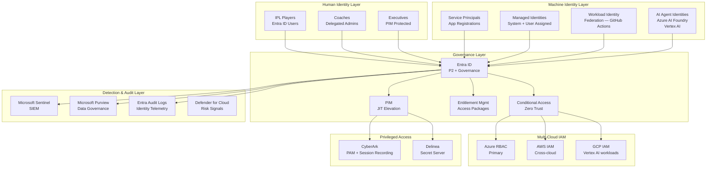

---

## Lab curriculum — complete map

### Phase 1 — Human Identity Foundation (Labs 01–08)
Already completed. Reference: Phase1_Learning_Reference.md

### Phase 2 — Identity Governance (Labs 09–13)
Already completed. Reference: Phase2_IGA_Labs.md

### Phase 3 — Authentication & Zero Trust (Labs 14–18)
Conditional Access, MFA, Named Locations, Authentication Strengths

### Phase 4 — Workload & AI Identity (Labs 19–26)
Service Principals, Managed Identities, Workload Federation, AI Agents

### Phase 5 — Multi-Cloud IAM (Labs 27–30)
AWS IAM, GCP IAM, Cross-cloud RBAC, ABAC

### Phase 6 — PAM (Labs 31–34)
CyberArk, Delinea, Session Recording, Secret Rotation

### Phase 7 — Detection & Audit (Labs 35–38)
Sentinel, Purview, Identity Risk Signals, Audit Correlation

### Phase 8 — Okta (Labs 39–44)
Workforce Identity, SCIM, Okta Lifecycle, SAML, OIDC

### Phase 9 — SailPoint (Labs 45–50)
IIQ concepts, Identity Cube, Certification Campaigns, Role Mining

---
### Phase 1 — Human Identity Foundation (Labs 01–08)

IPL Entra ID & Identity Administration Labs
Complete Curriculum — AD + Entra + IGA + Workload Identity + AI Identity
Dataset: IPL 2026 | Tenant: <Your domain> Solutions | License: 1x AAD P2
Environment & License Reality
Component	Status
Windows Server 2022	On-prem AD DS + AD FS
Entra Cloud Sync	Configured
Cross-tenant Sync	<> → Free tenant
License	1x AAD P2 (you = Global Admin)
IPL Dataset	10 teams × 25 players = 250 identities
Tooling	PowerShell 7 + Graph Explorer throughout
License strategy: 1 P2 license on your Global Admin account gives you access to all P2 features in the tenant. You can configure and test PIM, Governance, and Identity Protection — but only your licensed account can activate P2 features. Test accounts use free-tier features unless noted.

How labs are structured
Every lab follows this pattern:

SETUP → CONFIGURE → VERIFY → EXTEND
Setup — what to create/prepare before the main task
Configure — the actual Entra/AD configuration
Verify — PowerShell and Graph commands to confirm it worked
Extend — optional deeper challenge if you want to go further
No artificial break-and-fix is injected. You will hit real errors naturally — that is enough.

Curriculum Map
Phase 1 — Foundation (Labs 01–08)
Build the identity infrastructure from scratch

Phase 2 — Governance & IGA with Entra (Labs 09–16)
Use Entra as your IGA platform — access packages, reviews, PIM, lifecycle

Phase 3 — Authentication & Zero Trust (Labs 17–22)
MFA, passwordless, Conditional Access, SSPR

Phase 4 — Workload & AI Identities (Labs 23–28)
App registrations, Managed Identities, Workload Federation, AI service identities

Phase 5 — Monitoring & Operations (Labs 29–32)
Audit logs, Secure Score, Identity Protection, runbooks

PHASE 1 — FOUNDATION
Lab 01 — Bulk User Provisioning & Group-Based Licensing
Domain: Identity management
Time: 90 min
Tools: Entra portal, PowerShell 7, Graph Explorer
IPL context: Provision Chennai Super Kings (CSK) full squad — 25 players

Setup
# Confirm license seat availability
# Entra portal → Billing → Licenses → Microsoft Entra Suite or AAD P2
# Note available count before starting

# Export pre-lab snapshot
Connect-MgGraph -Scopes "User.Read.All","Directory.Read.All"
Get-MgUser -All -Property DisplayName,UserPrincipalName,Department,UsageLocation |
    Export-Csv "C:\LabPrep\Lab01-Before.csv" -NoTypeInformation
What to build
Create security groups E3-USER-GRP and F3-USER-GRP
Assign Entra Suite license to each group with different service plan tiers
Create group IPL-Captains as role-assignable group
Bulk create 17 domestic CSK players via CSV upload
Create 8 foreign players as cloud-only accounts (no license)
Assign domestic players to correct license group
Assign Ruturaj Gaikwad to IPL-Captains group
CSK Squad Dataset
Player	UPN	Department	License Group	Notes
Ruturaj Gaikwad	Ruturaj.Gaikwad@<Your domain>.solutions	Batting	E3-USER-GRP	Captain
MS Dhoni	MS.Dhoni@<Your domain>.solutions	WicketKeeping	E3-USER-GRP	Senior
Sanju Samson	Sanju.Samson@<Your domain>.solutions	WicketKeeping	F3-USER-GRP	
Ayush Mhatre	Ayush.Mhatre@<Your domain>.solutions	Batting	F3-USER-GRP	
Kartik Sharma	Kartik.Sharma@<Your domain>.solutions	WicketKeeping	F3-USER-GRP	
Sarfaraz Khan	Sarfaraz.Khan@<Your domain>.solutions	Batting	F3-USER-GRP	
Urvil Patel	Urvil.Patel@<Your domain>.solutions	WicketKeeping	F3-USER-GRP	
Ramakrishna Ghosh	Ramakrishna.Ghosh@<Your domain>.solutions	AllRound	F3-USER-GRP	
Prashant Veer	Prashant.Veer@<Your domain>.solutions	AllRound	F3-USER-GRP	
Aman Khan	Aman.Khan@<Your domain>.solutions	AllRound	F3-USER-GRP	
Shivam Dube	Shivam.Dube@<Your domain>.solutions	AllRound	F3-USER-GRP	
Khaleel Ahmed	Khaleel.Ahmed@<Your domain>.solutions	Bowling	F3-USER-GRP	
Anshul Kamboj	Anshul.Kamboj@<Your domain>.solutions	Bowling	F3-USER-GRP	
Mukesh Choudhary	Mukesh.Choudhary@<Your domain>.solutions	Bowling	F3-USER-GRP	
Shreyas Gopal	Shreyas.Gopal@<Your domain>.solutions	Bowling	F3-USER-GRP	
Gurjapneet Singh	Gurjapneet.Singh@<Your domain>.solutions	Bowling	F3-USER-GRP	
Rahul Chahar	Rahul.Chahar@<Your domain>.solutions	Bowling	F3-USER-GRP	
Dewald Brevis 🌍	Dewald.Brevis@<Your domain>.solutions	Batting	NO LICENSE	Foreign
Jamie Overton 🌍	Jamie.Overton@<Your domain>.solutions	AllRound	NO LICENSE	Foreign
Matthew Short 🌍	Matthew.Short@<Your domain>.solutions	AllRound	NO LICENSE	Foreign
Zak Foulkes 🌍	Zak.Foulkes@<Your domain>.solutions	AllRound	NO LICENSE	Foreign
Noor Ahmad 🌍	Noor.Ahmad@<Your domain>.solutions	Bowling	NO LICENSE	Foreign
Akeal Hosein 🌍	Akeal.Hosein@<Your domain>.solutions	Bowling	NO LICENSE	Foreign
Matt Henry 🌍	Matt.Henry@<Your domain>.solutions	Bowling	NO LICENSE	Foreign
Spencer Johnson 🌍	Spencer.Johnson@<Your domain>.solutions	Bowling	NO LICENSE	Foreign
Verify
# Zero direct license assignments
Get-MgUser -All -Property UserPrincipalName,LicenseAssignmentStates |
    ForEach-Object {
        $direct = $_.LicenseAssignmentStates |
            Where-Object {$_.AssignedByGroup -eq $null -and $_.State -eq "Active"}
        if($direct){ Write-Host "DIRECT: $($_.UserPrincipalName)" -ForegroundColor Red }
    }

# Group member counts
$e3 = Get-MgGroup -Filter "displayName eq 'E3-USER-GRP'"
$f3 = Get-MgGroup -Filter "displayName eq 'F3-USER-GRP'"
Write-Host "E3: $((Get-MgGroupMember -GroupId $e3.Id).Count) (expected 2)"
Write-Host "F3: $((Get-MgGroupMember -GroupId $f3.Id).Count) (expected 15)"
# Graph — verify license source
GET /users?$filter=assignedLicenses/any(x:x/skuId ne null)
    &$select=displayName,licenseAssignmentStates&$top=30
Extend
Add Stephen Fleming (Head Coach) and 2 assistant coaches as separate accounts in the Coaching department with no license — they will be used in governance labs later.

Lab 02 — Dynamic Group Membership Rules
Domain: Identity management
Time: 60 min
Tools: Entra portal, Graph Explorer
IPL context: Auto-group CSK players by cricket role — no more manual membership management

What to build
Create dynamic security groups for each playing role:

Group Name	Rule	Expected Members
CSK-Batting	(user.department -eq "Batting") and (user.userType -eq "Member")	3
CSK-WicketKeeping	(user.department -eq "WicketKeeping") and (user.userType -eq "Member")	4
CSK-AllRound	(user.department -eq "AllRound") and (user.userType -eq "Member")	4
CSK-Bowling	(user.department -eq "Bowling") and (user.userType -eq "Member")	6
IPL-All-Players	user.department -in ["Batting","WicketKeeping","AllRound","Bowling"]	25
Key steps
Before writing any rule — verify exact Department casing on all players
Use Validate rules button before saving each group
After saving — check Processing status, not member count
Test player transfer: change Sanju Samson Department to Batting → verify she moves groups → revert
Attempt license assignment to CSK-Batting — observe and document the error
Verify
# Graph — list all dynamic groups with rules
GET /groups?$filter=groupTypes/any(c:c eq 'DynamicMembership')
    &$select=displayName,membershipRule,membershipRuleProcessingState
Key concept
Dynamic groups cannot hold licenses. Your E3-USER-GRP and F3-USER-GRP must remain assigned groups. This is the most tested dynamic group limitation on SC-300.

Lab 03 — On-Prem AD Structure & Entra Cloud Sync Setup
Domain: Hybrid identity
Time: 90 min
Tools: Windows Server, PowerShell, Entra portal
IPL context: Create the on-prem AD OU structure for all 10 IPL teams and sync to Entra

What to build — on-prem AD OU structure
<Your domain>Solutions.local
└── IPL (root OU)
    ├── Teams
    │   ├── CSK          ← Chennai Super Kings
    │   ├── MI           ← Mumbai Indians
    │   ├── RCB          ← Royal Challengers Bengaluru
    │   └── ... (other 7 teams — create placeholders)
    ├── Support
    │   ├── Coaching     ← Coaches and analysts
    │   └── Admin        ← Administrative staff
    ├── Foreign          ← Foreign players (no license)
    └── Disabled         ← Offboarded accounts
PowerShell — create the OU structure
Import-Module ActiveDirectory

# Create root IPL OU
New-ADOrganizationalUnit -Name "IPL" -Path "DC=<Your domain>,DC=solutions"

# Create sub-OUs
$teams = @("CSK","MI","RCB","KKR","RR","SRH","PBKS","DC","GT","LSG")
foreach($team in $teams){
    New-ADOrganizationalUnit -Name $team `
        -Path "OU=Teams,OU=IPL,DC=<Your domain>,DC=solutions"
}

New-ADOrganizationalUnit -Name "Support" -Path "OU=IPL,DC=<Your domain>,DC=solutions"
New-ADOrganizationalUnit -Name "Coaching" -Path "OU=Support,OU=IPL,DC=<Your domain>,DC=solutions"
New-ADOrganizationalUnit -Name "Admin" -Path "OU=Support,OU=IPL,DC=<Your domain>,DC=solutions"
New-ADOrganizationalUnit -Name "Foreign" -Path "OU=IPL,DC=<Your domain>,DC=solutions"
New-ADOrganizationalUnit -Name "Disabled" -Path "OU=IPL,DC=<Your domain>,DC=solutions"

# Verify
Get-ADOrganizationalUnit -Filter * |
    Select-Object Name, DistinguishedName |
    Sort-Object DistinguishedName |
    Format-Table -AutoSize
Move existing CSK players into correct OU
# Move CSK players into CSK OU
$cskOU = "OU=CSK,OU=Teams,OU=IPL,DC=<Your domain>,DC=solutions"
$cskPlayers = @("Ruturaj.Gaikwad","MS.Dhoni","Sanju.Samson",
    "Ayush.Mhatre","Kartik.Sharma","Sarfaraz.Khan","Urvil.Patel",
    "Ramakrishna.Ghosh","Prashant.Veer","Aman.Khan","Shivam.Dube",
    "Khaleel.Ahmed","Anshul.Kamboj","Mukesh.Choudhary","Shreyas.Gopal",
    "Gurjapneet.Singh","Rahul.Chahar")

foreach($player in $cskPlayers){
    $user = Get-ADUser -Filter {SamAccountName -eq $player} -ErrorAction SilentlyContinue
    if($user){ Move-ADObject -Identity $user.DistinguishedName -TargetPath $cskOU }
}

# Move foreign players
$foreignOU = "OU=Foreign,OU=IPL,DC=<Your domain>,DC=solutions"
# Move each foreign player similarly
Configure Cloud Sync scope
Get exact OU DNs: Get-ADOrganizationalUnit -Filter * | Select-Object Name,DistinguishedName
Copy the DN strings exactly — no typing
Entra portal → Cloud Sync → Scoping → add:
OU=CSK,OU=Teams,OU=IPL,DC=<Your domain>,DC=solutions
OU=Support,OU=IPL,DC=<Your domain>,DC=solutions
Exclude Foreign and Disabled OUs explicitly
Verify
# On-prem count vs Entra synced count
$cskCount = (Get-ADUser -Filter * -SearchBase "OU=CSK,OU=Teams,OU=IPL,DC=<Your domain>,DC=solutions").Count
Write-Host "On-prem CSK players: $cskCount"
# Compare with: GET /users?$filter=onPremisesSyncEnabled eq true&$top=50
Lab 04 — Attribute Mapping & Sync Transformations
Domain: Hybrid identity
Time: 75 min
Tools: Entra Cloud Sync portal, PowerShell, Graph Explorer
IPL context: Transform player data during sync — display names with team, usageLocation, custom attributes

What to build
Source (AD)	Transformation	Target (Entra)
givenName + sn	Join(" ", [givenName], [sn])	displayName
extensionAttribute1	Direct	usageLocation
department	IIF(IsNullOrEmpty([department]),"Unassigned",[department])	department
mail	ToLower([mail])	mail
extensionAttribute2	Constant = "IPL2026"	extensionAttribute2
PowerShell — set extensionAttribute1 on all CSK players
# Set usageLocation source attribute on all on-prem CSK users
Get-ADUser -Filter * -SearchBase "OU=CSK,OU=Teams,OU=IPL,DC=<Your domain>,DC=solutions" |
    Set-ADUser -Replace @{extensionAttribute1="CA"}

# Verify
Get-ADUser -Filter * -SearchBase "OU=CSK,OU=Teams,OU=IPL,DC=<Your domain>,DC=solutions" `
    -Properties extensionAttribute1 |
    Select-Object Name, extensionAttribute1 |
    Format-Table -AutoSize
Verify
# Graph — check displayName format and usageLocation after sync
GET /users?$filter=onPremisesSyncEnabled eq true
    &$select=displayName,department,usageLocation,
    onPremisesExtensionAttributes&$top=25
Lab 05 — Administrative Units — Department Delegation
Domain: Identity management
Time: 75 min
Tools: Entra portal, Graph Explorer
IPL context: Each cricket department (Batting, Bowling etc.) has its own scoped admin — coaches can only manage their players

What to build
Administrative Unit	Dynamic Rule	Scoped Role	Scoped Admin
AU-CSK-Batting	department -eq "Batting"	Password Administrator	batting.coach@<Your domain>.solutions
AU-CSK-Bowling	department -eq "Bowling"	Password Administrator	bowling.coach@<Your domain>.solutions
AU-CSK-AllRound	department -eq "AllRound"	Helpdesk Administrator	allround.coach@<Your domain>.solutions
AU-CSK-WicketKeeping	department -eq "WicketKeeping"	Helpdesk Administrator	wk.coach@<Your domain>.solutions
AU-Executives	Assigned	Restricted Management	Global Admin only
Key steps
Create coach accounts: batting.coach, bowling.coach, allround.coach, wk.coach
Create each AU with dynamic membership rule
Assign scoped role to each coach on their respective AU
Test: sign in as batting.coach → try to reset Ruturaj's password (should work) → try to reset Khaleel Ahmed's password (should fail)
Create AU-Executives as restricted management AU → add Ruturaj and MS Dhoni
Verify
# Graph — list all AUs with rules
GET /directory/administrativeUnits
    ?$select=displayName,membershipType,membershipRule,
    isMemberManagementRestricted

# Members of AU-CSK-Batting
GET /directory/administrativeUnits/{auId}/members
    ?$select=displayName,userPrincipalName,department
Lab 06 — Guest B2B — Foreign Players as External Collaborators
Domain: External identity
Time: 60 min
Tools: Entra portal, Graph Explorer
IPL context: 8 foreign players are external collaborators — proper B2B guests from their home country domains

What to build
Delete the cloud-only foreign player accounts from Lab 01
Configure External collaboration settings — allow all domains
Invite each foreign player as B2B guest from their external email
Create security group IPL-Foreign-Players — add all 8 guests
Configure access review on IPL-Foreign-Players — quarterly, auto-deny on no review
Set guest access expiry policy — 180 days maximum
Foreign player invitations
Player	External Email (simulate)	Home Country
Dewald Brevis	dewald.brevis@cricket.za	South Africa
Jamie Overton	jamie.overton@cricket.eng	England
Matthew Short	matthew.short@cricket.au	Australia
Zak Foulkes	zak.foulkes@cricket.au	Australia
Noor Ahmad	noor.ahmad@cricket.afg	Afghanistan
Akeal Hosein	akeal.hosein@cricket.wi	West Indies
Matt Henry	matt.henry@cricket.nz	New Zealand
Spencer Johnson	spencer.johnson@cricket.au	Australia
Use personal Gmail/Outlook addresses you own to simulate external emails in your lab tenant

Verify
# Graph — all guest users
GET /users?$filter=userType eq 'Guest'
    &$select=displayName,userPrincipalName,
    userType,externalUserState,createdDateTime

# Check access review status
GET /identityGovernance/accessReviews/definitions
    ?$select=displayName,status,instanceEnumerationScope
Lab 07 — Entra Cloud Sync — Break, Diagnose, Recover
Domain: Hybrid identity
Time: 90 min
Tools: Windows Server, Event Viewer, Entra portal, Graph Explorer
IPL context: New MI players added to AD are not appearing in Entra — diagnose from scratch

What to build first (MI squad — 5 players)
$miOU = "OU=MI,OU=Teams,OU=IPL,DC=<Your domain>,DC=solutions"

$miPlayers = @(
    @{Name="Rohit Sharma"; Sam="rohit.sharma"; Dept="Batting"; Title="Captain"},
    @{Name="Hardik Pandya"; Sam="hardik.pandya"; Dept="AllRound"; Title="All-Rounder"},
    @{Name="Jasprit Bumrah"; Sam="jasprit.bumrah"; Dept="Bowling"; Title="Bowler"},
    @{Name="Tilak Varma"; Sam="tilak.varma"; Dept="Batting"; Title="Batter"},
    @{Name="Suryakumar Yadav"; Sam="suryakumar.yadav"; Dept="Batting"; Title="Batter"}
)

foreach($p in $miPlayers){
    New-ADUser -Name $p.Name -SamAccountName $p.Sam `
        -UserPrincipalName "$($p.Sam)@<Your domain>.solutions" `
        -Department $p.Dept -Title $p.Title `
        -Path $miOU -Enabled $true `
        -AccountPassword (ConvertTo-SecureString "IPL@2026!" -AsPlainText -Force)
}
Three faults to introduce deliberately
Fault 1 — Agent connectivity Stop the provisioning agent. Observe portal signals. Note how long before quarantine appears. Restart. Lift quarantine if needed.

Fault 2 — Scope filter change Narrow the Cloud Sync scope to exclude MI OU. Watch Delete cascade in provisioning logs. Restore scope. Observe re-provisioning.

Fault 3 — Deletion prevention threshold Set threshold to 2. Delete 3 MI players from AD simultaneously. Observe sync halt. Override threshold. Confirm deletions processed.

Three-source diagnostic methodology
Open simultaneously:

Event Viewer (server) → AzureADConnect → Admin
Entra portal → Provisioning logs
Cloud Sync portal → Overview
Document what each source shows at each phase.

Event ID reference
Event ID	Meaning	Action
14000	Agent started	Normal
14003	Connected to Entra	Healthy
12015	Connection failed	Investigate network
12009	Perf counter error	Cosmetic — run lodctr /R
12020	Deletion prevention triggered	Override in portal
Verify
# Agent health
Get-Service "Microsoft Azure AD Connect Provisioning Agent" | Select-Object Status

# Count match: on-prem vs Entra
$totalOnPrem = (Get-ADUser -Filter * -SearchBase "OU=IPL,DC=<Your domain>,DC=solutions" -SearchScope Subtree).Count
Write-Host "On-prem: $totalOnPrem"
# Compare: GET /users?$filter=onPremisesSyncEnabled eq true&$count=true
Lab 08 — Cross-Tenant Sync — IPL Multi-Franchise Governance
Domain: External identity / Multi-tenant
Time: 60 min
Tools: Entra portal (both tenants), Graph Explorer
IPL context: BCCI (Free tenant) needs visibility of all franchise players — cross-tenant sync from <Your domain> Solutions → BCCI tenant

What to build
Configure cross-tenant sync — <Your domain> Solutions (source) → Free tenant (destination)
Scope: sync only players in IPL-All-Players group
Attribute mapping: carry displayName, department, jobTitle, mail
Verify synced users appear as Members (not Guests) in Free tenant
Configure inbound access policy in Free tenant — trust MFA from <Your domain> Solutions
Key distinction for SC-300
Cross-tenant Sync	B2B Invitation
User type in destination	Member	Guest
Can hold admin roles	Yes	Limited
Provisioned automatically	Yes	Manual invite
Source of truth	Source tenant	External email
Verify
# In Free tenant Graph Explorer
GET /users?$filter=userType eq 'Member'
    &$select=displayName,userPrincipalName,
    userType,identities&$top=25

# Check cross-tenant access policies
GET /policies/crossTenantAccessPolicy/partners
PHASE 2 — GOVERNANCE & IGA WITH ENTRA
Lab 09 — Entitlement Management — IPL Access Packages
Domain: Identity Governance
Time: 90 min
Tools: Entra portal (Identity Governance blade), Graph Explorer
IPL context: New players request access to team resources through an approval workflow — Head Coach approves

What to build
Catalog: IPL-Resources
Access Packages:

Package Name	Resources	Requestable by	Approver	Expiry
CSK-Player-Access	CSK-Batting group, CSK-WK group	Any IPL player	Stephen Fleming	180 days
CSK-Premium-Access	E3-USER-GRP + coaching resources	Managers only	Ruturaj Gaikwad	90 days
IPL-Media-Access	Media group	Guest users	BCCI Admin	30 days
Key steps
Create catalog IPL-Resources — add groups as resources
Create each access package with policy (requestable, approval required, time-limited)
Test: sign in as a player → request CSK-Player-Access → approve as Stephen Fleming
Verify access was granted and expiry is set
Configure incompatible packages: CSK-Player-Access and CSK-Premium-Access cannot be held simultaneously (SOD)
Verify
# Graph — list access packages
GET /identityGovernance/entitlementManagement/accessPackages
    ?$select=displayName,description,isHidden&$top=10

# Check assignments
GET /identityGovernance/entitlementManagement/assignments
    ?$filter=state eq 'delivered'&$top=10
    &$select=state,expiredDateTime,accessPackage
Lab 10 — Access Reviews — Quarterly Player Certification
Domain: Identity Governance
Time: 60 min
Tools: Entra portal (Identity Governance blade), Graph Explorer
IPL context: Every quarter BCCI requires franchises to certify which players still have active access

What to build
Review Name	Scope	Reviewer	Frequency	Action on denial
CSK-Quarterly-Review	All CSK player group members	Stephen Fleming	Quarterly	Remove from group
IPL-Guest-Review	All guest users in tenant	Kamran (Admin)	Monthly	Block sign-in
Privileged-Role-Review	IPL-Captains group members	Kamran (Admin)	Monthly	Remove from role
Key steps
Create each access review with correct scope, reviewer, and auto-remediation
Start the review manually (do not wait for scheduled trigger)
Sign in as reviewer → complete the review — approve some, deny some
Apply results — observe what happens to denied users
Export the review history — this is your IGA audit evidence
Verify
# Graph — access review definitions
GET /identityGovernance/accessReviews/definitions
    ?$select=displayName,status,reviewers,settings

# Review instances (results)
GET /identityGovernance/accessReviews/definitions/{id}/instances
    ?$select=startDateTime,endDateTime,status
Lab 11 — PIM — Just-In-Time Privileged Access for Captains
Domain: Privileged Identity Management
Time: 75 min
Tools: Entra portal (PIM blade), Graph Explorer
License: Your P2 license required for configuration
IPL context: Ruturaj Gaikwad only gets Group Admin rights on match day — not permanently

What to build
Enable PIM for the User Administrator role
Make Ruturaj Gaikwad eligible (not permanent) for User Administrator
Configure activation policy: requires justification, 4-hour maximum, manager approval
Set Stephen Fleming as the approver
Test activation: sign in as Ruturaj → activate role → provide justification → get approval from Fleming
Verify role is active for 4 hours → expires automatically
Create PIM alert: notify when someone activates User Administrator outside business hours
Verify
# Get eligible role assignments
Get-MgRoleManagementDirectoryRoleEligibilitySchedule -All |
    Select-Object PrincipalId, RoleDefinitionId, StartDateTime, EndDateTime

# Get active role assignments
Get-MgRoleManagementDirectoryRoleAssignmentScheduleInstance -All |
    Select-Object PrincipalId, RoleDefinitionId, StartDateTime, EndDateTime
# Graph — PIM eligible assignments
GET /roleManagement/directory/roleEligibilitySchedules
    ?$select=principalId,roleDefinitionId,startDateTime,endDateTime
Lab 12 — Lifecycle Workflows — Joiner/Mover/Leaver Automation
Domain: Identity Governance
Time: 75 min
Tools: Entra portal (Identity Governance → Lifecycle Workflows), Graph Explorer
IPL context: Automate what happens when a new player joins CSK, transfers to MI, or retires

What to build
Joiner workflow — "New Player Onboarding"

Trigger: new user created with department in [Batting, Bowling, AllRound, WicketKeeping]
Tasks: send welcome email, add to IPL-All-Players group, generate temporary access pass
Mover workflow — "Player Transfer"

Trigger: department attribute changes
Tasks: remove from old team group, add to new team group, notify coaches
Leaver workflow — "Player Retirement"

Trigger: account disabled in AD (via Cloud Sync)
Tasks: remove from all groups, revoke all access package assignments, disable account
Verify
# Graph — list lifecycle workflows
GET /identityGovernance/lifecycleWorkflows/workflows
    ?$select=displayName,category,isEnabled,executionConditions

# Workflow run history
GET /identityGovernance/lifecycleWorkflows/workflows/{id}/runs
    ?$select=startedDateTime,completedDateTime,status
Lab 13 — Separation of Duties — Captain Cannot Be Auditor
Domain: Identity Governance
Time: 45 min
Tools: Entra portal (Entitlement Management), Graph Explorer
IPL context: A Captain managing match strategy cannot also audit team finances — conflicting access

What to build
Create two access packages: CSK-Captain-Access and CSK-Finance-Audit
Mark them as incompatible with each other in Entitlement Management
Test: request CSK-Captain-Access as Ruturaj → approved → then request CSK-Finance-Audit → should be blocked
Document the SOD violation workflow — what happens, what the requestor sees, who is notified
Key concept
SOD in Entra = Incompatible Access Packages
SOD in SailPoint = SOD Policy
SOD in both = same governance principle, different tool name
PHASE 3 — AUTHENTICATION & ZERO TRUST
Lab 14 — MFA & Authentication Methods
Domain: Authentication
Time: 75 min
Tools: Entra portal, Graph Explorer
IPL context: All CSK players must register MFA before the season starts — no exceptions

What to build
Enable Microsoft Authenticator for all users (Authentication methods policy)
Disable SMS and voice — enforce Authenticator only
Configure MFA registration campaign — snooze limit 3, enforce after deadline
Create Conditional Access policy: require MFA for all users, all apps
Exclude: break-glass account, IPL-Captains group (they use FIDO2 instead)
Set policy to Report-only → validate with What If → enable
Break-glass account setup
Display Name: IPL-BreakGlass
UPN: breakglass@<Your domain>.solutions
Type: Cloud-only (never synced)
MFA: Disabled
CA exclusion: All policies
Password: 32+ character random string stored offline
Verify
# Graph — MFA registration status
GET /reports/authenticationMethods/userRegistrationDetails
    ?$filter=isMfaRegistered eq false
    &$select=userPrincipalName,isMfaRegistered,methodsRegistered

# CA policy state
GET /identity/conditionalAccess/policies
    ?$select=displayName,state,conditions,grantControls
Lab 15 — SSPR with On-Prem Writeback
Domain: Authentication
Time: 60 min
Tools: Entra portal, Windows Server, Graph Explorer
IPL context: Players can reset their own passwords — writeback ensures AD is also updated

What to build
Enable SSPR — scope to CSK players group (not coaches)
Require 2 authentication methods: Authenticator app + email
Enable on-prem writeback in Cloud Sync configuration
Test: reset password via aka.ms/sspr as a CSK player
Verify writeback: check pwdLastSet on AD user object
# Verify writeback timestamp
Get-ADUser -Identity "ruturaj.gaikwad" -Properties pwdLastSet |
    Select-Object Name, @{N='PasswordLastSet';E={[datetime]::FromFileTime($_.pwdLastSet)}}
Lab 16 — Conditional Access — Zero Trust Framework
Domain: Conditional Access
Time: 90 min
Tools: Entra portal, Graph Explorer
IPL context: Different CA policies for players, captains, coaches, and foreign guests

What to build — CA policy stack
Policy Name	Who	Condition	Control
IPL-Require-MFA-All	All users	Any app, any location	Require MFA
IPL-Block-Legacy-Auth	All users	Legacy auth clients	Block
IPL-Captain-Strict	IPL-Captains group	Any app	Require MFA + compliant device
IPL-Guest-Restricted	Guest users	All cloud apps	Block except approved apps
IPL-Named-Location	All users	Outside India (named location)	Require MFA + sign-in risk check
Key steps
Create named location for India (country-based)
Build each policy in Report-only first
Use What If tool to validate each policy against test users before enabling
Enable one at a time — verify no lockouts between each
Verify
# Graph — export all CA policies
GET /identity/conditionalAccess/policies
    ?$select=displayName,state,conditions,grantControls,sessionControls

# What If evaluation (Graph)
POST /identity/conditionalAccess/evaluate
Body: {
  "appliedPoliciesOnly": false,
  "conditionalAccessWhatIfSubject": {"userPrincipalName": "Ruturaj.Gaikwad@<Your domain>.solutions"},
  "conditionalAccessWhatIfConditions": {"applicationId": "00000002-0000-0ff1-ce00-000000000000"}
}
Lab 17 — AD FS Claims Rules & Federation
Domain: Hybrid authentication
Time: 75 min
Tools: Windows Server (AD FS), Entra portal
IPL context: Legacy IPL scoring system requires AD FS federation — federate a test app

What to build
Review existing AD FS relying party trusts
Create a new relying party trust for a test SAML application
Configure claims rules: pass through UPN, department, display name
Test federation: access test app → observe SAML token claims
Break a claims rule deliberately → diagnose from AD FS event log → fix
# Check AD FS health
Get-AdfsRelyingPartyTrust | Select-Object Name, Enabled, ClaimsProviderName
Get-AdfsProperties | Select-Object HostName, HttpsPort, TlsClientPort

# View claims rules on a trust
Get-AdfsRelyingPartyTrust -Name "TestApp" | Select-Object -ExpandProperty IssuanceTransformRules
PHASE 4 — WORKLOAD & AI IDENTITIES
Lab 18 — App Registrations — IPL Scoring API
Domain: Workload identity
Time: 60 min
Tools: Entra portal, Graph Explorer, Azure portal (free tier)
IPL context: The IPL scoring application needs its own identity to call Microsoft Graph

What to build
Create app registration: IPL-Scoring-API
Configure API permissions: User.Read.All, Group.Read.All (application permissions)
Create a client secret — document expiry date
Grant admin consent for the permissions
Test: use the client credentials to obtain an access token and call Graph API
Create a second registration: IPL-Dashboard-App — user-delegated permissions
Client credentials flow — test it
# Get token using client credentials
$tenantId = "your-tenant-id"
$clientId = "your-app-client-id"
$clientSecret = "your-secret"

$body = @{
    grant_type    = "client_credentials"
    scope         = "https://graph.microsoft.com/.default"
    client_id     = $clientId
    client_secret = $clientSecret
}

$token = Invoke-RestMethod `
    -Uri "https://login.microsoftonline.com/$tenantId/oauth2/v2.0/token" `
    -Method POST -Body $body

Write-Host "Access token obtained: $($token.token_type)"

# Call Graph using the token
$headers = @{Authorization = "Bearer $($token.access_token)"}
$users = Invoke-RestMethod -Uri "https://graph.microsoft.com/v1.0/users" -Headers $headers
Write-Host "Users returned: $($users.value.Count)"
Verify
# Graph — list app registrations
GET /applications?$select=displayName,appId,passwordCredentials,requiredResourceAccess

# Check secret expiry
GET /applications/{appId}?$select=displayName,passwordCredentials
Key concept
App registrations use client secrets or certificates — secrets expire and must be rotated. Lab 19 replaces secrets with federated identity credentials (no secrets needed).

Lab 19 — Managed Identity & Workload Federation (No Secrets)
Domain: Workload identity
Time: 75 min
Tools: Entra portal, Graph Explorer, Azure portal (free tier)
IPL context: Replace the client secret from Lab 18 with federated identity — GitHub Actions deploys the IPL app without storing credentials

What to build
Create a user-assigned managed identity: IPL-App-Identity
Assign Graph API permissions to the managed identity
Configure federated identity credential on the IPL-Scoring-API app registration:
Issuer: https://token.actions.githubusercontent.com
Subject: your GitHub repo reference
Audience: api://AzureADTokenExchange
Delete the client secret from Lab 18 — the app now authenticates via federation
Test: simulate a token exchange call
Federated credential configuration
Name: github-actions-ipl
Issuer: https://token.actions.githubusercontent.com
Subject: repo:YourGitHub/ipl-app:ref:refs/heads/main
Audience: api://AzureADTokenExchange
Verify
# Graph — list federated credentials on an app
GET /applications/{appId}/federatedIdentityCredentials
    ?$select=name,issuer,subject,audiences

# Managed identities in tenant
GET /servicePrincipals?$filter=servicePrincipalType eq 'ManagedIdentity'
    &$select=displayName,appId,servicePrincipalType
Key concept
Federated credentials eliminate secret rotation entirely. No client secret = no expiry = no credential leak risk. This is the modern standard for workload authentication.

Lab 20 — Service Principals — Audit & Least Privilege
Domain: Workload identity
Time: 60 min
Tools: Graph Explorer, PowerShell
IPL context: Audit all application identities in the tenant — find over-privileged apps

What to build
Enumerate all app registrations and service principals in your tenant
Find any app with Global Administrator consent
Find secrets expiring within 30 days
Find apps with permissions that are never used
Document a remediation plan for each finding
# All app registrations with secret expiry
Get-MgApplication -All -Property DisplayName,AppId,PasswordCredentials |
    ForEach-Object {
        foreach($secret in $_.PasswordCredentials){
            $daysLeft = ($secret.EndDateTime - (Get-Date)).Days
            if($daysLeft -lt 90){
                [PSCustomObject]@{
                    App = $_.DisplayName
                    SecretName = $secret.DisplayName
                    ExpiresIn = "$daysLeft days"
                    ExpiryDate = $secret.EndDateTime
                }
            }
        }
    } | Sort-Object ExpiresIn | Format-Table -AutoSize

# Apps with admin-consented permissions
Get-MgServicePrincipal -All -Property DisplayName,AppRoleAssignments |
    Where-Object {$_.AppRoleAssignments -ne $null} |
    Select-Object DisplayName, @{N='RoleCount';E={$_.AppRoleAssignments.Count}} |
    Sort-Object RoleCount -Descending |
    Format-Table -AutoSize
Lab 21 — AI Service Identity — Azure OpenAI with Managed Identity (Free Tier)
Domain: AI Identity
Time: 60 min
Tools: Entra portal, Azure portal (free tier), Graph Explorer
IPL context: IPL analytics system uses Azure OpenAI to generate match summaries — authenticate without secrets

Free tier approach: Azure OpenAI requires a paid subscription. This lab uses the free Azure AI Services tier (Azure AI Translator or Azure Cognitive Search) which has a free pricing tier and still demonstrates the same managed identity pattern.

What to build
Create a free-tier Azure AI resource (Translator or Content Moderator)
Create a user-assigned managed identity: IPL-AI-Identity
Assign the managed identity the Cognitive Services User role on the AI resource
Create an app registration: IPL-Analytics-App
Configure the app to use the managed identity for AI service authentication
Test: call the AI service using the managed identity token
Managed identity assignment
Resource: Azure AI Translator (free tier F0)
Identity: IPL-AI-Identity (user-assigned managed identity)
Role: Cognitive Services User
Scope: the specific AI resource
Verify
# Graph — managed identities in tenant
GET /servicePrincipals?$filter=servicePrincipalType eq 'ManagedIdentity'
    &$select=displayName,appId,servicePrincipalType,appRoles

# Role assignments on managed identity
GET /servicePrincipals/{managedIdentityId}/appRoleAssignments
Key concept
AI services should never use API keys stored in code. Managed identity is the correct authentication pattern — the AI resource trusts the identity, the identity is managed by Entra, and no secret ever leaves the platform.

Lab 22 — Workload Identity Federation — GitHub to Entra (No Azure Required)
Domain: Workload identity
Time: 45 min
Tools: Entra portal, GitHub (free), Graph Explorer
IPL context: GitHub Actions CI/CD pipeline deploys IPL player data to SharePoint without storing any credentials in GitHub

What to build
Create a free GitHub repository: ipl-entra-lab
Create an app registration in Entra: IPL-GitHub-Actions
Assign it Microsoft Graph permissions: User.Read.All
Configure federated identity credential pointing to your GitHub repo
Create a GitHub Actions workflow that authenticates to Entra using OIDC
Run the workflow — verify it successfully calls Graph API without any stored secret
GitHub Actions workflow (no secrets stored)
name: IPL Entra Identity Test
on: [workflow_dispatch]

permissions:
  id-token: write
  contents: read

jobs:
  test-entra-auth:
    runs-on: ubuntu-latest
    steps:
      - name: Azure Login via Federated Identity
        uses: azure/login@v1
        with:
          client-id: ${{ secrets.AZURE_CLIENT_ID }}
          tenant-id: ${{ secrets.AZURE_TENANT_ID }}
          allow-no-subscriptions: true

      - name: Call Microsoft Graph
        run: |
          token=$(az account get-access-token --resource https://graph.microsoft.com --query accessToken -o tsv)
          curl -H "Authorization: Bearer $token" \
               https://graph.microsoft.com/v1.0/users?$top=5
Note: AZURE_CLIENT_ID and AZURE_TENANT_ID in GitHub Secrets are not credentials — they are public identifiers. The actual authentication happens via OIDC token exchange with no password or secret involved.

PHASE 5 — MONITORING & OPERATIONS
Lab 23 — Audit Logs & Sign-In Investigation
Domain: Monitoring
Time: 60 min
Tools: Entra portal, Graph Explorer, PowerShell
IPL context: Security team needs to audit all admin actions during the IPL season

What to build
Filter audit logs by category (User Management, Group Management, Policy)
Filter sign-in logs by user (Ruturaj Gaikwad) — find all sign-in events today
Find all failed sign-ins in the last 7 days
Export sign-in logs for a specific user as CSV
Build a PowerShell script that runs this export automatically
# Sign-in logs for specific player
Get-MgAuditLogSignIn -Filter "userPrincipalName eq 'Ruturaj.Gaikwad@<Your domain>.solutions'" `
    -Top 20 |
    Select-Object CreatedDateTime, AppDisplayName, IpAddress,
        @{N='Status';E={$_.Status.ErrorCode}},
        @{N='Location';E={$_.Location.City}} |
    Format-Table -AutoSize

# Failed sign-ins across tenant last 7 days
$since = (Get-Date).AddDays(-7).ToString("yyyy-MM-ddTHH:mm:ssZ")
Get-MgAuditLogSignIn `
    -Filter "status/errorCode ne 0 and createdDateTime ge $since" `
    -Top 50 |
    Select-Object CreatedDateTime, UserPrincipalName,
        @{N='ErrorCode';E={$_.Status.ErrorCode}},
        @{N='FailureReason';E={$_.Status.FailureReason}} |
    Export-Csv "C:\LabPrep\Lab23-FailedSignIns.csv" -NoTypeInformation
Lab 24 — Identity Secure Score & Hardening
Domain: Monitoring
Time: 45 min
Tools: Entra portal, Graph Explorer
IPL context: BCCI has set a minimum Secure Score requirement of 70% for all franchises

What to build
Review current Identity Secure Score in Entra portal → Security → Identity Secure Score
Identify the top 5 improvement actions
Implement at least 3 of them (choose achievable ones for your license level)
Re-check score after implementation
Document which actions require P2 license vs free tier
# Graph — current secure score
GET /security/secureScores?$top=1
    &$select=currentScore,maxScore,averageComparativeScores,controlScores

# Score improvement actions
GET /security/secureScoreControlProfiles
    ?$select=title,implementationCost,rank,maxScore,
    userImpact,actionType,remediationImpact
    &$orderby=rank asc&$top=20
Lab 25 — Identity Protection — Risky Players & Risky Sign-ins
Domain: Monitoring
Time: 60 min
Tools: Entra portal (Identity Protection), Graph Explorer
License: P2 required — your licensed admin account
IPL context: Security team monitors for compromised player accounts during the IPL season

What to build
Review Identity Protection dashboard — Risk detections, Risky users, Risky sign-ins
Configure risk-based Conditional Access policy:
High user risk → require password change
Medium sign-in risk → require MFA
Simulate a risky sign-in using the Tor browser (or VPN) to trigger a detection
Investigate the detection — confirm or dismiss the risk
Configure alert: email notification when any player is flagged as high risk
# Graph — risky users
GET /identityProtection/riskyUsers
    ?$filter=riskLevel eq 'high' or riskLevel eq 'medium'
    &$select=userDisplayName,userPrincipalName,riskLevel,
    riskState,riskLastUpdatedDateTime

# Risk detections
GET /identityProtection/riskDetections
    ?$top=10&$orderby=activityDateTime desc
    &$select=userDisplayName,detectionTimingType,
    riskEventType,riskLevel,ipAddress
Lab 26 — PowerShell Automation — IPL Identity Operations
Domain: Operations
Time: 75 min
Tools: PowerShell 7, Microsoft.Graph module
IPL context: Automate the weekly IPL identity hygiene report

What to build — IPL Weekly Report Script
# IPL-Weekly-Identity-Report.ps1
# Run every Monday — generates complete identity health report

Connect-MgGraph -Scopes "User.Read.All","Group.Read.All",
    "AuditLog.Read.All","Reports.Read.All","Directory.Read.All"

$report = @{}

# 1 — Total players per team
$report.PlayerCounts = Get-MgUser -All -Property Department |
    Where-Object {$_.Department -ne $null} |
    Group-Object Department |
    Select-Object @{N='Team';E={$_.Name}}, @{N='Players';E={$_.Count}}

# 2 — Players missing usageLocation
$report.MissingUsageLocation = Get-MgUser -All `
    -Property DisplayName,UserPrincipalName,UsageLocation,AssignedLicenses |
    Where-Object {
        $_.AssignedLicenses.Count -gt 0 -and
        [string]::IsNullOrEmpty($_.UsageLocation)
    } | Select-Object DisplayName, UserPrincipalName

# 3 — Direct license assignments (should be zero)
$report.DirectLicenses = Get-MgUser -All -Property UserPrincipalName,LicenseAssignmentStates |
    ForEach-Object {
        $direct = $_.LicenseAssignmentStates |
            Where-Object {$_.AssignedByGroup -eq $null -and $_.State -eq "Active"}
        if($direct){ $_.UserPrincipalName }
    }

# 4 — Guest users with no recent sign-in (last 30 days)
$cutoff = (Get-Date).AddDays(-30).ToString("yyyy-MM-ddTHH:mm:ssZ")
$report.InactiveGuests = Get-MgUser -All -Property DisplayName,UserPrincipalName,UserType,SignInActivity |
    Where-Object {
        $_.UserType -eq "Guest" -and
        ($null -eq $_.SignInActivity -or $_.SignInActivity.LastSignInDateTime -lt $cutoff)
    } | Select-Object DisplayName, UserPrincipalName

# 5 — App secrets expiring in 30 days
$report.ExpiringSecrets = Get-MgApplication -All -Property DisplayName,PasswordCredentials |
    ForEach-Object {
        foreach($s in $_.PasswordCredentials){
            if(($s.EndDateTime - (Get-Date)).Days -lt 30){
                [PSCustomObject]@{App=$_.DisplayName; ExpiresIn="$(($s.EndDateTime-(Get-Date)).Days) days"}
            }
        }
    }

# Output report
Write-Host "`n=== IPL WEEKLY IDENTITY REPORT ===" -ForegroundColor Cyan
Write-Host "`nPlayer counts per department:"
$report.PlayerCounts | Format-Table
Write-Host "`nPlayers missing usageLocation ($($report.MissingUsageLocation.Count)):"
$report.MissingUsageLocation | Format-Table
Write-Host "`nDirect license assignments (should be 0): $($report.DirectLicenses.Count)"
Write-Host "`nInactive guests (no sign-in 30+ days): $($report.InactiveGuests.Count)"
Write-Host "`nApp secrets expiring within 30 days: $($report.ExpiringSecrets.Count)"

# Export to CSV
$report.PlayerCounts | Export-Csv "C:\LabPrep\WeeklyReport-$(Get-Date -Format 'yyyy-MM-dd').csv" -NoTypeInformation
Write-Host "`nReport exported to C:\LabPrep\"
Quick Reference — Graph Queries Cheat Sheet
Users
# All synced users
GET /users?$filter=onPremisesSyncEnabled eq true&$select=displayName,userPrincipalName,department

# All guest users
GET /users?$filter=userType eq 'Guest'&$select=displayName,externalUserState

# Users missing usageLocation
GET /users?$filter=assignedLicenses/any(x:x/skuId ne null) and usageLocation eq null

# Fix usageLocation
PATCH /users/{id} — Body: {"usageLocation":"CA"}
Groups
# All dynamic groups
GET /groups?$filter=groupTypes/any(c:c eq 'DynamicMembership')&$select=displayName,membershipRule

# Group members
GET /groups/{id}/members?$select=displayName,userPrincipalName,department

# A user's group memberships
GET /users/{id}/memberOf?$select=displayName,id
Governance
# Access packages
GET /identityGovernance/entitlementManagement/accessPackages

# Access reviews
GET /identityGovernance/accessReviews/definitions

# Lifecycle workflows
GET /identityGovernance/lifecycleWorkflows/workflows

# PIM eligible assignments
GET /roleManagement/directory/roleEligibilitySchedules
Apps & Workload
# App registrations
GET /applications?$select=displayName,appId,passwordCredentials

# Federated credentials
GET /applications/{id}/federatedIdentityCredentials

# Managed identities
GET /servicePrincipals?$filter=servicePrincipalType eq 'ManagedIdentity'

# Service principal permissions
GET /servicePrincipals/{id}/appRoleAssignments
Monitoring
# Sign-in logs
GET /auditLogs/signIns?$filter=userPrincipalName eq 'user@domain'&$top=20

# Audit logs
GET /auditLogs/directoryAudits?$filter=category eq 'UserManagement'&$top=20

# Provisioning logs
GET /auditLogs/provisioning?$filter=status/result eq 'failure'

# Risky users
GET /identityProtection/riskyUsers?$filter=riskLevel eq 'high'

# Secure score
GET /security/secureScores?$top=1
PowerShell Module Reference
Module	Install Command	Use For
ActiveDirectory	Built into Windows Server	On-prem AD management
Microsoft.Graph	Install-Module Microsoft.Graph	Entra ID via Graph API
Az	Install-Module Az	Azure resources (workload labs)
# Connect commands
Import-Module ActiveDirectory  # No auth needed — uses current AD session
Connect-MgGraph -Scopes "User.Read.All","Directory.ReadWrite.All"  # Entra
Connect-AzAccount  # Azure (workload labs only)
IPL Dataset — All 10 Teams (Provision as you progress)
Lab	Team to add	Captain
Lab 01	CSK — Chennai Super Kings	Ruturaj Gaikwad
Lab 07	MI — Mumbai Indians	Rohit Sharma
Lab 09+	RCB — Royal Challengers Bengaluru	Rajat Patidar
Lab 09+	KKR — Kolkata Knight Riders	Ajinkya Rahane
Lab 12+	RR — Rajasthan Royals	Sanju Samson
Lab 12+	SRH — Sunrisers Hyderabad	Pat Cummins
Lab 16+	PBKS — Punjab Kings	Shreyas Iyer
Lab 16+	DC — Delhi Capitals	Axar Patel
Lab 20+	GT — Gujarat Titans	Shubman Gill
Lab 20+	LSG — Lucknow Super Giants	Rishabh Pant
Add each team when the lab scenario calls for it — IPL-All-Players dynamic group will grow automatically

Last updated: IPL 2026 Season · <Your domain> Solutions Entra Tenant · 1x AAD P2 License

### Phase 2 - Identity Governance (Labs 09-13)
Identity Governance & Administration (IGA) — Complete Concept Study Guide
Theory + Visual Diagrams + Entra ID Mapping + Lab Context
For IAM professionals building IGA expertise
Author: Kamran Arif
GitHub: https://github.com/ds-kamran/ipl-azure-entra-labs
Purpose: Understand IGA from first principles — then see how Entra implements each concept

How to use this guide
Read it like a book — top to bottom on your first pass.
After that use the table of contents below to jump to any concept you need to revisit.
Every section header is a GitHub anchor link — click and it takes you straight there.
The diagrams in Part 11 render natively on GitHub using Mermaid.

Table of Contents
Part 1 — Foundations
What is IGA and why does it exist
The four pillars of IGA
Part 2 — Pillar 1: Entitlement Management
The access request problem
Catalog
Access Package
Policy
Request workflow
Separation of Duties in entitlement management
Access Package lifecycle
Entra IGA vs SailPoint — same concept different name
Lab 09 — what you actually built explained with theory
Part 3 — Pillar 2: Access Reviews
The access accumulation problem
What an access review is
Reviewer types
Review frequency
Auto-remediation
Recommendation engine
The certification campaign concept
Regulatory drivers for access reviews
Lab 10 context
Part 4 — Pillar 3: Privileged Identity Management
The standing privilege problem
Eligible vs Active assignments
Activation workflow
PIM activation policy controls
PIM for groups
Alert types in PIM
Why PIM matters to auditors
SailPoint equivalent
Part 5 — Pillar 4: Lifecycle Management
The joiner mover leaver problem
Authoritative source
The three lifecycle events
Lifecycle workflow triggers in Entra
Lifecycle workflow tasks available in Entra
What Entra Lifecycle Workflows cannot do yet
SailPoint LCM equivalent
Part 6 — How Everything Connects
How the four pillars connect
A complete governance scenario end-to-end
Part 7 — IGA Maturity and Tool Comparison
IGA maturity model
IGA in Entra vs SailPoint vs Okta
When clients use each tool
Part 8 — Interview Preparation
Q1 — Authentication vs authorization
Q2 — RBAC vs ABAC
Q3 — Separation of Duties
Q4 — Provisioning vs deprovisioning
Q5 — What is SCIM
Q6 — JML process
Q7 — Orphaned accounts
Q8 — Service accounts
Q9 — Least privilege
Q10 — Identity sprawl
Part 9 — Phase 2 Labs Mapped to IGA Concepts
Lab 09 — Entitlement Management
Lab 10 — Access Reviews
Lab 11 — PIM
Lab 12 — Lifecycle Workflows
Lab 13 — Separation of Duties
Part 10 — Quick Reference
IGA terminology glossary
Study checklist before Phase 3
Part 11 — Visual Diagrams
Diagram 1 — Four pillars framework
Diagram 2 — Access request lifecycle
Diagram 3 — Joiner Mover Leaver
Diagram 4 — PIM JIT vs standing privilege
Diagram 5 — Access review lifecycle
Diagram 6 — IGA maturity model
Diagram 7 — Complete end-to-end scenario
Diagram 8 — Entra IGA vs SailPoint concept map
Part 1 — Foundations
What is IGA and why does it exist
Before IGA tools existed, access management looked like this:

Employee joins → IT creates account → Manager emails IT requesting access
→ IT manually adds user to groups → User gets access
→ Employee leaves → Sometimes IT removes access. Sometimes not.
→ Auditor asks "who has access to what and why?" → No one knows.
This created four problems that IGA exists to solve:

Problem	Consequence	IGA solution
Access accumulates over time	People keep access they no longer need	Access reviews — certify or revoke
No record of why access was granted	Cannot answer auditors	Access requests with approvals — documented trail
Joiners/movers/leavers not automated	Ex-employees retain access	Lifecycle workflows — automated provisioning
Privileged access always on	High blast radius if account compromised	PIM — just-in-time elevation
IGA is not a product — it is a discipline. The tools (Entra IGA, SailPoint, Saviynt, Omada) implement the discipline. Understanding the discipline means you can work in any tool.

The four pillars of IGA
┌─────────────────────────────────────────────────────────┐
│                    IGA FRAMEWORK                        │
├──────────────┬──────────────┬────────────┬──────────────┤
│   PILLAR 1   │   PILLAR 2   │  PILLAR 3  │   PILLAR 4   │
│   Access     │   Access     │ Privileged │  Lifecycle   │
│  Request &   │   Review &   │  Identity  │  Management  │
│  Entitlement │Certification │ Management │  (Joiner/    │
│  Management  │              │   (PIM)    │ Mover/Leaver)│
└──────────────┴──────────────┴────────────┴──────────────┘
       ↓               ↓            ↓              ↓
  Lab 09            Lab 10       Lab 11         Lab 12
  Entitlement      Access        PIM           Lifecycle
  Management       Reviews                     Workflows
Each pillar answers a different governance question:

Pillar 1 — Entitlement Management: "How does someone request access and get it approved?"
Pillar 2 — Access Reviews: "How do we certify that existing access is still appropriate?"
Pillar 3 — PIM: "How do we ensure privileged access is only active when needed?"
Pillar 4 — Lifecycle Management: "How do we automate access changes when someone joins, moves, or leaves?"
Part 2 — Pillar 1: Entitlement Management
The access request problem
Imagine you join a new organisation on Monday. You need access to 6 systems to do your job. Without IGA:

Email your manager
Manager emails IT
IT figures out what you need
IT manually provisions each system
3 days later you have partial access
2 systems were forgotten
No record exists of who approved what
With IGA (Entitlement Management):

You open the access portal
You see a catalogue of available access packages
You request "Standard Software Engineer Access"
Your manager gets an approval request
Manager approves in one click
All 6 systems provisioned automatically
Full audit trail: who requested, who approved, when, why
Catalog
A container that holds resources available for access management. Think of it as a department store — different floors for different types of access. IT resources on floor 1, Finance resources on floor 2.

In Entra:

Identity Governance → Entitlement Management → Catalogs
A catalog contains:

Groups (Entra security groups)
Applications (enterprise apps)
SharePoint sites
Teams
Access Package
A bundle of related resources that a user requests as a single unit. Instead of requesting 5 individual permissions, they request one package that grants all 5 simultaneously.

IPL analogy: "CSK-Player-Access" package contains:

Membership in CSK-Batting dynamic group
Access to CSK match scheduling app
Access to team communication channel
License assignment via F3-USER-GRP
One request → one approval → all four resources granted together.

Policy
Rules that govern who can request a package, who approves it, and how long access lasts.

A single access package can have multiple policies for different requestor types:

Policy 1: Current employees — manager approval, 1 year expiry
Policy 2: Contractors — dual approval, 90 day expiry
Policy 3: Automatic assignment — no approval, permanent (for base access)
Request workflow
Requestor submits request
        ↓
Policy evaluated — is requestor eligible?
        ↓
Approval stage 1 (e.g. line manager)
        ↓
Approval stage 2 if configured (e.g. resource owner)
        ↓
Access granted — all resources in package provisioned
        ↓
Expiry date set — access auto-revokes at expiry
        ↓
(Optional) Access review triggered before expiry
Separation of Duties (SOD) in entitlement management
Two access packages marked as incompatible with each other. If a user holds Package A, they cannot request Package B.

Why this matters: A financial analyst should not also be the one approving their own expense reports. These two roles are incompatible — holding both creates a fraud risk.

In Entra: incompatible access packages enforce this at the provisioning layer — the request is blocked before it reaches an approver.

Identity Governance → Access Packages → select package
→ Incompatible access packages → add conflicting package
Access Package lifecycle
Request → Approve → Grant → Active → Expiry warning → Review → Extend or Revoke
                                ↑                                      ↓
                         Renew if needed                         Access removed
Entra IGA vs SailPoint — same concept, different name
IGA Concept	Entra IGA name	SailPoint name
Resource container	Catalog	Application
Bundled access	Access Package	Role / Bundle
Request workflow	Access Package Policy	Access Request Policy
Incompatible access	Incompatible Packages	SOD Policy
Requestor portal	My Access portal (myaccess.microsoft.com)	IdentityNow Service Catalog
Lab 09 — what you actually built explained with theory
When you completed Lab 09 you built:

1. A catalog (the container) This is the governance boundary. Resources inside the catalog can only be managed by catalog owners. Resources outside are not governed by entitlement management.

2. An access package (the bundle) You bundled one or more groups together into a single requestable unit. A player requesting this package gets added to all bundled groups simultaneously without IT intervention.

3. A policy (the rules) You defined who can request (specific users or groups), who approves (Stephen Fleming as Head Coach), and when access expires (e.g. 180 days or end of season).

4. The approval workflow (the governance) When a player requests the package, Fleming receives an email. He approves or denies. The decision is logged permanently. If he does not respond within the deadline, the request auto-denies (or auto-approves — depending on your policy).

What you might not have realised you built: An audit trail. Every request, every approval decision, every grant and revocation is logged in the entitlement management audit history. This is the evidence an auditor needs to prove access was properly controlled.

Verify what you built via Graph
# Your catalogs
GET /identityGovernance/entitlementManagement/catalogs
    ?$select=displayName,description,isExternallyVisible

# Your access packages
GET /identityGovernance/entitlementManagement/accessPackages
    ?$select=displayName,description,isHidden,catalog

# Active assignments (who currently has access via package)
GET /identityGovernance/entitlementManagement/assignments
    ?$filter=state eq 'delivered'
    &$select=state,expiredDateTime,assignmentPolicyId
    &$expand=accessPackage,target

# Request history (full audit trail)
GET /identityGovernance/entitlementManagement/assignmentRequests
    ?$filter=requestType eq 'UserAdd'
    &$select=requestType,state,createdDateTime,justification
    &$expand=requestor,accessPackage
Part 3 — Pillar 2: Access Reviews
The access accumulation problem
Access accumulates over time. This is a universal truth in every organisation that does not actively manage it.

How it happens:

Employee moves from Sales to Finance. Sales access revoked? Usually not.
Contractor finishes project. Account disabled? Often not for weeks.
Manager leaves. Their reports still have manager-approved access to systems the new manager does not know about.
Application team grants emergency access during an incident. Emergency access never removed.
After 3 years, a typical user has 3x more access than they need. After 5 years, access lists are so polluted that no one trusts them.

This is why access reviews exist — to periodically ask: "Does this person still need this access? Should they still have it?"

What an access review is
A structured process where a designated reviewer examines each access assignment and makes one of three decisions:

Approve — access is still appropriate, keep it
Deny — access is no longer appropriate, remove it
Don't know — need more information (usually escalates)
Reviewer types
Reviewer type	Who reviews	Best for
Self-review	The user reviews their own access	Low-risk access, large populations
Manager	User's manager reviews	Most common — manager knows what user needs
Resource owner	Owner of the group or app reviews	Technical access, app-specific
Specific reviewers	Named individuals review	Privileged access, sensitive resources
Multi-stage	Multiple reviewers in sequence	High-risk access requiring dual sign-off
Review frequency
Weekly/Monthly — high-risk privileged access, admin roles
Quarterly — standard application access, external guests
Semi-annually — general group memberships
Annually — low-risk access, large user populations
Frequency should match the risk level of the access being reviewed.

Auto-remediation
What happens when a reviewer does not respond:

Auto-deny — access removed if reviewer ignores the request
Auto-approve — access continues if reviewer ignores (less common)
No change — access remains until manually resolved
For privileged access: always use auto-deny on non-response. For general access: auto-deny is also preferred — conservative is safer.

Recommendation engine
Entra generates a recommendation for each access decision based on:

Has the user signed in recently?
Have they used this access in the last 30 days?
Was the access granted long ago and never reviewed?
Important: The recommendation for new accounts or infrequently used access will almost always be "Deny" — even if the access is legitimate. Reviewers should understand this and not blindly follow recommendations.

The certification campaign concept (SailPoint terminology)
In SailPoint, access reviews are called "Certification Campaigns." The concept is identical — a scheduled or triggered process where designated reviewers certify that access assignments are appropriate.

Entra term	SailPoint term
Access Review	Certification Campaign
Review definition	Campaign template
Review instance	Campaign run
Reviewer decision	Certification decision
Auto-remediation	Automatic revocation
Regulatory drivers for access reviews
Understanding why clients demand access reviews:

Regulation	Requirement
SOX	Quarterly review of access to financial systems
HIPAA	Periodic review of access to patient data
PCI DSS	Regular review of access to cardholder data environments
ISO 27001	Formal access review process at regular intervals
GDPR	Review of access to personal data
When a client says "we need SOX compliance for our IAM" — they are asking for access reviews as a minimum requirement.

Lab 10 context — what the access review you build actually does
Review scope: Foreign-Players group (or any group you configured)
Reviewer: Team manager or your admin account
Frequency: Quarterly
Auto-remediation: Remove from group if denied

Timeline of one review cycle:
Day 1:  Review opens. Reviewer gets email notification.
Day 1-7: Reviewer examines each member — Approve or Deny.
Day 7:  Review closes. Auto-remediation runs.
        Denied members removed from group immediately.
        Approved members retain access until next review.
        Full decision log available for audit.
Part 4 — Pillar 3: Privileged Identity Management
The standing privilege problem
Most organisations give administrators permanent elevated access. A User Administrator has User Administrator rights 24/7/365. Even when they are on holiday. Even when they are asleep. Even when their account is compromised.

This is called "standing privilege" and it is a major security risk.

The blast radius problem: If an attacker compromises a permanent Global Administrator account, they have unlimited access immediately — no waiting, no approval, no notification. The window from compromise to damage is zero seconds.

PIM solves this with just-in-time (JIT) access.

Eligible vs Active assignments
Assignment type	Access state	Requires activation	Expires
Active (permanent)	Always on	No	No
Eligible (PIM)	Off by default	Yes — on demand	Yes — configured duration
With PIM:

Ruturaj Gaikwad is eligible for User Administrator
He has zero elevated access in day-to-day operations
On match day he activates the role — provides justification
He has User Administrator for 4 hours maximum
Role expires automatically — no manual cleanup needed
Activation workflow
1. Admin opens PIM portal
2. Selects eligible role to activate
3. Provides business justification
4. Requests duration (up to configured maximum)
5. (Optional) Approval required from a designated approver
6. Role becomes Active for the requested duration
7. Role expires automatically at end of duration
8. All activation events logged to PIM audit log
PIM activation policy controls
Each role in PIM has configurable activation requirements:

Control	Options	Use for
Require justification	Yes / No	Always yes for privileged roles
Require approval	Yes / No	High-risk roles — Global Admin, Security Admin
Approver	Specific users or groups	Role owners, security team
Maximum activation duration	1–24 hours	Match to task duration
Require MFA on activation	Yes / No	Always yes
Require ticket number	Yes / No	Change management integration
Send notifications	Activation, deactivation, denial	Security team awareness
PIM for groups (your IPL-Captains scenario)
PIM is not just for directory roles — it also applies to group membership.

IPL-Captains group → PIM-enabled group membership
→ Ruturaj is ELIGIBLE member of IPL-Captains
→ Ruturaj activates membership for 4 hours
→ Group Admin role (assigned to IPL-Captains) is active for 4 hours
→ Membership expires → Group Admin role gone
This is more powerful than role-level PIM in some scenarios because:

Multiple resources can be attached to one group
Activating group membership grants all associated resources at once
Works with access packages, CA policies, and AU delegation
Alert types in PIM
PIM generates security alerts for suspicious patterns:

Alert	What it detects
Roles activated too frequently	Possible automation or policy violation
Role activated outside business hours	Suspicious — investigate
Role assigned outside PIM	Standing privilege created — governance gap
Duplicate role assignments	Redundant access — cleanup needed
Roles without MFA	Security control gap
Why PIM matters to auditors
Every financial and security audit asks two questions about privileged access:

"Who has admin rights?"
"When did they use them and why?"
Without PIM: answer to #1 is "everyone who was ever given admin rights." Answer to #2 is "we have no idea."

With PIM: answer to #1 is "no one has standing admin rights except break-glass." Answer to #2 is a complete log of every activation with justification and duration.

SailPoint equivalent
SailPoint does not have PIM natively. It relies on integration with Microsoft Entra PIM or CyberArk for privileged access management. In SailPoint-heavy environments, PAM tools handle the JIT elevation while SailPoint handles the request and certification workflows.

Part 5 — Pillar 4: Lifecycle Management
The joiner mover leaver problem
The three most dangerous moments in an employee's identity lifecycle:

Joiner — risk of under-provisioning: New employee starts Monday. Access not ready. Cannot do their job. Productivity loss. Frustrated employee. IT team manually creating accounts across 8 systems.

Mover — risk of access accumulation: Employee moves from Finance to Engineering. Engineering access granted. Finance access never revoked. Now has access to systems in both departments. No one noticed. Access review might catch it 6 months later.

Leaver — risk of orphaned accounts: Employee resigns Friday. Last day is in 2 weeks. Two weeks later, IT is notified. Account disabled in AD. But the ServiceNow account? Still active. The Salesforce account? Still active. 6 weeks later a ticket: "why does ex-employee still have Salesforce access?"

LCM automates all three transitions — triggered by events in the authoritative source (HR system or AD) without manual IT intervention.

Authoritative source
The system of record for identity data. The source of truth.

HR system (Workday, SAP HR, BambooHR) for employment status
Active Directory for on-prem identity state
Entra ID for cloud identity state
Changes in the authoritative source trigger downstream identity changes. The IAM system listens for events and acts automatically.

The three lifecycle events
Joiner:

HR creates employee record
        ↓
IAM detects new record
        ↓
Create AD account
        ↓
Cloud Sync provisions Entra account
        ↓
Assign base access package (standard role)
        ↓
Send welcome email with credentials
        ↓
Temporary access pass generated (passwordless first login)
Mover:

HR updates department or job title
        ↓
IAM detects attribute change
        ↓
Evaluate: what access should change?
        ↓
Remove incompatible access from old role
        ↓
Grant access for new role
        ↓
Notify manager of access changes
Leaver:

HR marks employee as terminated
OR
AD account disabled
        ↓
IAM detects leaver event
        ↓
Revoke all access package assignments
        ↓
Remove from all groups
        ↓
Block sign-in (cloud account)
        ↓
Disable AD account
        ↓
Move to Disabled OU (retain for audit period)
        ↓
Notify manager and IT
        ↓
Schedule permanent deletion after retention period (e.g. 90 days)
Lifecycle workflow triggers in Entra
Event	Trigger type	Example use
User created	Attribute-based	New hire provisioning
Attribute changed	Attribute-based	Department transfer
Account enabled	Attribute-based	Return from leave
Account disabled	Attribute-based	Leaver offboarding
Days before/after event	Time-based	Send welcome email 2 days before start date
X days after creation	Time-based	Temporary access pass generation
Lifecycle workflow tasks available in Entra
Joiner tasks:

Generate Temporary Access Pass
Send welcome email
Add user to groups
Assign access package
Enable account
Mover tasks:

Add/remove from groups
Notify manager
Update attributes
Request access review
Leaver tasks:

Remove from all groups
Revoke all access package assignments
Block sign-in
Disable account
Notify manager
Delete account (after retention period)
What Entra Lifecycle Workflows cannot do (yet)
Be aware of current limitations:

Cannot provision to third-party applications directly (use SCIM provisioning on enterprise apps instead)
Cannot make complex conditional decisions (use Logic Apps for orchestration if complex branching needed)
Cannot directly interact with on-prem AD (Cloud Sync handles the AD → Entra direction)
Manual trigger per-user requires PowerShell (no "run now for this user" button in portal)
SailPoint LCM equivalent
Entra term	SailPoint term
Lifecycle Workflow	Lifecycle Event Rule / Provisioning Policy
Joiner workflow	Joiner provisioning event
Mover workflow	Mover / Transfer event
Leaver workflow	Leaver / Terminate event
Workflow task	Workflow step / Action
Authoritative source	Authoritative Source application
Cloud Sync	Direct connector / AD connector
Part 6 — How Everything Connects
How the four pillars connect
This is the part most people miss — IGA pillars are not independent. They work as a connected governance system.

AUTHORITATIVE SOURCE (HR / AD)
        │
        ▼
LIFECYCLE MANAGEMENT ──── creates identity with base access
        │                  triggers access package assignment
        │                  triggers deprovisioning on leave
        ▼
ENTITLEMENT MANAGEMENT ── governs what access can be requested
        │                  maintains approval audit trail
        │                  sets expiry on all access grants
        │                  enforces SOD conflicts
        ▼
ACCESS REVIEWS ─────────── certifies ongoing appropriateness
        │                  removes stale or inappropriate access
        │                  generates compliance evidence
        ▼
PIM ────────────────────── controls elevated access activation
                           ensures no standing privilege
                           full activation audit trail
A complete governance scenario end-to-end
Event: New software engineer joins organisation on Monday.

Monday 8:00am — HR creates record in Workday
Monday 8:01am — Lifecycle Workflow (Joiner) triggers
Monday 8:02am — AD account created in OU=Engineering
Monday 8:03am — Cloud Sync provisions Entra account
Monday 8:04am — Base access package "Standard-Engineer" auto-assigned
                 (groups, apps, license — all provisioned)
Monday 8:05am — Temporary Access Pass generated and emailed
Monday 8:06am — Welcome email sent with IT onboarding guide

Monday 9:00am — Engineer arrives, signs in with TAP
Monday 9:01am — Registers MFA (forced by CA policy)
Monday 9:02am — Requests "Senior-Engineer-Access" via myaccess portal
Monday 9:03am — Manager receives approval request
Monday 9:10am — Manager approves
Monday 9:11am — Additional groups and app access provisioned
                 Approval logged: manager name, timestamp, justification

3 months later — Quarterly access review begins
                 Manager reviews engineer's access assignments
                 Approves standard access. Denies one stale group membership.
                 Stale group removed automatically.
                 Audit log shows: reviewer, decision, timestamp, action.

6 months later — Engineer promoted to Tech Lead
                 Manager updates job title in HR
                 Lifecycle Mover workflow triggers
                 New access package "Tech-Lead-Access" assigned
                 Old "Standard-Engineer" incompatible items revoked
                 PIM eligibility for "Groups Administrator" granted

Day engineer leaves — HR marks terminated
                      Lifecycle Leaver workflow triggers immediately
                      All access packages revoked
                      Removed from all groups
                      Sign-in blocked within minutes
                      Manager notified
                      Account moved to Disabled OU
                      Permanent deletion scheduled for 90 days
This entire scenario runs without a single IT help desk ticket. That is what mature IGA looks like.

Part 7 — IGA Maturity and Tool Comparison
IGA maturity model
Understanding where an organisation sits on the maturity curve helps you scope what needs to be built and in what order.

Level 0 — No governance
Manual account creation on request via email
No approval process — IT just provisions whatever is asked
No deprovisioning process — accounts accumulate
No visibility into who has what access
Audit evidence: none
Level 1 — Basic automation
Automated joiner provisioning from HR feed
Automated leaver disabling from HR termination
No approval workflow — base access automatic
Some access reviews done manually in spreadsheets
Audit evidence: inconsistent, mostly manual
Level 2 — Structured access request
Formal access request workflow with approvals
Access packages or roles defined for common access patterns
Joiner/leaver automated, mover still partially manual
Access reviews automated for some resource types
Audit evidence: approval records exist for requested access
Level 3 — Governed lifecycle (where Phase 2 labs take you)
Full joiner/mover/leaver automation
All access via access packages — no manual provisioning
SOD policies enforced at request time
Quarterly access reviews for all sensitive access
PIM for all privileged roles — no standing privilege
Audit evidence: complete — every grant, approval, revocation logged
Level 4 — Risk-aware governance
Real-time access analytics — detect anomalous access patterns
AI-driven review recommendations based on usage data
Continuous access certification (not just quarterly)
Integration with SIEM for identity-driven threat detection
Audit evidence: automated, real-time, regulatory-mapped
Level 5 — Zero Trust identity
No user has standing access to anything
All access just-in-time, scoped, time-limited
Every access request evaluated against risk posture
Continuous authentication — trust evaluated per session
Audit evidence: immutable, real-time, court-admissible
Your current lab position: Building Level 3. Most enterprise clients that engage IAM consultants are at Level 1-2. Your job is to help them reach Level 3.

IGA in Entra vs SailPoint vs Okta
Access Request & Entitlement
Concept	Entra IGA	SailPoint IIQ	Okta
Resource container	Catalog	Application	N/A (app-centric)
Bundled access	Access Package	Role / Bundle	Group
Request portal	myaccess.microsoft.com	Self-Service UI	Okta End User Dashboard
Approval workflow	Access Package Policy	Approval Workflow	Built-in approval
SOD enforcement	Incompatible Packages	SOD Policy	N/A (not native)
Audit trail	Entitlement assignment history	Identity Cube audit	System Log
Access Reviews
Concept	Entra IGA	SailPoint IIQ	Okta
Review process	Access Review	Certification Campaign	Access Certifications
Review scope	Group, App, Role	Application, Entitlement	Group, App
Reviewer types	Manager, Owner, Self	Manager, App Owner, Self	Manager, App Owner
Auto-remediation	Yes — configurable	Yes — configurable	Limited
Frequency options	Daily to Annually	Daily to Annually	Periodic
Privileged Access
Concept	Entra IGA	SailPoint IIQ	Okta
JIT elevation	PIM (native)	PAM module / CyberArk	Okta + CyberArk / BeyondTrust
Role activation	PIM portal	IIQ request workflow	N/A (not native)
Approval on activation	Yes	Yes (via IIQ)	Via PAM tool
Audit trail	PIM audit log	IIQ activity log	System Log
Lifecycle Management
Concept	Entra IGA	SailPoint IIQ	Okta
Joiner automation	Lifecycle Workflows	Joiner Lifecycle Event	Okta Lifecycle Management
Mover automation	Lifecycle Workflows	Mover/Refresh event	Attribute-based rules
Leaver automation	Lifecycle Workflows	Leaver event	Okta Lifecycle Management
HR source integration	Workday connector (via API)	HR connector (direct)	Workday, BambooHR, SAP HR
When clients use each
Scenario	Typical tool choice
Microsoft-first organisation	Entra IGA — native, no extra cost with P2
Complex enterprise, many non-MS systems	SailPoint IIQ — deeper connector library
Primarily SaaS applications	Okta — SCIM-first, app integration depth
Government or highly regulated	SailPoint or Saviynt — compliance frameworks
Hybrid (on-prem + cloud)	SailPoint + Entra PIM — SailPoint for IGA, Entra for PAM
Mid-market, fast deployment	Okta or Entra IGA — faster to implement
Part 8 — Interview Preparation
Q1: What is the difference between authentication and authorization?
Authentication: Proving who you are. "I am Kamran Arif." Verified by: password, MFA, certificate, biometric.

Authorization: Determining what you can do. "Kamran can read financial reports but not edit them." Controlled by: roles, groups, access packages, permissions.

IGA primarily concerns authorization — who has access to what and why. Authentication is handled by MFA, Conditional Access, and identity providers.

Q2: What is Role-Based Access Control (RBAC) and how does it differ from ABAC?
RBAC (Role-Based): Access granted based on a user's role. All users with role "Finance Analyst" get the same access. Simple, auditable, but inflexible for edge cases.

ABAC (Attribute-Based): Access granted based on user attributes. Access granted if: department = Finance AND clearance_level >= 3 AND location = HQ. Flexible and granular but complex to manage.

Entra uses both:

RBAC → directory roles (Global Admin, User Admin, etc.)
ABAC → Conditional Access policies (grant access if device is compliant AND location is trusted AND risk is low)
Dynamic groups → ABAC-style membership (users with department = Engineering auto-join group)
Q3: What is Segregation of Duties (SOD) and why does it matter?
SOD ensures no single person has enough access to commit fraud alone.

Classic SOD conflict: Create purchase order + Approve purchase order. If one person can do both, they can create and approve their own fraudulent PO. SOD policy: these two capabilities cannot be held by the same person.

In IGA: SOD policies detect and prevent conflicting access requests. In Entra: incompatible access packages enforce SOD. In SailPoint: SOD policies evaluate role combinations.

Q4: What is the difference between provisioning and deprovisioning?
Provisioning: Creating and granting access to identity resources. Account creation, group membership, license assignment, app access.

Deprovisioning: Removing access and disabling or deleting the identity. Account disabling, group removal, license revocation, app access removal.

The leaver process is deprovisioning. The joiner process is provisioning. SCIM protocol automates both directions between identity provider and apps.

Q5: What is SCIM and why is it important?
SCIM (System for Cross-domain Identity Management) is a standard protocol for automating user provisioning and deprovisioning between systems.

Without SCIM: IAM team manually creates accounts in each app. With SCIM: when a user is added to a group in Entra, SCIM automatically creates their account in Salesforce, ServiceNow, and AWS simultaneously.

SCIM token: The authentication credential SCIM uses. Must be rotated periodically — rotation must be done carefully to avoid provisioning outage (covered in Enterprise Lab E-08).

Q6: What is a Joiner/Mover/Leaver (JML) process?
The three events in an employee identity lifecycle that require action:

Joiner: New employee. Provision access appropriate to their role. Mover: Role change. Remove old access, grant new access. Leaver: Departure. Revoke all access immediately.

Most IGA projects spend 80% of their effort getting the leaver process right because orphaned accounts are the most common audit finding and the highest security risk.

Q7: What is an orphaned account?
An account that exists in a system with no corresponding active employee. The employee left but the account was not disabled or deleted.

Common causes:

Leaver process not automated (most common)
System not connected to IAM — IT does not know account exists
Contractor access not tracked — end date missed
Impact:

Security risk — ex-employee could still sign in
Compliance finding — every audit checks for orphaned accounts
Licence cost — organisation paying for access no one uses
Q8: What is a Service Account and why is it an IGA challenge?
A non-human identity used by an application or service to authenticate and perform automated tasks. Examples: database connection strings, API integration credentials, scheduled job accounts.

Why IGA struggles with service accounts:

They do not have a human owner who changes jobs or leaves
They often have high privilege (need broad API access)
Their passwords are embedded in application code
Password rotation breaks the application
Modern solution: Replace service account credentials with Managed Identities (Entra) or Workload Identity Federation. No password to rotate. No credential to steal. Covered in Phase 4 of your curriculum.

Q9: What is the principle of least privilege?
Every user, application, and service should have the minimum access required to perform their function — and nothing more.

In practice:

Default access = zero
Access granted per role/task = minimum required
Access expiry = shortest appropriate duration
Privileged access = just-in-time only (PIM)
Why it is hard: Least privilege requires knowing exactly what each person needs. Most organisations do not have this documented. IGA projects start by documenting role requirements, then enforcing them.

Q10: What is Identity Sprawl?
The proliferation of identities across multiple systems that are not centrally managed or connected to the authoritative source.

A single employee might have:

Active Directory account
Salesforce account (created manually years ago)
AWS IAM user (created by a dev team)
GitHub account (personal, used for work)
3 contractor accounts from previous employment at the same org
Test account someone created and forgot
IGA solution: Identity discovery → connect all systems → correlate accounts to employees → decommission orphans → centralise management.

This is what large SailPoint and Saviynt implementations do first — discover what identities exist before governing them.

Part 9 — Phase 2 Labs Mapped to IGA Concepts
Lab 09 — Entitlement Management
IGA pillar: Access Request & Entitlement
What you built: Catalog → Access Package → Policy → Approval workflow
Theory applied: Access bundling, approval audit trail, access expiry, SOD

Real-world equivalent: New team member requests access to team resources via myaccess portal. Manager approves or denies with documented justification. Access auto-revokes at season end (expiry). Captain cannot also hold auditor access (SOD via incompatible packages).

What to verify you truly understand:

Can you explain what would happen if the approver does not respond?
Can you explain the difference between a catalog owner and a resource owner?
Can you explain what incompatible packages enforces and why?
Lab 10 — Access Reviews
IGA pillar: Access Review & Certification
What you built: Review definition → Instance → Reviewer decisions → Auto-remediation
Theory applied: Certification campaign, reviewer types, auto-deny, audit evidence

Real-world equivalent: Quarterly audit requires all player access to be certified. Managers review and certify each player's access. Inactive or transferred players are denied and removed automatically. Audit trail exported as evidence for the compliance team.

What to verify you truly understand:

Why does the recommendation engine suggest Deny for new accounts?
What happens to access if the reviewer never responds?
Where is the audit evidence of reviewer decisions stored?
Lab 11 — PIM
IGA pillar: Privileged Identity Management
What you built: PIM-eligible role assignment → Activation policy → Approval workflow
Theory applied: JIT elevation, standing privilege risk, activation audit log

Real-world equivalent: Captain does not have permanent Group Admin rights. On match day they activate the role for 4 hours with justification. Head Coach approves the activation. Role expires at end of day — no cleanup needed. Full activation history available for governance review.

What to verify you truly understand:

What is the difference between eligible and active assignment?
What happens when the activation duration expires?
Why is standing privilege a security risk even for trusted users?
Lab 12 — Lifecycle Workflows
IGA pillar: Lifecycle Management
What you built: Joiner → Mover → Leaver workflows triggered by AD events
Theory applied: JML process, authoritative source, automated provisioning

Real-world equivalent: New player created in AD → welcome email, TAP, base access package all triggered. Player transfers (department changes) → mover workflow removes old access, grants new. Player retires (AD account disabled) → leaver workflow removes all groups, blocks sign-in.

What to verify you truly understand:

What is the authoritative source in your environment?
What triggers the mover workflow in your setup?
Why does the leaver workflow not delete the account immediately?
Lab 13 — Separation of Duties
IGA pillar: Access Request & Entitlement (SOD enforcement)
What you built: Incompatible access packages → SOD conflict detection → Request blocked
Theory applied: SOD principle, fraud prevention, regulatory requirement

Real-world equivalent: A player cannot be both team Captain and Finance Auditor simultaneously. When they already hold Captain-Access and request Finance-Audit, the request is blocked at the policy layer before reaching an approver. SOD violation is logged — compliance team notified.

Part 10 — Quick Reference
Quick reference — IGA terminology glossary
Term	Definition
Access Package	A bundle of resources (groups, apps) that can be requested as a unit
Access Review	A periodic process to certify that access is still appropriate
ABAC	Attribute-Based Access Control — access decisions based on user attributes
Certification Campaign	SailPoint term for an access review
Catalog	Container for resources managed by entitlement management
Deprovisioning	Removing access and disabling/deleting an identity
Eligible assignment	PIM — access that must be activated before use
Entitlement	A specific permission, group membership, or access right
IGA	Identity Governance & Administration — the discipline of governing who has access to what and why
JIT	Just-In-Time — access granted only when needed, expired after use
JML	Joiner/Mover/Leaver — the three lifecycle events requiring identity action
Least privilege	Minimum access required to perform a function
Lifecycle workflow	Automated process triggered by identity lifecycle events
LCM	Lifecycle Management — automation of joiner/mover/leaver processes
Managed Identity	A non-human identity managed by Entra — no password, no rotation
Orphaned account	An account with no corresponding active employee
PAM	Privileged Access Management — governance of elevated access
PIM	Privileged Identity Management — Entra's JIT elevation tool
Provisioning	Creating and granting access to an identity
RBAC	Role-Based Access Control — access granted based on role assignment
SCIM	System for Cross-domain Identity Management — standard provisioning protocol
SOD	Segregation of Duties — ensuring no single person can commit fraud alone
Standing privilege	Permanent elevated access — the problem PIM solves
Temporary Access Pass	One-time passcode for first login — replaces initial password
Workflow	Automated sequence of tasks triggered by an event
Study checklist — before moving to Phase 3
Before starting Phase 3 (Authentication & Zero Trust), confirm you can answer these questions without looking anything up:

Entitlement Management:

 What is the difference between a catalog and an access package?
 What happens when an access package expires?
 How do incompatible packages enforce SOD?
 Where is the approval audit trail stored?
Access Reviews:

 What are the three reviewer types and when do you use each?
 What does auto-remediation on non-response mean?
 Why does the recommendation engine suggest Deny for new accounts?
 What regulatory frameworks require access reviews?
PIM:

 What is the difference between eligible and active assignment?
 What is standing privilege and why is it a risk?
 What happens when a PIM activation expires?
 What information does a PIM activation require from the user?
Lifecycle Workflows:

 What are the three lifecycle events?
 What triggers a leaver workflow in your Entra environment?
 Why does the leaver workflow disable rather than delete immediately?
 What is the authoritative source in your environment?
Conceptual:

 Can you draw the four pillars of IGA and explain what each does?
 Can you explain IGA to a non-technical person in 2 minutes?
 Can you map Entra IGA concepts to SailPoint terminology?
 Can you describe the complete governance lifecycle of a new employee?
IGA is the discipline. Entra, SailPoint, and Okta are the tools.
Master the discipline and you can work in any tool.
This guide gives you the discipline.

Part 11 — Visual Diagrams
These diagrams use Mermaid syntax which renders natively on GitHub. Open this file on GitHub to see the visual charts. Use these alongside the theory sections above as visual anchors.

Diagram 1 — The four pillars of IGA

How to read this: The authoritative source drives everything. All four pillars feed into one governance outcome. Click any pillar heading in the table of contents to jump to its theory section.

Diagram 2 — Access request lifecycle (Pillar 1)

Key points: SOD check happens before the approval stage. The audit trail is generated regardless of outcome — denials are logged too. Expiry is set at grant time — access does not need to be manually revoked.

Diagram 3 — Joiner · Mover · Leaver lifecycle (Pillar 4)

The mover is the hardest to get right. It must remove old access AND grant new access simultaneously. Most organisations only build the grant side — and that is how access accumulation starts.

Diagram 4 — PIM just-in-time vs standing privilege (Pillar 3)

The two audit answers. Without PIM: "everyone we ever gave it to." With PIM: "no one permanently — here is every activation with justification and timestamp."

Diagram 5 — Access review lifecycle (Pillar 2)

What reviewers often get wrong: The recommendation engine suggests Deny for new accounts with no sign-in history — even if the access is legitimate. Reviewers must decide based on business need, not blindly follow the recommendation.

Diagram 6 — IGA maturity model

Where enterprise clients typically sit: Most organisations that engage an IAM consultant are at Level 0 or Level 1. The gap from Level 1 to Level 3 is what most IAM consulting engagements are paid to close.

Diagram 7 — Complete end-to-end governance scenario

This is mature IGA. From day one to offboarding — every identity event is automated, governed, and auditable. No manual IT tickets. No orphaned accounts. Complete audit trail for every access decision made throughout the employee's tenure.

Diagram 8 — Entra IGA vs SailPoint concept map

Why this matters: IGA concepts are universal. The tool changes but the concept does not. If you understand what a Certification Campaign does — you understand what an Access Review does. Learn the concept once. Apply it in any tool.

IGA is the discipline. Entra, SailPoint, and Okta are the tools.
Master the discipline and you can work in any tool.
This guide gives you the discipline.


# PHASE 3 — AUTHENTICATION & ZERO TRUST

---

## Lab 14 — Conditional Access Foundations

### WHY

```
Without Conditional Access:
User has valid username and password
→ Signs in from a café in a foreign country at 3am
→ Access granted — no questions asked
→ Attacker with stolen credentials: same experience

With Conditional Access:
→ Location: untrusted
→ Time: unusual
→ Device: unknown
→ Risk: elevated
→ Policy fires: require MFA + compliant device
→ Attacker cannot complete MFA — blocked
```

CA is the policy engine of Zero Trust.
Every sign-in is evaluated. Trust is never assumed.

### THEORY

Zero Trust principle: **never trust, always verify.**

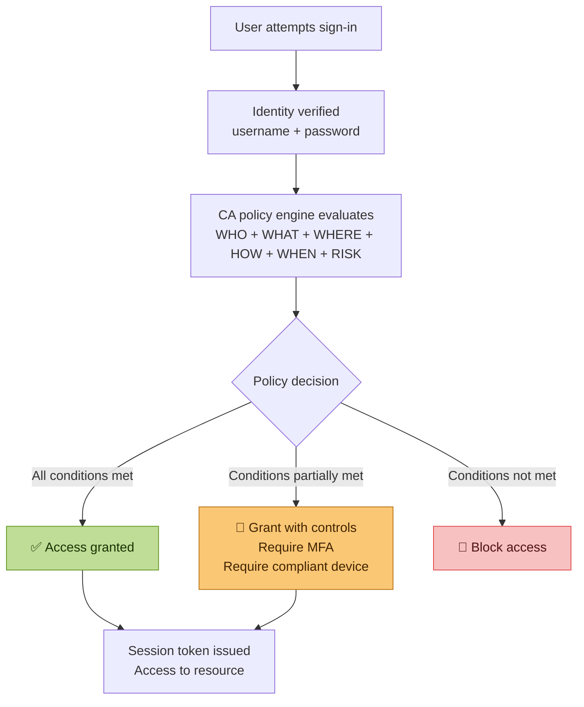

**The six CA signal inputs:**

| Signal | Examples |
|---|---|
| User/Group | Who is signing in — player, coach, admin, AI agent |
| Application | What app — Teams, Azure portal, custom API |
| Location | Named location (trusted office IP) vs anonymous proxy |
| Device | Entra joined, compliant, hybrid joined, unknown |
| Risk (Identity Protection) | Low, medium, high — based on sign-in behaviour |
| Authentication strength | Password only, MFA, phishing-resistant MFA |

**The three CA outcomes:**

```
Block           → access denied entirely
Grant           → access allowed — optionally with conditions
Session control → access allowed but with restrictions
                  (app enforced restrictions, sign-in frequency,
                   persistent browser session controls)
```

### DIAGRAM

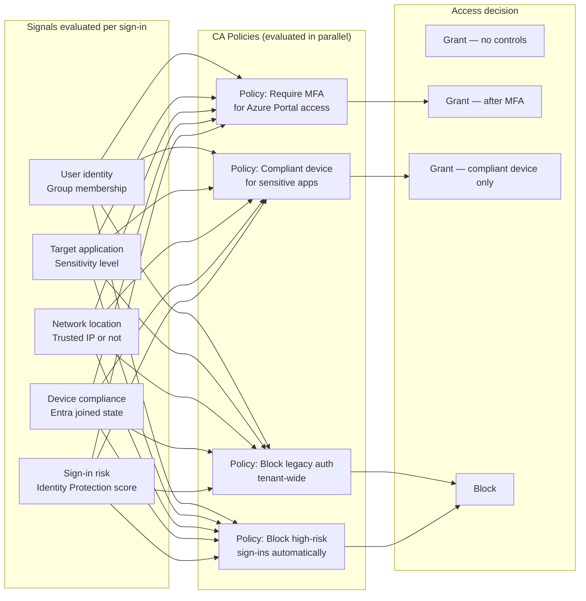

### LAB

**Use Case A — Require MFA for Azure Portal access**

Scenario: No player should access the Azure/Entra portal without MFA.
Admin tasks require elevated assurance beyond password alone.

```
Entra portal
→ Protection
→ Conditional Access
→ Policies
→ New policy

Name: IPL-Require-MFA-Azure-Portal

Assignments:
→ Users: Include → All users
→ Exclude → your break-glass account (CRITICAL — always exclude)
→ Target resources: Include → Select apps
   → Search: Microsoft Azure Management
   → Select also: Microsoft Entra admin center

Conditions: (leave as default for this policy)

Access controls → Grant
→ Grant access
→ Require multifactor authentication
→ Select

Enable policy: Report-only FIRST (not On)
→ Create
```

**CRITICAL — break-glass account exclusion:**

Before enabling ANY CA policy, create and exclude a break-glass account.
If your CA policy accidentally locks everyone out — including yourself —
the break-glass account bypasses CA and lets you recover.

```powershell
Connect-MgGraph -Scopes "User.ReadWrite.All","Group.ReadWrite.All"

# Create break-glass account
$breakGlass = New-MgUser -BodyParameter @{
    DisplayName       = "Break-Glass Emergency"
    UserPrincipalName = "breakglass@<Your domain>.solutions"
    AccountEnabled    = $true
    UsageLocation     = "CA"
    PasswordProfile   = @{
        ForceChangePasswordNextSignIn = $false
        Password = "BG@Emergency2026!"  # Store securely offline
    }
}

# Assign Global Admin to break-glass
$gaRoleId = (Get-MgRoleManagementDirectoryRoleDefinition `
    -Filter "displayName eq 'Global Administrator'").Id

New-MgRoleManagementDirectoryRoleAssignment -BodyParameter @{
    principalId      = $breakGlass.Id
    roleDefinitionId = $gaRoleId
    directoryScopeId = "/"
}

Write-Host "Break-glass created: $($breakGlass.UserPrincipalName)"
Write-Host "CRITICAL: Store credentials offline in a sealed envelope"
Write-Host "CRITICAL: Exclude this account from ALL CA policies"
Write-Host "CRITICAL: Set up alerts if this account ever signs in"
```

**Test in Report-only mode before enabling:**

```
CA → Policies → IPL-Require-MFA-Azure-Portal
→ Insights and reporting tab
→ Sign in as a test user without MFA registered
→ Check what the policy would have done
→ Confirm: "would have required MFA"
→ Only then switch from Report-only to On
```

**Use Case B — Block legacy authentication**

Legacy auth (SMTP, IMAP, POP3, older Office protocols) cannot do MFA.
Any policy requiring MFA is bypassed by legacy auth clients.
Block it tenant-wide.

```
New policy: IPL-Block-Legacy-Auth

Users: All users (exclude break-glass)
Target resources: All cloud apps

Conditions:
→ Client apps: Yes
→ Select: Exchange ActiveSync clients + Other clients
→ (do NOT select Browser or Mobile apps — only legacy)

Access controls → Block access
→ Enable: On (safe to enable directly — legacy auth has no legitimate use)
→ Create
```

**Use Case C — Named location for India (trusted)**

```
CA → Named locations → New location → Countries location
→ Name: IPL-India
→ Select countries: India
→ Save

CA → Named locations → New IP ranges location
→ Name: IPL-Mumbai-Office
→ IP ranges: your office IP/CIDR
→ Mark as trusted: Yes
→ Save
```

Now use these in a CA policy:

```
New policy: IPL-Risky-Location-MFA

Users: All players (IPL-All-Players group)
Target resources: All cloud apps

Conditions:
→ Locations: Yes
→ Include: Any location
→ Exclude: IPL-India (trusted country)

Grant: Require MFA
→ Enable: On
```

Effect: players signing in from outside India must complete MFA.
Players in India get standard access.

### VERIFY

```powershell
Connect-MgGraph -Scopes "Policy.Read.All"

# List all CA policies and their states
Get-MgIdentityConditionalAccessPolicy -All |
    Select-Object DisplayName, State,
        @{N='Users';  E={$_.Conditions.Users.IncludeUsers}},
        @{N='Apps';   E={$_.Conditions.Applications.IncludeApplications}},
        @{N='Grant';  E={$_.GrantControls.BuiltInControls}} |
    Format-Table -AutoSize
```

**Graph — better for backup and bulk operations:**

```powershell
# Export all CA policies as JSON backup before any changes
Get-MgIdentityConditionalAccessPolicy -All |
    ConvertTo-Json -Depth 10 |
    Out-File "CA-Policies-Backup-$(Get-Date -Format 'yyyyMMdd').json"

# Clone a policy via Graph (portal has no clone button)
$source = Get-MgIdentityConditionalAccessPolicy -ConditionalAccessPolicyId "SOURCE-ID"
$clone  = $source | ConvertTo-Json -Depth 10 | ConvertFrom-Json
$clone.displayName = "$($source.displayName) — Copy"
$clone.state       = "disabled"
"id","createdDateTime","modifiedDateTime" | ForEach-Object {
    $clone.PSObject.Properties.Remove($_)
}
New-MgIdentityConditionalAccessPolicy -BodyParameter $clone
```

### DOCS
- https://learn.microsoft.com/en-us/entra/identity/conditional-access/overview
- https://learn.microsoft.com/en-us/entra/identity/conditional-access/plan-conditional-access
- https://learn.microsoft.com/en-us/entra/identity/conditional-access/howto-conditional-access-policy-all-users-mfa

### TAKEAWAY

CA is a policy engine not a feature. Every sign-in produces a set of signals. Policies evaluate those signals. The outcome is grant, grant-with-controls, or block. Report-only mode is not optional — it is the professional way to test before going live. The break-glass account is not optional either — one misconfigured CA policy without a break-glass account means locked out of your own tenant.

---

## Lab 15 — Authentication Strengths & Phishing-Resistant MFA

### WHY

Not all MFA is equal. A one-time SMS code can be intercepted (SIM swap, SS7 attack). An authenticator app push notification can be approved by an exhausted user (MFA fatigue attack). Phishing-resistant MFA — FIDO2 security keys and Windows Hello — cannot be intercepted or socially engineered because the cryptographic response is bound to the specific website domain.

For the AI identity role specifically: AI agents authenticating to APIs need credential types that are cryptographically verifiable without human interaction. Understanding the MFA strength hierarchy is the foundation for designing AI workload authentication.

### THEORY

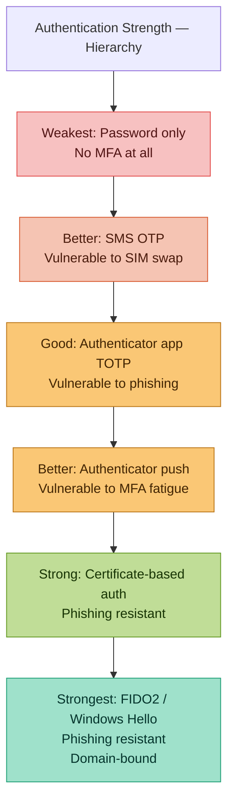

### LAB

**Create a custom authentication strength requiring phishing-resistant MFA for admin roles:**

```
Entra portal
→ Protection
→ Authentication methods
→ Authentication strengths
→ New authentication strength

Name: IPL-Admin-PhishingResistant
Description: Required for all admin role activations
Methods to include:
→ FIDO2 security key
→ Windows Hello for Business
→ Certificate-based authentication (multifactor)
→ Create
```

**Apply in a CA policy scoped to PIM activations:**

```
New CA policy: IPL-PIM-PhishingResistant-MFA

Users: All users
Target resources: Microsoft Azure Management + Microsoft Entra admin center

Conditions:
→ Authentication context: c1 (define custom auth context for PIM)
   Note: use Authentication flows → Authentication context in Entra

Grant:
→ Require authentication strength
→ Select: IPL-Admin-PhishingResistant
→ Enable: Report-only first
```

**Why this matters for the AI identity role:**

When an AI agent activates a PIM role or accesses a privileged resource, the authentication must be workload-identity-based (managed identity, federated credential) — not SMS or push notification. Understanding the strength hierarchy helps you design AI agent authentication that satisfies the same assurance level as phishing-resistant MFA for humans.

### DOCS
- https://learn.microsoft.com/en-us/entra/identity/authentication/concept-authentication-strengths
- https://learn.microsoft.com/en-us/entra/identity/authentication/howto-authentication-passwordless-security-key

---

# PHASE 4 — WORKLOAD & AI IDENTITY

---

## Lab 19 — Service Principals and App Registrations

### WHY

```
Human identity:   User signs in → gets token → accesses resource
Machine identity: App authenticates → gets token → accesses resource

The problem:
Traditional approach uses client secrets (passwords for apps).
Secrets expire. Secrets get committed to code repositories.
Secrets get leaked. Secrets cause breaches.

5,000+ credential leaks per day are found in public GitHub repos.
Almost all of them are application client secrets or API keys.

Modern approach: no secrets at all.
Managed identities and workload identity federation
authenticate without any stored credential.
```

This lab is foundational for the AI identity role.
Every AI agent needs an identity. That identity is a service principal.
How that service principal authenticates determines your security posture.

### THEORY

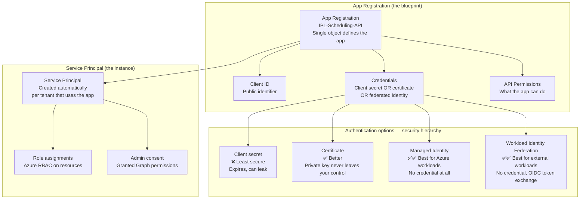

**Three types of identity for machine workloads:**

| Type | When to use | Credential |
|---|---|---|
| App Registration + Client Secret | Legacy apps, quick POCs | Secret (bad) |
| App Registration + Certificate | Apps outside Azure needing Graph access | Certificate (better) |
| System-assigned Managed Identity | Azure resource calling another Azure resource | None (best) |
| User-assigned Managed Identity | Multiple Azure resources sharing one identity | None (best) |
| Workload Identity Federation | GitHub Actions, GCP workloads, external OIDC | None (best) |

### LAB

**Use Case A — Create an App Registration with Graph permissions (portal)**

Scenario: An IPL scoring application needs to read player user profiles from Entra.

```
Entra portal
→ Applications
→ App registrations
→ New registration

Name: IPL-Scoring-API
Supported account types: Accounts in this org directory only
Redirect URI: Leave blank for now
→ Register
```

You now have an App Registration. Note the Application (client) ID and Directory (tenant) ID — your app will need both.

**Add API permissions:**

```
IPL-Scoring-API → API permissions → Add a permission
→ Microsoft Graph → Application permissions
→ Search: User.Read.All → Add
→ Search: Group.Read.All → Add
→ Grant admin consent for <Your domain> Solutions → Yes

Note: Application permissions (not Delegated)
Application = app acts as itself, no signed-in user
Delegated = app acts on behalf of a signed-in user
```

**Create a client secret (what NOT to do in production):**

```
IPL-Scoring-API → Certificates & secrets
→ New client secret
→ Description: Lab-testing-only
→ Expires: 90 days
→ Add

COPY THE SECRET VALUE NOW — it will never be shown again
```

**Authenticate and call Graph with the secret:**

```powershell
# This demonstrates WHY secrets are dangerous
# Hardcoded secret in code = immediate security risk

$tenantId     = "YOUR-TENANT-ID"
$clientId     = "YOUR-CLIENT-ID"
$clientSecret = "YOUR-SECRET-VALUE"  # Never do this in production

$body = @{
    grant_type    = "client_credentials"
    client_id     = $clientId
    client_secret = $clientSecret
    scope         = "https://graph.microsoft.com/.default"
}

$tokenResponse = Invoke-RestMethod `
    -Uri "https://login.microsoftonline.com/$tenantId/oauth2/v2.0/token" `
    -Method POST `
    -Body $body

$token = $tokenResponse.access_token
Write-Host "Token acquired (first 50 chars): $($token.Substring(0,50))..."

# Now call Graph
$headers = @{Authorization = "Bearer $token"}
$users   = Invoke-RestMethod `
    -Uri "https://graph.microsoft.com/v1.0/users?`$select=displayName,userPrincipalName&`$top=5" `
    -Headers $headers

$users.value | Select-Object displayName, userPrincipalName | Format-Table
```

**Use Case B — Replace secret with certificate (better)**

```powershell
# Generate a self-signed certificate
$cert = New-SelfSignedCertificate `
    -Subject "CN=IPL-Scoring-API" `
    -CertStoreLocation "Cert:\CurrentUser\My" `
    -KeyExportPolicy Exportable `
    -KeySpec Signature `
    -KeyLength 2048 `
    -HashAlgorithm SHA256 `
    -NotAfter (Get-Date).AddYears(1)

# Export the public key (upload to Entra)
$certPath = "C:\LabPrep\IPL-Scoring-API.cer"
Export-Certificate -Cert $cert -FilePath $certPath
Write-Host "Upload this file to your App Registration: $certPath"
```

```
Entra portal → IPL-Scoring-API
→ Certificates & secrets → Certificates tab
→ Upload certificate → select IPL-Scoring-API.cer
→ Upload
```

Now authenticate with certificate (no secret in code):

```powershell
Connect-MgGraph -ClientId "YOUR-CLIENT-ID" `
    -TenantId "YOUR-TENANT-ID" `
    -Certificate $cert

Get-MgUser -Top 5 -Property DisplayName,UserPrincipalName |
    Select-Object DisplayName, UserPrincipalName
```

### DOCS
- https://learn.microsoft.com/en-us/entra/identity-platform/app-objects-and-service-principals
- https://learn.microsoft.com/en-us/entra/identity-platform/howto-create-service-principal-portal

---

## Lab 20 — Managed Identities

### WHY

If your Azure Function needs to read a Key Vault secret, it needs an identity to authenticate. The traditional approach: create a client secret, store it in configuration. The problem: you now have a secret that protects access to other secrets. A managed identity eliminates this entirely — Azure manages the credential on your behalf, rotates it automatically, and it never leaves Azure infrastructure.

This is the correct pattern for every AI workload running inside Azure.

### THEORY

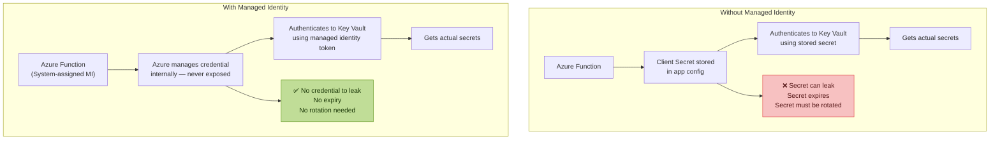

**System-assigned vs User-assigned:**

| Type | Lifecycle | Use when |
|---|---|---|
| System-assigned | Tied to the Azure resource — deleted when resource is deleted | One resource, one identity |
| User-assigned | Independent lifecycle — can be shared | Multiple resources need same identity, or you need the identity before the resource |

### LAB

**Use Case A — Grant Graph permissions to a Managed Identity (Graph only — portal cannot do this)**

This is a core portal limitation. Managed Identities cannot receive Graph API app permissions through the portal UI. PowerShell is the only path.

Scenario: An Azure Function running IPL analytics needs to read Entra user data.

```powershell
Connect-MgGraph -Scopes "AppRoleAssignment.ReadWrite.All","Application.Read.All"

# The managed identity name matches your Azure resource name
$miName = "IPL-Analytics-Function"

# Get the managed identity's service principal
$mi = Get-MgServicePrincipal -Filter "displayName eq '$miName'"
if(-not $mi){
    Write-Host "Managed Identity service principal not found" -ForegroundColor Red
    Write-Host "Ensure the Azure Function has system-assigned MI enabled"
    Write-Host "Then re-run this script"
    exit
}

# Get Microsoft Graph service principal
$graph = Get-MgServicePrincipal `
    -Filter "appId eq '00000003-0000-0000-c000-000000000000'"

# Define permissions to grant
$permissionsToGrant = @(
    "User.Read.All",
    "Group.Read.All",
    "AuditLog.Read.All"
)

foreach($permName in $permissionsToGrant){
    $appRole = $graph.AppRoles | Where-Object {$_.Value -eq $permName}
    if(-not $appRole){
        Write-Host "Permission not found: $permName" -ForegroundColor Yellow
        continue
    }

    try{
        New-MgServicePrincipalAppRoleAssignment `
            -ServicePrincipalId $mi.Id `
            -BodyParameter @{
                principalId = $mi.Id
                resourceId  = $graph.Id
                appRoleId   = $appRole.Id
            }
        Write-Host "Granted: $permName → $miName" -ForegroundColor Green
    }
    catch{
        if($_.Exception.Message -like "*already exists*"){
            Write-Host "Already granted: $permName" -ForegroundColor Yellow
        } else {
            Write-Host "Failed: $permName — $($_.Exception.Message)" -ForegroundColor Red
        }
    }
}
```

**Verify what was granted:**

```powershell
# See all Graph permissions the managed identity holds
Get-MgServicePrincipalAppRoleAssignment -ServicePrincipalId $mi.Id |
    ForEach-Object {
        $resource = Get-MgServicePrincipal -ServicePrincipalId $_.ResourceId
        $role = $resource.AppRoles | Where-Object {$_.Id -eq $_.AppRoleId}
        [PSCustomObject]@{
            Permission = $role.Value
            Resource   = $resource.DisplayName
            Granted    = $_.CreatedDateTime
        }
    } | Format-Table -AutoSize
```

### DOCS
- https://learn.microsoft.com/en-us/entra/identity/managed-identities-azure-resources/overview
- https://learn.microsoft.com/en-us/entra/identity/managed-identities-azure-resources/how-manage-user-assigned-managed-identities

---

## Lab 21 — Workload Identity Federation

### WHY

GitHub Actions workflows need to deploy to Azure. Traditional approach: create a service principal secret, store it as a GitHub secret, use it in the workflow. Problem: secrets in GitHub can be exposed, need rotation, and the access exists permanently whether a workflow is running or not.

Workload Identity Federation eliminates the secret entirely. GitHub Actions gets a short-lived OIDC token from GitHub's identity provider. Azure exchanges that token for an Azure access token. No stored credential anywhere.

This is the same pattern used by GCP workloads calling Azure APIs — which is directly relevant to the Vertex AI cross-cloud scenario in the job description.

### THEORY

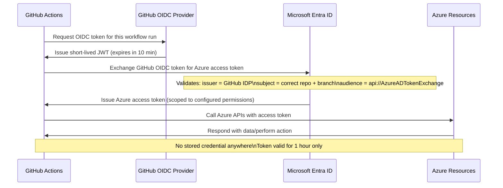

### LAB

**Step 1 — Create App Registration for GitHub Actions**

```
Entra portal → App registrations → New registration
→ Name: IPL-GitHub-Actions-Deploy
→ Register
```

**Step 2 — Add federated credential**

```
IPL-GitHub-Actions-Deploy
→ Certificates & secrets
→ Federated credentials
→ Add credential

Federated credential scenario: GitHub Actions deploying Azure resources
→ Organization: iam-kamran
→ Repository: ipl-azure-entra-labs
→ Entity type: Branch
→ Branch: main
→ Name: github-main-branch
→ Add
```

Add a second credential for PRs:

```
→ Add credential again
→ Entity type: Pull request
→ Name: github-pull-request
→ Add
```

**Step 3 — Grant Azure RBAC to the service principal**

```powershell
$spId         = (Get-MgServicePrincipal `
    -Filter "displayName eq 'IPL-GitHub-Actions-Deploy'").Id
$subscription = (Get-AzSubscription).Id

New-AzRoleAssignment `
    -ObjectId $spId `
    -RoleDefinitionName "Contributor" `
    -Scope "/subscriptions/$subscription"
```

**Step 4 — GitHub Actions workflow using federation**

```yaml
# .github/workflows/entra-identity-test.yml
name: IPL IAM — Identity Verification

on:
  push:
    branches: [main]
  workflow_dispatch:

permissions:
  id-token: write   # Required for OIDC token request
  contents: read

jobs:
  verify-identity:
    runs-on: ubuntu-latest

    steps:
      - uses: actions/checkout@v4

      - name: Azure Login via Workload Identity Federation
        uses: azure/login@v2
        with:
          client-id: ${{ secrets.AZURE_CLIENT_ID }}
          tenant-id: ${{ secrets.AZURE_TENANT_ID }}
          subscription-id: ${{ secrets.AZURE_SUBSCRIPTION_ID }}
          # No client-secret — federation handles authentication

      - name: Verify identity — list Entra users
        run: |
          echo "Authenticated as workload identity — no stored credential used"
          az account show
          az ad user list --query "[?department=='Batting'].{Name:displayName,UPN:userPrincipalName}" \
            --output table

      - name: Run identity health check
        run: |
          az ad group list --query "[?starts_with(displayName,'CSK')].displayName" \
            --output tsv
```

**Step 5 — Store secrets in GitHub (only IDs — no secret value)**

```
GitHub repo → Settings → Secrets and variables → Actions
→ New repository secret
→ AZURE_CLIENT_ID:     your app registration client ID
→ AZURE_TENANT_ID:     your tenant ID
→ AZURE_SUBSCRIPTION_ID: your subscription ID

Note: NO client secret is stored — federation handles auth
```

### DOCS
- https://learn.microsoft.com/en-us/entra/workload-id/workload-identity-federation
- https://learn.microsoft.com/en-us/entra/workload-id/workload-identity-federation-create-trust

---

## Lab 22 — AI Agent Identity (The Core Lab for the Target Role)

### WHY

AI agents are not humans. They do not sign in interactively. They do not use MFA. They act autonomously — executing tasks, calling APIs, accessing data stores — often without a human watching every action. This creates a new identity governance problem:

```
Traditional IAM question: Does this human have the right access?

AI Identity question:
├── Does this AI agent have the right identity?
├── What human delegated what permissions to this agent?
├── Can the agent's permissions exceed the human's permissions?
├── If the agent is compromised — what is the blast radius?
├── If the agent receives a malicious prompt — can it be tricked
│   into using its credentials to perform unauthorised actions?
└── Is every action the agent takes auditable and attributable?
```

### THEORY — The AI Identity threat model

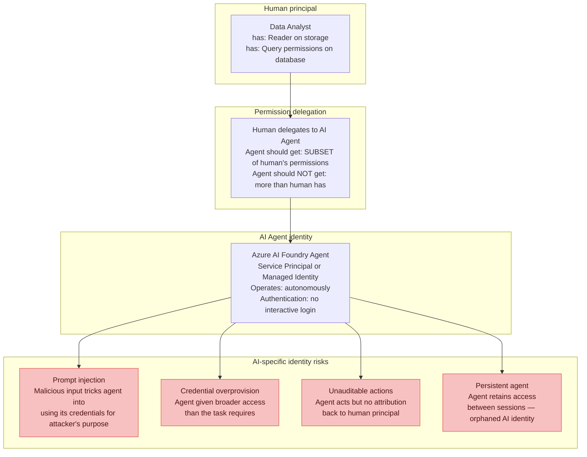

**The permission delegation chain — the most important concept:**

```
Human analyst (Reader + Query)
        │
        │ delegates via access token or managed identity assignment
        ▼
AI Agent (should get ≤ analyst's permissions)
        │
        │ calls APIs, reads data, writes outputs
        ▼
Resources (storage, database, downstream APIs)
```

The agent can NEVER have more permissions than the human who authorised it.
This principle is called the **delegation invariant** and it is the core
governance control for AI identity.

### LAB

**Use Case A — Create an AI Agent identity with least privilege**

Scenario: An IPL analytics AI agent reads match data from storage and writes summaries to a database. Least privilege means: read access to specific storage container only, write access to specific database table only.

**Step 1 — Create a user-assigned managed identity for the agent**

```
Azure portal
→ Search: Managed Identities
→ Create
→ Resource group: IPL-AI-RG
→ Region: Canada Central
→ Name: IPL-Analytics-Agent-MI
→ Review + Create → Create
```

Use user-assigned (not system-assigned) because:
- Agent identity survives resource recreation
- Same identity can be assigned to multiple compute resources
- Identity can be pre-configured before the workload is deployed

**Step 2 — Assign least-privilege RBAC on specific resources**

```powershell
Connect-AzAccount
$mi = Get-AzUserAssignedIdentity -Name "IPL-Analytics-Agent-MI" `
    -ResourceGroupName "IPL-AI-RG"

# Storage: Read access to specific CONTAINER only — not entire storage account
New-AzRoleAssignment `
    -ObjectId $mi.PrincipalId `
    -RoleDefinitionName "Storage Blob Data Reader" `
    -Scope "/subscriptions/SUB-ID/resourceGroups/IPL-AI-RG/providers/Microsoft.Storage/storageAccounts/ipldata/blobServices/default/containers/match-data"

# NOT this — too broad:
# -Scope "/subscriptions/SUB-ID/resourceGroups/IPL-AI-RG/providers/Microsoft.Storage/storageAccounts/ipldata"

Write-Host "Agent has Reader on match-data container ONLY"
Write-Host "Agent cannot read other containers, other storage accounts, or other resource types"
```

**Step 3 — Grant Graph permissions for identity context (PowerShell only)**

```powershell
Connect-MgGraph -Scopes "AppRoleAssignment.ReadWrite.All","Application.Read.All"

$agentMI = Get-MgServicePrincipal -Filter "displayName eq 'IPL-Analytics-Agent-MI'"
$graph   = Get-MgServicePrincipal `
    -Filter "appId eq '00000003-0000-0000-c000-000000000000'"

# Grant ONLY what the agent needs — no broad permissions
$minimalPermissions = @("User.Read.All")   # Read user context only

foreach($perm in $minimalPermissions){
    $role = $graph.AppRoles | Where-Object {$_.Value -eq $perm}
    New-MgServicePrincipalAppRoleAssignment `
        -ServicePrincipalId $agentMI.Id `
        -BodyParameter @{
            principalId = $agentMI.Id
            resourceId  = $graph.Id
            appRoleId   = $role.Id
        }
    Write-Host "Granted: $perm" -ForegroundColor Green
}
```

**Step 4 — Document the delegation chain**

This is the governance artefact that the job description requires.
Every AI agent identity should have a documented delegation chain:

```markdown
# AI Agent Identity — Delegation Record

**Agent name:** IPL-Analytics-Agent
**Agent identity:** IPL-Analytics-Agent-MI (User-assigned Managed Identity)
**Agent principal ID:** [your MI principal ID]
**Created:** 2026-07-02
**Owner:** Kamran Arif (IAM team)
**Authorising human:** [data analyst UPN]

## Permission delegation chain

| Permission | Source | Scope | Justification |
|---|---|---|---|
| Storage Blob Data Reader | Analyst has Contributor on storage | match-data container only | Read match statistics for analysis |
| User.Read.All (Graph) | Admin consent | Tenant-wide | Read player profiles for contextualisation |

## Constraints
- Agent cannot write to storage (read-only delegation)
- Agent cannot access other containers
- Agent cannot create or modify Entra objects
- Agent sessions audited via Sentinel workbook (see Lab 35)

## Lifecycle
- Review every 90 days via access review
- Decommission trigger: when analytics pipeline is retired
- Offboarding: remove RBAC assignments, disable MI, archive audit logs
```

**Step 5 — Detect prompt injection as an identity risk**

```powershell
# Sentinel alert rule — detect anomalous agent behaviour
# (preview — requires Sentinel workspace connected to Entra)

# The concept: normal agent behaviour has predictable API call patterns
# Prompt injection changes those patterns — agent calls APIs it normally would not

# Log query for Sentinel (KQL):
$kqlQuery = @"
AuditLogs
| where InitiatedBy.app.servicePrincipalId == "YOUR-AGENT-MI-PRINCIPAL-ID"
| where OperationName !in (
    "Get user",           // normal — agent reads user profiles
    "Get blob",           // normal — agent reads match data
    "Add member to group" // ANOMALOUS — agent should never modify groups
)
| project TimeGenerated, OperationName, TargetResources, Result
| where Result == "success"
| order by TimeGenerated desc
"@

Write-Host "Add this KQL to Sentinel as an Analytics Rule"
Write-Host "Alert when agent performs operations outside its expected pattern"
Write-Host "This detects prompt injection — agent tricked into using credentials unexpectedly"
```

**Use Case B — AI Agent lifecycle management (onboard and offboard)**

```powershell
# Onboard an AI agent identity — production-grade function
function New-AIAgentIdentity {
    param(
        [string]$AgentName,
        [string]$ResourceGroup,
        [string]$OwnerUPN,
        [string]$Purpose,
        [string[]]$GraphPermissions,
        [hashtable]$AzureRoleAssignments
    )

    Write-Host "=== AI Agent Identity Onboarding: $AgentName ===" -ForegroundColor Cyan

    # Step 1 — Create user-assigned managed identity
    $mi = New-AzUserAssignedIdentity `
        -Name $AgentName `
        -ResourceGroupName $ResourceGroup `
        -Location "canadacentral" `
        -Tag @{
            Owner       = $OwnerUPN
            Purpose     = $Purpose
            CreatedDate = (Get-Date).ToString("yyyy-MM-dd")
            ReviewDate  = (Get-Date).AddDays(90).ToString("yyyy-MM-dd")
            Type        = "AI-Agent-Identity"
        }

    Write-Host "Created MI: $($mi.PrincipalId)" -ForegroundColor Green

    # Step 2 — Grant Graph permissions
    Connect-MgGraph -Scopes "AppRoleAssignment.ReadWrite.All","Application.Read.All"
    $agentSP = Get-MgServicePrincipal -Filter "displayName eq '$AgentName'"
    $graphSP = Get-MgServicePrincipal `
        -Filter "appId eq '00000003-0000-0000-c000-000000000000'"

    foreach($perm in $GraphPermissions){
        $role = $graphSP.AppRoles | Where-Object {$_.Value -eq $perm}
        if($role){
            New-MgServicePrincipalAppRoleAssignment `
                -ServicePrincipalId $agentSP.Id `
                -BodyParameter @{
                    principalId = $agentSP.Id
                    resourceId  = $graphSP.Id
                    appRoleId   = $role.Id
                }
            Write-Host "Granted Graph permission: $perm" -ForegroundColor Green
        }
    }

    # Step 3 — Grant Azure RBAC
    foreach($scope in $AzureRoleAssignments.Keys){
        $roleName = $AzureRoleAssignments[$scope]
        New-AzRoleAssignment `
            -ObjectId $mi.PrincipalId `
            -RoleDefinitionName $roleName `
            -Scope $scope
        Write-Host "Granted Azure role: $roleName on $scope" -ForegroundColor Green
    }

    # Step 4 — Generate delegation record
    $record = @"
# AI Agent Identity Delegation Record
Agent: $AgentName
Principal ID: $($mi.PrincipalId)
Owner: $OwnerUPN
Purpose: $Purpose
Created: $(Get-Date -Format 'yyyy-MM-dd')
Review due: $((Get-Date).AddDays(90).ToString('yyyy-MM-dd'))
Graph permissions: $($GraphPermissions -join ', ')
"@
    $record | Out-File ".\ai-agents\$AgentName-delegation-record.md"
    Write-Host "Delegation record saved" -ForegroundColor Green

    return $mi
}

# Offboard an AI agent identity
function Remove-AIAgentIdentity {
    param([string]$AgentName, [string]$ResourceGroup)

    Write-Host "=== AI Agent Identity Offboarding: $AgentName ===" -ForegroundColor Yellow

    # Remove all Graph permissions first
    $agentSP = Get-MgServicePrincipal -Filter "displayName eq '$AgentName'"
    $assignments = Get-MgServicePrincipalAppRoleAssignment -ServicePrincipalId $agentSP.Id
    foreach($a in $assignments){
        Remove-MgServicePrincipalAppRoleAssignment `
            -ServicePrincipalId $agentSP.Id `
            -AppRoleAssignmentId $a.Id
        Write-Host "Removed Graph permission: $($a.Id)" -ForegroundColor Green
    }

    # Remove Azure RBAC assignments
    $rbac = Get-AzRoleAssignment -ObjectId $agentSP.Id
    foreach($r in $rbac){
        Remove-AzRoleAssignment -InputObject $r
        Write-Host "Removed Azure role: $($r.RoleDefinitionName)" -ForegroundColor Green
    }

    # Delete the managed identity
    Remove-AzUserAssignedIdentity -Name $AgentName -ResourceGroupName $ResourceGroup
    Write-Host "AI Agent identity deleted: $AgentName" -ForegroundColor Green
    Write-Host "Audit logs preserved in Sentinel for 90 days"
}
```

### DOCS
- https://learn.microsoft.com/en-us/entra/workload-id/workload-identities-overview
- https://learn.microsoft.com/en-us/azure/ai-foundry/concepts/identity-based-auth
- https://learn.microsoft.com/en-us/entra/identity/managed-identities-azure-resources/managed-identity-best-practice-recommendations

### TAKEAWAY

AI agents need identities that are governed with the same rigour as privileged human accounts. The three principles: least privilege (agent gets minimum permissions for its specific task), delegation invariant (agent never exceeds the permissions of the human who authorised it), and full auditability (every action taken by the agent is attributable back to the agent identity and the human principal). The prompt injection risk is an identity risk — a compromised agent using its legitimate credentials for an attacker's purposes — and the detection pattern is anomaly detection on the agent's API call signature.

---

# PHASE 5 — MULTI-CLOUD IAM

---

## Lab 27 — AWS IAM + Azure Identity Federation

### WHY

The job description specifies multi-cloud IAM across Azure, GCP, and AWS. An AI workload running in Azure may need to call AWS S3 for data, or a GCP Vertex AI agent may need to authenticate to Azure resources. Identity federation between clouds eliminates the need for static credentials.

### THEORY

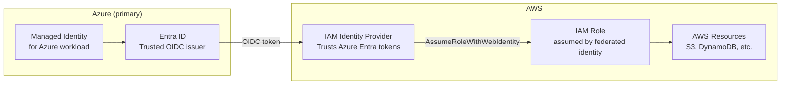

### LAB

**Step 1 — Create OIDC Identity Provider in AWS**

```
AWS Console → IAM → Identity providers → Add provider
→ Provider type: OpenID Connect
→ Provider URL: https://login.microsoftonline.com/YOUR-TENANT-ID/v2.0
→ Get thumbprint
→ Audience: api://AzureADTokenExchange
→ Add provider
```

**Step 2 — Create IAM role trusted by the OIDC provider**

```json
{
  "Version": "2012-10-17",
  "Statement": [{
    "Effect": "Allow",
    "Principal": {
      "Federated": "arn:aws:iam::ACCOUNT-ID:oidc-provider/login.microsoftonline.com/TENANT-ID/v2.0"
    },
    "Action": "sts:AssumeRoleWithWebIdentity",
    "Condition": {
      "StringEquals": {
        "login.microsoftonline.com/TENANT-ID/v2.0:aud": "api://AzureADTokenExchange",
        "login.microsoftonline.com/TENANT-ID/v2.0:sub": "YOUR-MANAGED-IDENTITY-OBJECT-ID"
      }
    }
  }]
}
```

**Step 3 — Azure workload assumes AWS role using managed identity token**

```python
import boto3
import requests

# Get Azure managed identity token scoped for AWS
metadata_url = "http://169.254.169.254/metadata/identity/oauth2/token"
params = {
    "api-version": "2018-02-01",
    "resource": "api://AzureADTokenExchange"
}
headers = {"Metadata": "true"}

response = requests.get(metadata_url, params=params, headers=headers)
azure_token = response.json()["access_token"]

# Exchange Azure token for AWS temporary credentials
sts = boto3.client("sts", region_name="us-east-1")
assumed_role = sts.assume_role_with_web_identity(
    RoleArn="arn:aws:iam::ACCOUNT-ID:role/IPL-Azure-FederatedRole",
    RoleSessionName="IPL-Analytics-Session",
    WebIdentityToken=azure_token,
    DurationSeconds=3600
)

credentials = assumed_role["Credentials"]
print(f"AWS temporary credentials obtained — no stored secret used")
print(f"Expires: {credentials['Expiration']}")

# Now use AWS resources with temporary credentials
s3 = boto3.client(
    "s3",
    aws_access_key_id=credentials["AccessKeyId"],
    aws_secret_access_key=credentials["SecretAccessKey"],
    aws_session_token=credentials["SessionToken"]
)

# List objects in IPL data bucket
objects = s3.list_objects_v2(Bucket="ipl-match-data", Prefix="2026/")
print(f"Found {objects['KeyCount']} match data files")
```

### DOCS
- https://docs.aws.amazon.com/IAM/latest/UserGuide/id_roles_providers_oidc.html
- https://learn.microsoft.com/en-us/entra/workload-id/workload-identity-federation

---

# PHASE 6 — PRIVILEGED ACCESS MANAGEMENT

---

## Lab 31 — CyberArk Concepts and Integration with Entra

### WHY

CyberArk is the market-leading PAM tool. It appears in almost every large enterprise IAM environment. CyberArk manages privileged credentials — root passwords, service account passwords, SSH keys — and provides session recording for all privileged activity. For the AI identity role, CyberArk is relevant when AI agents need to access privileged credentials (database passwords, API keys) securely without those credentials being embedded in code.

### THEORY

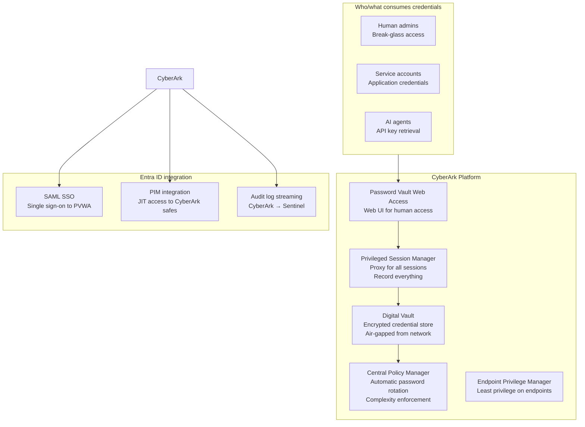

**The CyberArk object model:**

| Object | What it is | IAM equivalent |
|---|---|---|
| Safe | Container for credentials | Access Package / Catalog |
| Account | A managed credential (password, key) | Entitlement |
| Policy | Rules for rotation, access, recording | CA Policy |
| Safe member | Who/what can access a safe | Group membership |
| Session | Recorded privileged session | PIM activation window |

### LAB (Conceptual — requires CyberArk licence)

**CyberArk REST API — retrieve a credential for an AI agent**

This is how an AI agent should retrieve database credentials instead of having them hardcoded:

```python
import requests
import os

# AI agent retrieves credential from CyberArk at runtime
# Credential is never stored in the agent's config or code

class CyberArkCredentialProvider:
    def __init__(self, pvwa_url: str, app_id: str):
        self.pvwa_url = pvwa_url
        self.app_id   = app_id

    def get_credential(self, safe: str, object_name: str) -> dict:
        """
        Retrieve credential from CyberArk Central Credential Provider.
        Uses CCP (non-interactive) — no human login required.
        AI agent authenticates via certificate.
        """
        url = f"{self.pvwa_url}/AIMWebService/api/Accounts"
        params = {
            "AppID":      self.app_id,
            "Safe":       safe,
            "Object":     object_name,
            "reason":     "IPL Analytics pipeline credential retrieval",
        }

        # Certificate-based auth — no secret in code
        response = requests.get(
            url,
            params=params,
            cert=("./agent-cert.pem", "./agent-key.pem"),
            verify=True
        )
        response.raise_for_status()
        data = response.json()

        return {
            "username": data["UserName"],
            "password": data["Content"],
            "address":  data["Address"]
        }

    def rotate_credential(self, safe: str, object_name: str):
        """Trigger immediate rotation after use."""
        # Tell CyberArk to rotate the password immediately
        # This means even if the credential was intercepted,
        # it is invalid before the attacker can use it
        pass

# Usage in AI agent
provider = CyberArkCredentialProvider(
    pvwa_url="https://cyberark.<Your domain>.solutions",
    app_id="IPL-Analytics-Agent"
)

creds = provider.get_credential(
    safe="IPL-Database-Credentials",
    object_name="IPL-Prod-DB-Admin"
)

# Connect to database using retrieved credential
# Credential is never written to disk or logs
print(f"Connected as {creds['username']} — credential retrieved from vault at runtime")
```

**Entra PIM + CyberArk integration concept:**

```
Human admin needs database access:
→ Activates PIM role (User Administrator scoped to DB team)
→ PIM activation triggers CyberArk workflow
→ CyberArk grants time-limited safe access (same duration as PIM)
→ Admin uses PVWA to connect — session recorded
→ PIM expires → CyberArk access expires simultaneously
→ Full audit: PIM log + CyberArk session recording
```

### DOCS
- https://docs.cyberark.com/Product-Doc/OnlineHelp/PAS/Latest/en/Content/HomeTilesLan/HP-Tiles.htm
- https://docs.cyberark.com/Product-Doc/OnlineHelp/PAS/Latest/en/Content/PASIMP/Integrating-with-Microsoft-Entra-ID.htm

---

## Lab 32 — Delinea Secret Server

### WHY

Delinea (formerly Thycotic) is the main alternative to CyberArk in the mid-market. Many enterprises use Secret Server for secrets management — API keys, service account passwords, SSH keys. For AI workloads, Secret Server provides an API that agents can call to retrieve credentials at runtime without storing them.

### THEORY

Delinea Secret Server architecture is similar to CyberArk but simpler:

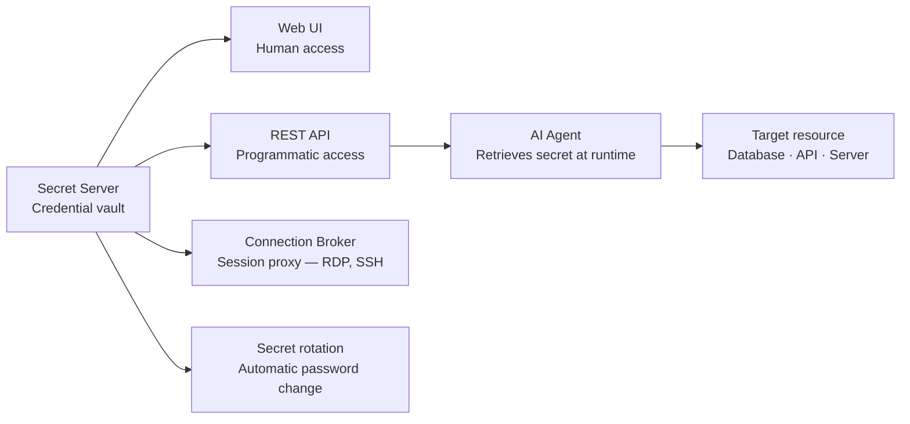

### LAB

**Retrieve a secret via Delinea REST API:**

```powershell
# Delinea Secret Server — PowerShell credential retrieval
function Get-DelineaSecret {
    param(
        [string]$SecretServerUrl,
        [string]$SecretId,
        [string]$Username,
        [string]$Password
    )

    # Step 1 — Authenticate to Secret Server
    $tokenBody = @{
        username   = $Username
        password   = $Password
        grant_type = "password"
    }

    $tokenResponse = Invoke-RestMethod `
        -Uri "$SecretServerUrl/oauth2/token" `
        -Method POST `
        -Body $tokenBody

    $token = $tokenResponse.access_token

    # Step 2 — Retrieve the secret
    $headers = @{Authorization = "Bearer $token"}

    $secret = Invoke-RestMethod `
        -Uri "$SecretServerUrl/api/v1/secrets/$SecretId" `
        -Headers $headers

    # Step 3 — Extract credential fields
    $username = ($secret.items | Where-Object {$_.fieldName -eq "Username"}).itemValue
    $password = ($secret.items | Where-Object {$_.fieldName -eq "Password"}).itemValue

    Write-Host "Secret retrieved: $($secret.name)"
    Write-Host "Username: $username"
    # Never log the password

    return @{
        Username = $username
        Password = $password
    }
}

# Usage by AI agent — no hardcoded credentials
$creds = Get-DelineaSecret `
    -SecretServerUrl "https://secrets.<Your domain>.solutions" `
    -SecretId 42 `
    -Username $env:SS_SERVICE_ACCOUNT `
    -Password $env:SS_SERVICE_PASSWORD
```

### DOCS
- https://docs.delinea.com/online-help/secret-server/restapi/

---

# PHASE 7 — DETECTION & AUDIT

---

## Lab 35 — Sentinel Identity Workbook

### WHY

Identity telemetry in a SIEM is what makes your IAM programme auditable and detectable. Entra generates hundreds of identity-related signals — sign-in logs, audit logs, PIM activations, CA policy matches, risky users. Without a SIEM, these signals exist but nobody sees them until after a breach. With Sentinel, you create detection rules that alert on suspicious identity patterns before damage occurs.

For the AI identity role specifically: AI agent anomalous behaviour shows up as unusual API call patterns in audit logs. Sentinel KQL queries correlate those patterns.

### THEORY

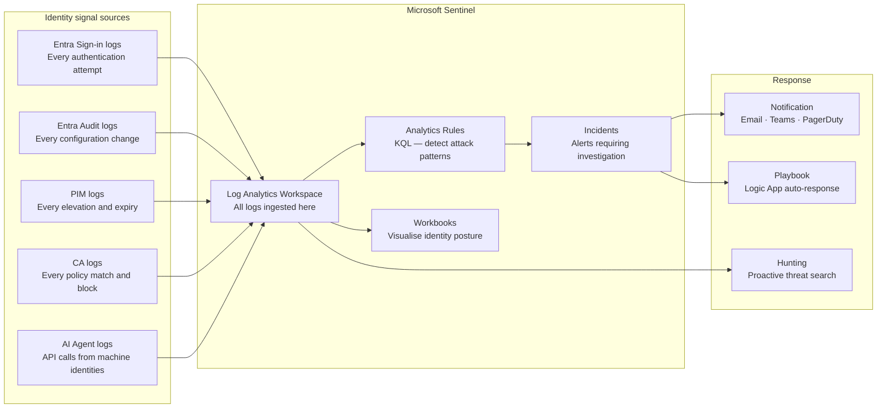

### LAB

**KQL queries for identity threat detection:**

```kql
// Detection 1 — PIM activation outside business hours
// Risk: legitimate users activate during work hours
// Suspicious: activations at 3am suggest account compromise

PrivilegedIdentityManagementEvents
| where TimeGenerated > ago(7d)
| where OperationName == "SelfActivate"
| extend ActivationHour = hourofday(TimeGenerated)
| where ActivationHour !between (8 .. 18)  // outside 8am-6pm
| project TimeGenerated, RequestorId, RoleName = Properties.roleDefinitionName,
          Justification = Properties.justification, ActivationHour
| order by TimeGenerated desc
```

```kql
// Detection 2 — AI agent calling APIs outside its expected pattern
// Replace with your actual managed identity object ID

let agentObjectId = "YOUR-AI-AGENT-MI-OBJECT-ID";
let normalOperations = dynamic(["Get user", "List groups", "Get blob"]);

AuditLogs
| where TimeGenerated > ago(24h)
| where InitiatedBy.app.servicePrincipalId == agentObjectId
| where OperationName !in (normalOperations)
| project TimeGenerated, OperationName, 
          TargetResource = TargetResources[0].displayName,
          Result
| where Result == "success"
| order by TimeGenerated desc
// Any results here = potential prompt injection or misconfiguration
```

```kql
// Detection 3 — Impossible travel
// User signs in from two geographically impossible locations

let travelThresholdKm = 500;

SigninLogs
| where TimeGenerated > ago(1d)
| where ResultType == 0  // successful sign-in
| project TimeGenerated, UserPrincipalName, IPAddress,
          Location = todynamic(LocationDetails)
| extend City    = Location.city,
         Country = Location.countryOrRegion,
         Lat     = todouble(Location.geoCoordinates.latitude),
         Lon     = todouble(Location.geoCoordinates.longitude)
| sort by UserPrincipalName asc, TimeGenerated asc
| extend PrevTime = prev(TimeGenerated),
         PrevLat  = prev(Lat),
         PrevLon  = prev(Lon),
         PrevUser = prev(UserPrincipalName)
| where UserPrincipalName == PrevUser
| extend TimeDiffHours = datetime_diff('minute', TimeGenerated, PrevTime) / 60.0
| extend DistanceKm = geo_distance_2points(Lon, Lat, PrevLon, PrevLat) / 1000
| where DistanceKm > travelThresholdKm and TimeDiffHours < 2
| project TimeGenerated, UserPrincipalName, DistanceKm, TimeDiffHours,
          IPAddress, City, Country
| order by TimeGenerated desc
```

```kql
// Detection 4 — Orphaned AI agent identity
// Managed identity active but has not called any API in 30+ days
// Indicates potentially forgotten AI agent that should be decommissioned

AuditLogs
| where TimeGenerated > ago(30d)
| where InitiatedBy.app.servicePrincipalId != ""
| summarize LastSeen = max(TimeGenerated) by 
    AgentId = InitiatedBy.app.servicePrincipalId,
    AgentName = InitiatedBy.app.displayName
| where LastSeen < ago(30d)
| project AgentName, AgentId, LastSeen,
          DaysSinceLastActivity = datetime_diff('day', now(), LastSeen)
| order by DaysSinceLastActivity desc
// These are candidates for decommissioning
```

### DOCS
- https://learn.microsoft.com/en-us/azure/sentinel/overview
- https://learn.microsoft.com/en-us/azure/sentinel/detect-threats-built-in

---

# PHASE 8 — OKTA

---

## Lab 39 — Okta Workforce Identity Foundations

### WHY

Okta is the dominant cloud-native identity provider in enterprises that are not primarily Microsoft-stack. Many clients run Okta for SSO + MFA while also having Entra for Microsoft 365. Understanding Okta means you can work in both environments and explain the differences and integration points.

### THEORY

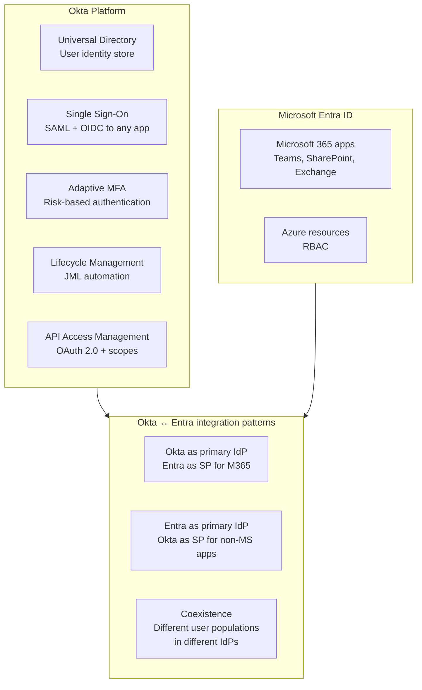

**Okta vs Entra — concept mapping:**

| Concept | Okta term | Entra term |
|---|---|---|
| Identity store | Universal Directory | Entra ID directory |
| Policy engine | Sign-on Policy | Conditional Access |
| MFA | Okta Verify | Microsoft Authenticator |
| App integration | Application | Enterprise Application |
| Provisioning | Lifecycle Management | Lifecycle Workflows + SCIM |
| Privileged access | Okta Privileged Access | PIM |
| Developer identity | CIAM | External ID |
| API gateway | API Access Management | Entra ID + APIM |

### LAB

**Sign up for free Okta Developer tenant:**
```
developer.okta.com → Create free account
Your org URL: https://dev-XXXXXXX.okta.com
Admin console: https://dev-XXXXXXX-admin.okta.com
```

**Use Case A — SAML SSO integration**

```
Okta Admin → Applications → Browse App Catalog
→ Search: "SAML Test App" or any catalog app
→ Add Integration
→ General → configure SAML settings
→ Assignments → assign to "Everyone" or a test group
→ Test SSO by opening app from Okta dashboard
```

**Use Case B — Okta Lifecycle Management (JML automation)**

```
Okta Admin → Workflow → Create Workflow
→ Trigger: User added to group "IPL-Players"
→ Action 1: Activate user account
→ Action 2: Assign app "IPL-Scheduling"
→ Action 3: Send welcome email
→ Save and test
```

**Use Case C — Okta SCIM provisioning to Entra (or vice versa)**

```
Okta Admin → Directory → Directory Integrations
→ Add Active Directory or Microsoft Entra ID
→ Install Okta AD Agent on Windows Server
→ Configure sync direction: Okta → AD or AD → Okta
→ Define attribute mappings
→ Test with a pilot group before full rollout
```

**Use Case D — Okta API Access Management (OAuth scopes for AI agents)**

```
Okta Admin → Security → API → Add Authorization Server
→ Name: IPL-AI-API
→ Audience: api://ipl-analytics
→ Add scopes:
   - analytics:read (AI agent can read data)
   - analytics:write (restricted — human approval required)
→ Add access policy:
   - Machine-to-machine clients: grant analytics:read automatically
   - analytics:write: require step-up authentication
```

### DOCS
- https://developer.okta.com/docs/
- https://help.okta.com/en-us/content/topics/apps/apps_app_integration_wizard_saml.htm
- https://developer.okta.com/docs/concepts/oauth-openid/

---

# PHASE 9 — SAILPOINT

---

## Lab 45 — SailPoint IdentityIQ Concepts

### WHY

SailPoint IIQ is the dominant IGA platform in large enterprises — banks, insurance, healthcare, government. While Entra IGA covers Microsoft-centric environments, SailPoint governs identity across every application in an enterprise estate — SAP, Oracle, mainframes, RACF, custom apps. Many IAM consulting engagements involve SailPoint.

### THEORY

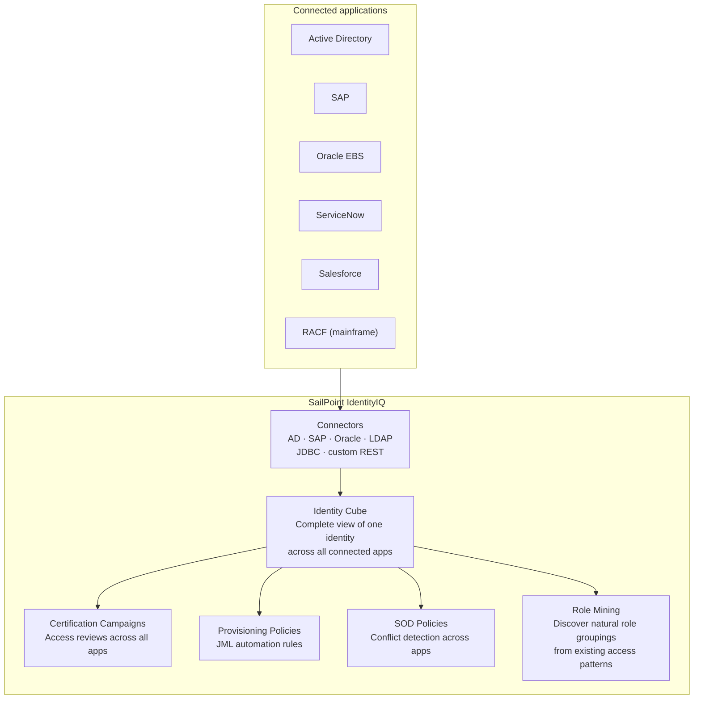

**SailPoint vs Entra IGA — feature comparison:**

| Capability | SailPoint IIQ | Entra IGA |
|---|---|---|
| Connector library | 200+ pre-built | ~100 SCIM apps + custom |
| Mainframe identity | RACF, ACF2, TopSecret | Not supported |
| Role mining | Native AI-driven | Not available |
| SOD policy complexity | Enterprise-grade, multi-app | Single-tenant, Entra apps only |
| Certification granularity | Entitlement-level | Group/app/role level |
| Workflow engine | Java-based BPM | Logic Apps + Lifecycle Workflows |
| Target market | Large enterprise ($1B+ revenue) | SMB to enterprise (Microsoft-first) |
| Licence model | Per-managed-identity | Per-user P2 + Governance |

### LAB (Conceptual — requires SailPoint IIQ licence)

**SailPoint Developer Community — free access:**
```
https://developer.sailpoint.com/
→ SailPoint IdentityNow (cloud) — free developer tenant
→ SailPoint IIQ — requires licence (check with employer)
```

**Key concepts to demonstrate understanding:**

```java
// SailPoint IIQ rule — Joiner provisioning (BeanShell/Java)
// This is what SailPoint uses instead of Lifecycle Workflows

import sailpoint.object.*;
import sailpoint.api.*;

public Object execute(SailPointContext context, Map args) throws Exception {

    Identity identity = (Identity) args.get("identity");
    String  dept      = identity.getAttribute("department");
    String  location  = identity.getAttribute("location");

    // Determine what access to provision based on attributes
    List rolesToAssign = new ArrayList();

    if("Batting".equals(dept)){
        rolesToAssign.add("CSK-Batting-Standard");
    }

    if("Canada".equals(location)){
        rolesToAssign.add("Canada-Office-Access");
    }

    // This is the Identity Cube concept — SailPoint builds a complete
    // view of every identity and their access across all connected apps
    // Then provisions based on rules like this one

    return rolesToAssign;
}
```

**SailPoint IIQ REST API — equivalent of Microsoft Graph:**

```powershell
# Authenticate to SailPoint IIQ
$iiqUrl  = "https://iiq.<Your domain>.solutions/identityiq"
$session = Invoke-RestMethod `
    -Uri "$iiqUrl/rest/login" `
    -Method POST `
    -Body "username=admin&password=PASSWORD" `
    -SessionVariable "iiqSession"

# Get identity details (equivalent to Get-MgUser)
$identity = Invoke-RestMethod `
    -Uri "$iiqUrl/rest/identities/ruturaj.gaikwad" `
    -WebSession $iiqSession

Write-Host "Identity: $($identity.name)"
Write-Host "Entitlements: $($identity.links.Count) connected accounts"

# List all entitlements for an identity
# (equivalent to Get-MgUserMemberOf)
$identity.links | ForEach-Object {
    Write-Host "App: $($_.application.name) — Account: $($_.nativeIdentity)"
}
```

### DOCS
- https://developer.sailpoint.com/docs/
- https://community.sailpoint.com/
- https://documentation.sailpoint.com/identityiq/help/iiq_landing_page.html

---

## Weekend study plan

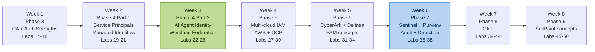

---

## Role readiness checklist

**Traditional IAM (already built in Phase 1-2):**
- [x] Entra ID user and group management
- [x] Hybrid identity — Cloud Sync and AD
- [x] Administrative Units and scoped delegation
- [x] Entitlement Management — access packages
- [x] Access Reviews — certification campaigns
- [x] PIM — just-in-time elevation
- [x] Separation of Duties enforcement
- [ ] Conditional Access and Zero Trust (Phase 3)

**Workload & AI Identity (Phase 4):**
- [ ] Service principals and app registrations
- [ ] Managed identities — system and user assigned
- [ ] Workload identity federation — no stored secrets
- [ ] AI agent identity lifecycle — onboard, govern, offboard
- [ ] Delegation chain documentation
- [ ] Prompt injection as identity risk — detection pattern

**Multi-cloud (Phase 5):**
- [ ] AWS IAM role federation from Entra
- [ ] GCP Workload Identity Pool
- [ ] Cross-cloud RBAC design
- [ ] ABAC across cloud boundaries

**PAM (Phase 6):**
- [ ] CyberArk architecture and object model
- [ ] Delinea Secret Server API
- [ ] Session recording and audit integration
- [ ] PIM + PAM combined workflow

**Detection (Phase 7):**
- [ ] Sentinel workspace and data connectors
- [ ] KQL for identity threat detection
- [ ] AI agent anomaly detection
- [ ] Purview data sensitivity integration

**Okta (Phase 8):**
- [ ] Universal Directory and Sign-on Policies
- [ ] SAML SSO integration
- [ ] Lifecycle Management workflows
- [ ] API Access Management for machine identities

**SailPoint (Phase 9):**
- [ ] Identity Cube concept
- [ ] Certification Campaigns
- [ ] Provisioning policies and BeanShell rules
- [ ] SOD policy configuration
- [ ] IIQ REST API

---

*This curriculum builds Traditional IAM → Workload Identity → AI Identity → Multi-cloud → PAM → Detection → Okta → SailPoint.*  
*Every lab is grounded in a real enterprise problem.*  
*Phase 4 Lab 22 (AI Agent Identity) is the core differentiator for the target role.*

