# Enterprise IAM Lab Plan — Human + AI Workload Identity
## End-to-End Hands-On Curriculum
### Entra ID · SailPoint · Okta · CyberArk · Delinea · AI Identity

**Author:** Kamran Arif  - https://www.linkedin.com/in/karifa/
**Target role:** IAM Engineer — AI Workload Identity & Traditional IAM  
**Last updated:** 2026-07-02  


---

## How to use this guide

Every lab follows this structure:
```
WHY       → The real-world problem this lab solves
THEORY    → Conceptual foundation before touching the portal
DIAGRAM   → Architecture of what you are building
LAB       → Step-by-step — portal first, Graph where it adds value
VERIFY    → How to confirm it worked
DOCS      → Official Microsoft/vendor documentation links
TAKEAWAY  → What you now understand
```

Portal-first means you understand what you are doing.
Graph is introduced where the portal cannot do it or where
automation is the production-grade approach.

---

## Architecture — full environment

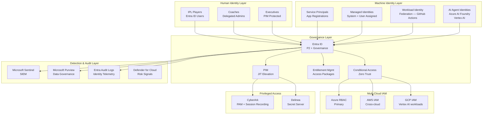

---

## Lab curriculum — complete map

### Phase 1 — Human Identity Foundation (Labs 01–08)
Already completed. Reference: Phase1_Learning_Reference.md

### Phase 2 — Identity Governance (Labs 09–13)
Already completed. Reference: Phase2_IGA_Labs.md

### Phase 3 — Authentication & Zero Trust (Labs 14–18)
Conditional Access, MFA, Named Locations, Authentication Strengths

### Phase 4 — Workload & AI Identity (Labs 19–26)
Service Principals, Managed Identities, Workload Federation, AI Agents

### Phase 5 — Multi-Cloud IAM (Labs 27–30)
AWS IAM, GCP IAM, Cross-cloud RBAC, ABAC

### Phase 6 — PAM (Labs 31–34)
CyberArk, Delinea, Session Recording, Secret Rotation

### Phase 7 — Detection & Audit (Labs 35–38)
Sentinel, Purview, Identity Risk Signals, Audit Correlation

### Phase 8 — Okta (Labs 39–44)
Workforce Identity, SCIM, Okta Lifecycle, SAML, OIDC

### Phase 9 — SailPoint (Labs 45–50)
IIQ concepts, Identity Cube, Certification Campaigns, Role Mining

---

# PHASE 3 — AUTHENTICATION & ZERO TRUST

---

## Lab 14 — Conditional Access Foundations

### WHY

```
Without Conditional Access:
User has valid username and password
→ Signs in from a café in a foreign country at 3am
→ Access granted — no questions asked
→ Attacker with stolen credentials: same experience

With Conditional Access:
→ Location: untrusted
→ Time: unusual
→ Device: unknown
→ Risk: elevated
→ Policy fires: require MFA + compliant device
→ Attacker cannot complete MFA — blocked
```

CA is the policy engine of Zero Trust.
Every sign-in is evaluated. Trust is never assumed.

### THEORY

Zero Trust principle: **never trust, always verify.**

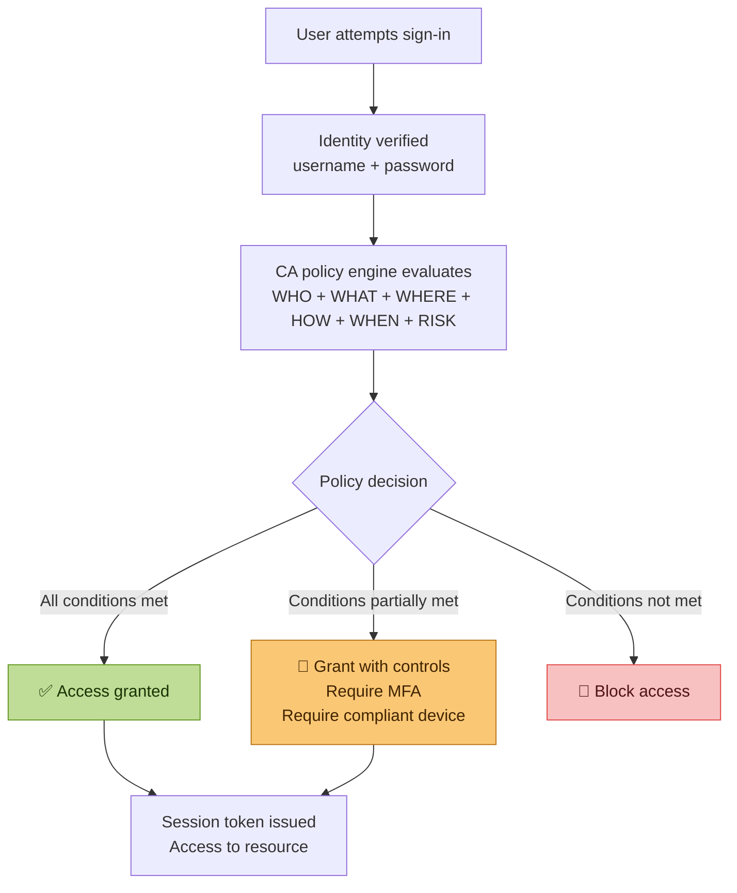

**The six CA signal inputs:**

| Signal | Examples |
|---|---|
| User/Group | Who is signing in — player, coach, admin, AI agent |
| Application | What app — Teams, Azure portal, custom API |
| Location | Named location (trusted office IP) vs anonymous proxy |
| Device | Entra joined, compliant, hybrid joined, unknown |
| Risk (Identity Protection) | Low, medium, high — based on sign-in behaviour |
| Authentication strength | Password only, MFA, phishing-resistant MFA |

**The three CA outcomes:**

```
Block           → access denied entirely
Grant           → access allowed — optionally with conditions
Session control → access allowed but with restrictions
                  (app enforced restrictions, sign-in frequency,
                   persistent browser session controls)
```

### DIAGRAM

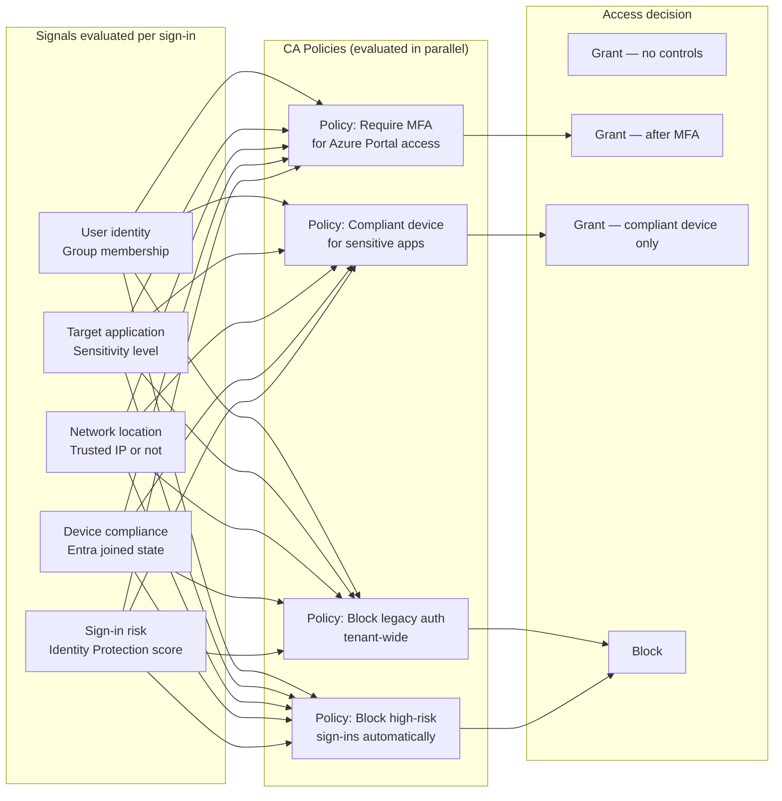

### LAB

**Use Case A — Require MFA for Azure Portal access**

Scenario: No player should access the Azure/Entra portal without MFA.
Admin tasks require elevated assurance beyond password alone.

```
Entra portal
→ Protection
→ Conditional Access
→ Policies
→ New policy

Name: IPL-Require-MFA-Azure-Portal

Assignments:
→ Users: Include → All users
→ Exclude → your break-glass account (CRITICAL — always exclude)
→ Target resources: Include → Select apps
   → Search: Microsoft Azure Management
   → Select also: Microsoft Entra admin center

Conditions: (leave as default for this policy)

Access controls → Grant
→ Grant access
→ Require multifactor authentication
→ Select

Enable policy: Report-only FIRST (not On)
→ Create
```

**CRITICAL — break-glass account exclusion:**

Before enabling ANY CA policy, create and exclude a break-glass account.
If your CA policy accidentally locks everyone out — including yourself —
the break-glass account bypasses CA and lets you recover.

```powershell
Connect-MgGraph -Scopes "User.ReadWrite.All","Group.ReadWrite.All"

# Create break-glass account
$breakGlass = New-MgUser -BodyParameter @{
    DisplayName       = "Break-Glass Emergency"
    UserPrincipalName = "breakglass@ansari.solutions"
    AccountEnabled    = $true
    UsageLocation     = "CA"
    PasswordProfile   = @{
        ForceChangePasswordNextSignIn = $false
        Password = "BG@Emergency2026!"  # Store securely offline
    }
}

# Assign Global Admin to break-glass
$gaRoleId = (Get-MgRoleManagementDirectoryRoleDefinition `
    -Filter "displayName eq 'Global Administrator'").Id

New-MgRoleManagementDirectoryRoleAssignment -BodyParameter @{
    principalId      = $breakGlass.Id
    roleDefinitionId = $gaRoleId
    directoryScopeId = "/"
}

Write-Host "Break-glass created: $($breakGlass.UserPrincipalName)"
Write-Host "CRITICAL: Store credentials offline in a sealed envelope"
Write-Host "CRITICAL: Exclude this account from ALL CA policies"
Write-Host "CRITICAL: Set up alerts if this account ever signs in"
```

**Test in Report-only mode before enabling:**

```
CA → Policies → IPL-Require-MFA-Azure-Portal
→ Insights and reporting tab
→ Sign in as a test user without MFA registered
→ Check what the policy would have done
→ Confirm: "would have required MFA"
→ Only then switch from Report-only to On
```

**Use Case B — Block legacy authentication**

Legacy auth (SMTP, IMAP, POP3, older Office protocols) cannot do MFA.
Any policy requiring MFA is bypassed by legacy auth clients.
Block it tenant-wide.

```
New policy: IPL-Block-Legacy-Auth

Users: All users (exclude break-glass)
Target resources: All cloud apps

Conditions:
→ Client apps: Yes
→ Select: Exchange ActiveSync clients + Other clients
→ (do NOT select Browser or Mobile apps — only legacy)

Access controls → Block access
→ Enable: On (safe to enable directly — legacy auth has no legitimate use)
→ Create
```

**Use Case C — Named location for India (trusted)**

```
CA → Named locations → New location → Countries location
→ Name: IPL-India
→ Select countries: India
→ Save

CA → Named locations → New IP ranges location
→ Name: IPL-Mumbai-Office
→ IP ranges: your office IP/CIDR
→ Mark as trusted: Yes
→ Save
```

Now use these in a CA policy:

```
New policy: IPL-Risky-Location-MFA

Users: All players (IPL-All-Players group)
Target resources: All cloud apps

Conditions:
→ Locations: Yes
→ Include: Any location
→ Exclude: IPL-India (trusted country)

Grant: Require MFA
→ Enable: On
```

Effect: players signing in from outside India must complete MFA.
Players in India get standard access.

### VERIFY

```powershell
Connect-MgGraph -Scopes "Policy.Read.All"

# List all CA policies and their states
Get-MgIdentityConditionalAccessPolicy -All |
    Select-Object DisplayName, State,
        @{N='Users';  E={$_.Conditions.Users.IncludeUsers}},
        @{N='Apps';   E={$_.Conditions.Applications.IncludeApplications}},
        @{N='Grant';  E={$_.GrantControls.BuiltInControls}} |
    Format-Table -AutoSize
```

**Graph — better for backup and bulk operations:**

```powershell
# Export all CA policies as JSON backup before any changes
Get-MgIdentityConditionalAccessPolicy -All |
    ConvertTo-Json -Depth 10 |
    Out-File "CA-Policies-Backup-$(Get-Date -Format 'yyyyMMdd').json"

# Clone a policy via Graph (portal has no clone button)
$source = Get-MgIdentityConditionalAccessPolicy -ConditionalAccessPolicyId "SOURCE-ID"
$clone  = $source | ConvertTo-Json -Depth 10 | ConvertFrom-Json
$clone.displayName = "$($source.displayName) — Copy"
$clone.state       = "disabled"
"id","createdDateTime","modifiedDateTime" | ForEach-Object {
    $clone.PSObject.Properties.Remove($_)
}
New-MgIdentityConditionalAccessPolicy -BodyParameter $clone
```

### DOCS
- https://learn.microsoft.com/en-us/entra/identity/conditional-access/overview
- https://learn.microsoft.com/en-us/entra/identity/conditional-access/plan-conditional-access
- https://learn.microsoft.com/en-us/entra/identity/conditional-access/howto-conditional-access-policy-all-users-mfa

### TAKEAWAY

CA is a policy engine not a feature. Every sign-in produces a set of signals. Policies evaluate those signals. The outcome is grant, grant-with-controls, or block. Report-only mode is not optional — it is the professional way to test before going live. The break-glass account is not optional either — one misconfigured CA policy without a break-glass account means locked out of your own tenant.

---

## Lab 15 — Authentication Strengths & Phishing-Resistant MFA

### WHY

Not all MFA is equal. A one-time SMS code can be intercepted (SIM swap, SS7 attack). An authenticator app push notification can be approved by an exhausted user (MFA fatigue attack). Phishing-resistant MFA — FIDO2 security keys and Windows Hello — cannot be intercepted or socially engineered because the cryptographic response is bound to the specific website domain.

For the AI identity role specifically: AI agents authenticating to APIs need credential types that are cryptographically verifiable without human interaction. Understanding the MFA strength hierarchy is the foundation for designing AI workload authentication.

### THEORY

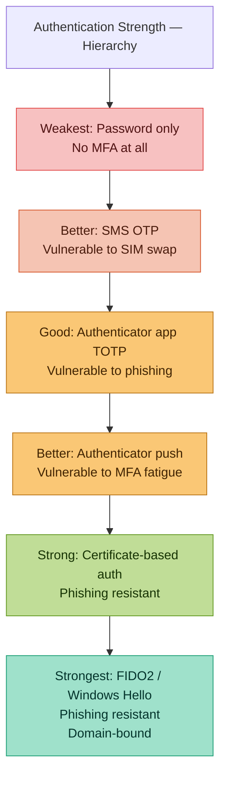

### LAB

**Create a custom authentication strength requiring phishing-resistant MFA for admin roles:**

```
Entra portal
→ Protection
→ Authentication methods
→ Authentication strengths
→ New authentication strength

Name: IPL-Admin-PhishingResistant
Description: Required for all admin role activations
Methods to include:
→ FIDO2 security key
→ Windows Hello for Business
→ Certificate-based authentication (multifactor)
→ Create
```

**Apply in a CA policy scoped to PIM activations:**

```
New CA policy: IPL-PIM-PhishingResistant-MFA

Users: All users
Target resources: Microsoft Azure Management + Microsoft Entra admin center

Conditions:
→ Authentication context: c1 (define custom auth context for PIM)
   Note: use Authentication flows → Authentication context in Entra

Grant:
→ Require authentication strength
→ Select: IPL-Admin-PhishingResistant
→ Enable: Report-only first
```

**Why this matters for the AI identity role:**

When an AI agent activates a PIM role or accesses a privileged resource, the authentication must be workload-identity-based (managed identity, federated credential) — not SMS or push notification. Understanding the strength hierarchy helps you design AI agent authentication that satisfies the same assurance level as phishing-resistant MFA for humans.

### DOCS
- https://learn.microsoft.com/en-us/entra/identity/authentication/concept-authentication-strengths
- https://learn.microsoft.com/en-us/entra/identity/authentication/howto-authentication-passwordless-security-key

---

# PHASE 4 — WORKLOAD & AI IDENTITY

---

## Lab 19 — Service Principals and App Registrations

### WHY

```
Human identity:   User signs in → gets token → accesses resource
Machine identity: App authenticates → gets token → accesses resource

The problem:
Traditional approach uses client secrets (passwords for apps).
Secrets expire. Secrets get committed to code repositories.
Secrets get leaked. Secrets cause breaches.

5,000+ credential leaks per day are found in public GitHub repos.
Almost all of them are application client secrets or API keys.

Modern approach: no secrets at all.
Managed identities and workload identity federation
authenticate without any stored credential.
```

This lab is foundational for the AI identity role.
Every AI agent needs an identity. That identity is a service principal.
How that service principal authenticates determines your security posture.

### THEORY

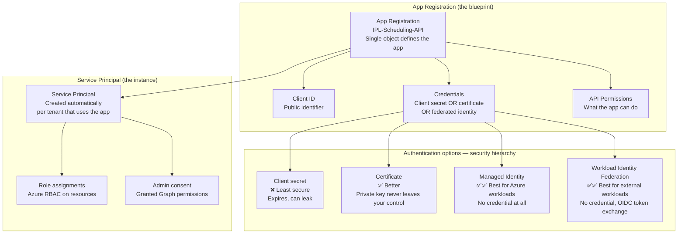

**Three types of identity for machine workloads:**

| Type | When to use | Credential |
|---|---|---|
| App Registration + Client Secret | Legacy apps, quick POCs | Secret (bad) |
| App Registration + Certificate | Apps outside Azure needing Graph access | Certificate (better) |
| System-assigned Managed Identity | Azure resource calling another Azure resource | None (best) |
| User-assigned Managed Identity | Multiple Azure resources sharing one identity | None (best) |
| Workload Identity Federation | GitHub Actions, GCP workloads, external OIDC | None (best) |

### LAB

**Use Case A — Create an App Registration with Graph permissions (portal)**

Scenario: An IPL scoring application needs to read player user profiles from Entra.

```
Entra portal
→ Applications
→ App registrations
→ New registration

Name: IPL-Scoring-API
Supported account types: Accounts in this org directory only
Redirect URI: Leave blank for now
→ Register
```

You now have an App Registration. Note the Application (client) ID and Directory (tenant) ID — your app will need both.

**Add API permissions:**

```
IPL-Scoring-API → API permissions → Add a permission
→ Microsoft Graph → Application permissions
→ Search: User.Read.All → Add
→ Search: Group.Read.All → Add
→ Grant admin consent for Ansari Solutions → Yes

Note: Application permissions (not Delegated)
Application = app acts as itself, no signed-in user
Delegated = app acts on behalf of a signed-in user
```

**Create a client secret (what NOT to do in production):**

```
IPL-Scoring-API → Certificates & secrets
→ New client secret
→ Description: Lab-testing-only
→ Expires: 90 days
→ Add

COPY THE SECRET VALUE NOW — it will never be shown again
```

**Authenticate and call Graph with the secret:**

```powershell
# This demonstrates WHY secrets are dangerous
# Hardcoded secret in code = immediate security risk

$tenantId     = "YOUR-TENANT-ID"
$clientId     = "YOUR-CLIENT-ID"
$clientSecret = "YOUR-SECRET-VALUE"  # Never do this in production

$body = @{
    grant_type    = "client_credentials"
    client_id     = $clientId
    client_secret = $clientSecret
    scope         = "https://graph.microsoft.com/.default"
}

$tokenResponse = Invoke-RestMethod `
    -Uri "https://login.microsoftonline.com/$tenantId/oauth2/v2.0/token" `
    -Method POST `
    -Body $body

$token = $tokenResponse.access_token
Write-Host "Token acquired (first 50 chars): $($token.Substring(0,50))..."

# Now call Graph
$headers = @{Authorization = "Bearer $token"}
$users   = Invoke-RestMethod `
    -Uri "https://graph.microsoft.com/v1.0/users?`$select=displayName,userPrincipalName&`$top=5" `
    -Headers $headers

$users.value | Select-Object displayName, userPrincipalName | Format-Table
```

**Use Case B — Replace secret with certificate (better)**

```powershell
# Generate a self-signed certificate
$cert = New-SelfSignedCertificate `
    -Subject "CN=IPL-Scoring-API" `
    -CertStoreLocation "Cert:\CurrentUser\My" `
    -KeyExportPolicy Exportable `
    -KeySpec Signature `
    -KeyLength 2048 `
    -HashAlgorithm SHA256 `
    -NotAfter (Get-Date).AddYears(1)

# Export the public key (upload to Entra)
$certPath = "C:\LabPrep\IPL-Scoring-API.cer"
Export-Certificate -Cert $cert -FilePath $certPath
Write-Host "Upload this file to your App Registration: $certPath"
```

```
Entra portal → IPL-Scoring-API
→ Certificates & secrets → Certificates tab
→ Upload certificate → select IPL-Scoring-API.cer
→ Upload
```

Now authenticate with certificate (no secret in code):

```powershell
Connect-MgGraph -ClientId "YOUR-CLIENT-ID" `
    -TenantId "YOUR-TENANT-ID" `
    -Certificate $cert

Get-MgUser -Top 5 -Property DisplayName,UserPrincipalName |
    Select-Object DisplayName, UserPrincipalName
```

### DOCS
- https://learn.microsoft.com/en-us/entra/identity-platform/app-objects-and-service-principals
- https://learn.microsoft.com/en-us/entra/identity-platform/howto-create-service-principal-portal

---

## Lab 20 — Managed Identities

### WHY

If your Azure Function needs to read a Key Vault secret, it needs an identity to authenticate. The traditional approach: create a client secret, store it in configuration. The problem: you now have a secret that protects access to other secrets. A managed identity eliminates this entirely — Azure manages the credential on your behalf, rotates it automatically, and it never leaves Azure infrastructure.

This is the correct pattern for every AI workload running inside Azure.

### THEORY

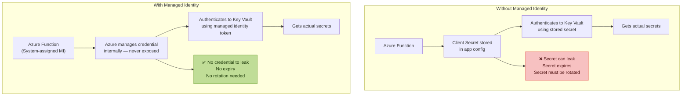

**System-assigned vs User-assigned:**

| Type | Lifecycle | Use when |
|---|---|---|
| System-assigned | Tied to the Azure resource — deleted when resource is deleted | One resource, one identity |
| User-assigned | Independent lifecycle — can be shared | Multiple resources need same identity, or you need the identity before the resource |

### LAB

**Use Case A — Grant Graph permissions to a Managed Identity (Graph only — portal cannot do this)**

This is a core portal limitation. Managed Identities cannot receive Graph API app permissions through the portal UI. PowerShell is the only path.

Scenario: An Azure Function running IPL analytics needs to read Entra user data.

```powershell
Connect-MgGraph -Scopes "AppRoleAssignment.ReadWrite.All","Application.Read.All"

# The managed identity name matches your Azure resource name
$miName = "IPL-Analytics-Function"

# Get the managed identity's service principal
$mi = Get-MgServicePrincipal -Filter "displayName eq '$miName'"
if(-not $mi){
    Write-Host "Managed Identity service principal not found" -ForegroundColor Red
    Write-Host "Ensure the Azure Function has system-assigned MI enabled"
    Write-Host "Then re-run this script"
    exit
}

# Get Microsoft Graph service principal
$graph = Get-MgServicePrincipal `
    -Filter "appId eq '00000003-0000-0000-c000-000000000000'"

# Define permissions to grant
$permissionsToGrant = @(
    "User.Read.All",
    "Group.Read.All",
    "AuditLog.Read.All"
)

foreach($permName in $permissionsToGrant){
    $appRole = $graph.AppRoles | Where-Object {$_.Value -eq $permName}
    if(-not $appRole){
        Write-Host "Permission not found: $permName" -ForegroundColor Yellow
        continue
    }

    try{
        New-MgServicePrincipalAppRoleAssignment `
            -ServicePrincipalId $mi.Id `
            -BodyParameter @{
                principalId = $mi.Id
                resourceId  = $graph.Id
                appRoleId   = $appRole.Id
            }
        Write-Host "Granted: $permName → $miName" -ForegroundColor Green
    }
    catch{
        if($_.Exception.Message -like "*already exists*"){
            Write-Host "Already granted: $permName" -ForegroundColor Yellow
        } else {
            Write-Host "Failed: $permName — $($_.Exception.Message)" -ForegroundColor Red
        }
    }
}
```

**Verify what was granted:**

```powershell
# See all Graph permissions the managed identity holds
Get-MgServicePrincipalAppRoleAssignment -ServicePrincipalId $mi.Id |
    ForEach-Object {
        $resource = Get-MgServicePrincipal -ServicePrincipalId $_.ResourceId
        $role = $resource.AppRoles | Where-Object {$_.Id -eq $_.AppRoleId}
        [PSCustomObject]@{
            Permission = $role.Value
            Resource   = $resource.DisplayName
            Granted    = $_.CreatedDateTime
        }
    } | Format-Table -AutoSize
```

### DOCS
- https://learn.microsoft.com/en-us/entra/identity/managed-identities-azure-resources/overview
- https://learn.microsoft.com/en-us/entra/identity/managed-identities-azure-resources/how-manage-user-assigned-managed-identities

---

## Lab 21 — Workload Identity Federation

### WHY

GitHub Actions workflows need to deploy to Azure. Traditional approach: create a service principal secret, store it as a GitHub secret, use it in the workflow. Problem: secrets in GitHub can be exposed, need rotation, and the access exists permanently whether a workflow is running or not.

Workload Identity Federation eliminates the secret entirely. GitHub Actions gets a short-lived OIDC token from GitHub's identity provider. Azure exchanges that token for an Azure access token. No stored credential anywhere.

This is the same pattern used by GCP workloads calling Azure APIs — which is directly relevant to the Vertex AI cross-cloud scenario in the job description.

### THEORY

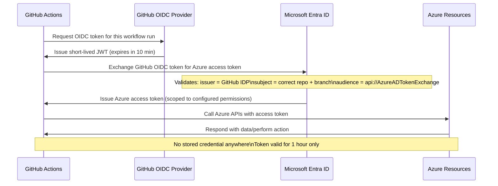

### LAB

**Step 1 — Create App Registration for GitHub Actions**

```
Entra portal → App registrations → New registration
→ Name: IPL-GitHub-Actions-Deploy
→ Register
```

**Step 2 — Add federated credential**

```
IPL-GitHub-Actions-Deploy
→ Certificates & secrets
→ Federated credentials
→ Add credential

Federated credential scenario: GitHub Actions deploying Azure resources
→ Organization: iam-kamran
→ Repository: ipl-azure-entra-labs
→ Entity type: Branch
→ Branch: main
→ Name: github-main-branch
→ Add
```

Add a second credential for PRs:

```
→ Add credential again
→ Entity type: Pull request
→ Name: github-pull-request
→ Add
```

**Step 3 — Grant Azure RBAC to the service principal**

```powershell
$spId         = (Get-MgServicePrincipal `
    -Filter "displayName eq 'IPL-GitHub-Actions-Deploy'").Id
$subscription = (Get-AzSubscription).Id

New-AzRoleAssignment `
    -ObjectId $spId `
    -RoleDefinitionName "Contributor" `
    -Scope "/subscriptions/$subscription"
```

**Step 4 — GitHub Actions workflow using federation**

```yaml
# .github/workflows/entra-identity-test.yml
name: IPL IAM — Identity Verification

on:
  push:
    branches: [main]
  workflow_dispatch:

permissions:
  id-token: write   # Required for OIDC token request
  contents: read

jobs:
  verify-identity:
    runs-on: ubuntu-latest

    steps:
      - uses: actions/checkout@v4

      - name: Azure Login via Workload Identity Federation
        uses: azure/login@v2
        with:
          client-id: ${{ secrets.AZURE_CLIENT_ID }}
          tenant-id: ${{ secrets.AZURE_TENANT_ID }}
          subscription-id: ${{ secrets.AZURE_SUBSCRIPTION_ID }}
          # No client-secret — federation handles authentication

      - name: Verify identity — list Entra users
        run: |
          echo "Authenticated as workload identity — no stored credential used"
          az account show
          az ad user list --query "[?department=='Batting'].{Name:displayName,UPN:userPrincipalName}" \
            --output table

      - name: Run identity health check
        run: |
          az ad group list --query "[?starts_with(displayName,'CSK')].displayName" \
            --output tsv
```

**Step 5 — Store secrets in GitHub (only IDs — no secret value)**

```
GitHub repo → Settings → Secrets and variables → Actions
→ New repository secret
→ AZURE_CLIENT_ID:     your app registration client ID
→ AZURE_TENANT_ID:     your tenant ID
→ AZURE_SUBSCRIPTION_ID: your subscription ID

Note: NO client secret is stored — federation handles auth
```

### DOCS
- https://learn.microsoft.com/en-us/entra/workload-id/workload-identity-federation
- https://learn.microsoft.com/en-us/entra/workload-id/workload-identity-federation-create-trust

---

## Lab 22 — AI Agent Identity (The Core Lab for the Target Role)

### WHY

AI agents are not humans. They do not sign in interactively. They do not use MFA. They act autonomously — executing tasks, calling APIs, accessing data stores — often without a human watching every action. This creates a new identity governance problem:

```
Traditional IAM question: Does this human have the right access?

AI Identity question:
├── Does this AI agent have the right identity?
├── What human delegated what permissions to this agent?
├── Can the agent's permissions exceed the human's permissions?
├── If the agent is compromised — what is the blast radius?
├── If the agent receives a malicious prompt — can it be tricked
│   into using its credentials to perform unauthorised actions?
└── Is every action the agent takes auditable and attributable?
```

### THEORY — The AI Identity threat model

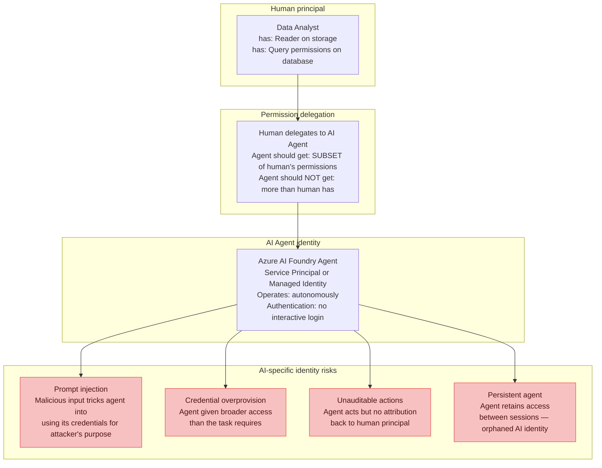

**The permission delegation chain — the most important concept:**

```
Human analyst (Reader + Query)
        │
        │ delegates via access token or managed identity assignment
        ▼
AI Agent (should get ≤ analyst's permissions)
        │
        │ calls APIs, reads data, writes outputs
        ▼
Resources (storage, database, downstream APIs)
```

The agent can NEVER have more permissions than the human who authorised it.
This principle is called the **delegation invariant** and it is the core
governance control for AI identity.

### LAB

**Use Case A — Create an AI Agent identity with least privilege**

Scenario: An IPL analytics AI agent reads match data from storage and writes summaries to a database. Least privilege means: read access to specific storage container only, write access to specific database table only.

**Step 1 — Create a user-assigned managed identity for the agent**

```
Azure portal
→ Search: Managed Identities
→ Create
→ Resource group: IPL-AI-RG
→ Region: Canada Central
→ Name: IPL-Analytics-Agent-MI
→ Review + Create → Create
```

Use user-assigned (not system-assigned) because:
- Agent identity survives resource recreation
- Same identity can be assigned to multiple compute resources
- Identity can be pre-configured before the workload is deployed

**Step 2 — Assign least-privilege RBAC on specific resources**

```powershell
Connect-AzAccount
$mi = Get-AzUserAssignedIdentity -Name "IPL-Analytics-Agent-MI" `
    -ResourceGroupName "IPL-AI-RG"

# Storage: Read access to specific CONTAINER only — not entire storage account
New-AzRoleAssignment `
    -ObjectId $mi.PrincipalId `
    -RoleDefinitionName "Storage Blob Data Reader" `
    -Scope "/subscriptions/SUB-ID/resourceGroups/IPL-AI-RG/providers/Microsoft.Storage/storageAccounts/ipldata/blobServices/default/containers/match-data"

# NOT this — too broad:
# -Scope "/subscriptions/SUB-ID/resourceGroups/IPL-AI-RG/providers/Microsoft.Storage/storageAccounts/ipldata"

Write-Host "Agent has Reader on match-data container ONLY"
Write-Host "Agent cannot read other containers, other storage accounts, or other resource types"
```

**Step 3 — Grant Graph permissions for identity context (PowerShell only)**

```powershell
Connect-MgGraph -Scopes "AppRoleAssignment.ReadWrite.All","Application.Read.All"

$agentMI = Get-MgServicePrincipal -Filter "displayName eq 'IPL-Analytics-Agent-MI'"
$graph   = Get-MgServicePrincipal `
    -Filter "appId eq '00000003-0000-0000-c000-000000000000'"

# Grant ONLY what the agent needs — no broad permissions
$minimalPermissions = @("User.Read.All")   # Read user context only

foreach($perm in $minimalPermissions){
    $role = $graph.AppRoles | Where-Object {$_.Value -eq $perm}
    New-MgServicePrincipalAppRoleAssignment `
        -ServicePrincipalId $agentMI.Id `
        -BodyParameter @{
            principalId = $agentMI.Id
            resourceId  = $graph.Id
            appRoleId   = $role.Id
        }
    Write-Host "Granted: $perm" -ForegroundColor Green
}
```

**Step 4 — Document the delegation chain**

This is the governance artefact that the job description requires.
Every AI agent identity should have a documented delegation chain:

```markdown
# AI Agent Identity — Delegation Record

**Agent name:** IPL-Analytics-Agent
**Agent identity:** IPL-Analytics-Agent-MI (User-assigned Managed Identity)
**Agent principal ID:** [your MI principal ID]
**Created:** 2026-07-02
**Owner:** Kamran Arif (IAM team)
**Authorising human:** [data analyst UPN]

## Permission delegation chain

| Permission | Source | Scope | Justification |
|---|---|---|---|
| Storage Blob Data Reader | Analyst has Contributor on storage | match-data container only | Read match statistics for analysis |
| User.Read.All (Graph) | Admin consent | Tenant-wide | Read player profiles for contextualisation |

## Constraints
- Agent cannot write to storage (read-only delegation)
- Agent cannot access other containers
- Agent cannot create or modify Entra objects
- Agent sessions audited via Sentinel workbook (see Lab 35)

## Lifecycle
- Review every 90 days via access review
- Decommission trigger: when analytics pipeline is retired
- Offboarding: remove RBAC assignments, disable MI, archive audit logs
```

**Step 5 — Detect prompt injection as an identity risk**

```powershell
# Sentinel alert rule — detect anomalous agent behaviour
# (preview — requires Sentinel workspace connected to Entra)

# The concept: normal agent behaviour has predictable API call patterns
# Prompt injection changes those patterns — agent calls APIs it normally would not

# Log query for Sentinel (KQL):
$kqlQuery = @"
AuditLogs
| where InitiatedBy.app.servicePrincipalId == "YOUR-AGENT-MI-PRINCIPAL-ID"
| where OperationName !in (
    "Get user",           // normal — agent reads user profiles
    "Get blob",           // normal — agent reads match data
    "Add member to group" // ANOMALOUS — agent should never modify groups
)
| project TimeGenerated, OperationName, TargetResources, Result
| where Result == "success"
| order by TimeGenerated desc
"@

Write-Host "Add this KQL to Sentinel as an Analytics Rule"
Write-Host "Alert when agent performs operations outside its expected pattern"
Write-Host "This detects prompt injection — agent tricked into using credentials unexpectedly"
```

**Use Case B — AI Agent lifecycle management (onboard and offboard)**

```powershell
# Onboard an AI agent identity — production-grade function
function New-AIAgentIdentity {
    param(
        [string]$AgentName,
        [string]$ResourceGroup,
        [string]$OwnerUPN,
        [string]$Purpose,
        [string[]]$GraphPermissions,
        [hashtable]$AzureRoleAssignments
    )

    Write-Host "=== AI Agent Identity Onboarding: $AgentName ===" -ForegroundColor Cyan

    # Step 1 — Create user-assigned managed identity
    $mi = New-AzUserAssignedIdentity `
        -Name $AgentName `
        -ResourceGroupName $ResourceGroup `
        -Location "canadacentral" `
        -Tag @{
            Owner       = $OwnerUPN
            Purpose     = $Purpose
            CreatedDate = (Get-Date).ToString("yyyy-MM-dd")
            ReviewDate  = (Get-Date).AddDays(90).ToString("yyyy-MM-dd")
            Type        = "AI-Agent-Identity"
        }

    Write-Host "Created MI: $($mi.PrincipalId)" -ForegroundColor Green

    # Step 2 — Grant Graph permissions
    Connect-MgGraph -Scopes "AppRoleAssignment.ReadWrite.All","Application.Read.All"
    $agentSP = Get-MgServicePrincipal -Filter "displayName eq '$AgentName'"
    $graphSP = Get-MgServicePrincipal `
        -Filter "appId eq '00000003-0000-0000-c000-000000000000'"

    foreach($perm in $GraphPermissions){
        $role = $graphSP.AppRoles | Where-Object {$_.Value -eq $perm}
        if($role){
            New-MgServicePrincipalAppRoleAssignment `
                -ServicePrincipalId $agentSP.Id `
                -BodyParameter @{
                    principalId = $agentSP.Id
                    resourceId  = $graphSP.Id
                    appRoleId   = $role.Id
                }
            Write-Host "Granted Graph permission: $perm" -ForegroundColor Green
        }
    }

    # Step 3 — Grant Azure RBAC
    foreach($scope in $AzureRoleAssignments.Keys){
        $roleName = $AzureRoleAssignments[$scope]
        New-AzRoleAssignment `
            -ObjectId $mi.PrincipalId `
            -RoleDefinitionName $roleName `
            -Scope $scope
        Write-Host "Granted Azure role: $roleName on $scope" -ForegroundColor Green
    }

    # Step 4 — Generate delegation record
    $record = @"
# AI Agent Identity Delegation Record
Agent: $AgentName
Principal ID: $($mi.PrincipalId)
Owner: $OwnerUPN
Purpose: $Purpose
Created: $(Get-Date -Format 'yyyy-MM-dd')
Review due: $((Get-Date).AddDays(90).ToString('yyyy-MM-dd'))
Graph permissions: $($GraphPermissions -join ', ')
"@
    $record | Out-File ".\ai-agents\$AgentName-delegation-record.md"
    Write-Host "Delegation record saved" -ForegroundColor Green

    return $mi
}

# Offboard an AI agent identity
function Remove-AIAgentIdentity {
    param([string]$AgentName, [string]$ResourceGroup)

    Write-Host "=== AI Agent Identity Offboarding: $AgentName ===" -ForegroundColor Yellow

    # Remove all Graph permissions first
    $agentSP = Get-MgServicePrincipal -Filter "displayName eq '$AgentName'"
    $assignments = Get-MgServicePrincipalAppRoleAssignment -ServicePrincipalId $agentSP.Id
    foreach($a in $assignments){
        Remove-MgServicePrincipalAppRoleAssignment `
            -ServicePrincipalId $agentSP.Id `
            -AppRoleAssignmentId $a.Id
        Write-Host "Removed Graph permission: $($a.Id)" -ForegroundColor Green
    }

    # Remove Azure RBAC assignments
    $rbac = Get-AzRoleAssignment -ObjectId $agentSP.Id
    foreach($r in $rbac){
        Remove-AzRoleAssignment -InputObject $r
        Write-Host "Removed Azure role: $($r.RoleDefinitionName)" -ForegroundColor Green
    }

    # Delete the managed identity
    Remove-AzUserAssignedIdentity -Name $AgentName -ResourceGroupName $ResourceGroup
    Write-Host "AI Agent identity deleted: $AgentName" -ForegroundColor Green
    Write-Host "Audit logs preserved in Sentinel for 90 days"
}
```

### DOCS
- https://learn.microsoft.com/en-us/entra/workload-id/workload-identities-overview
- https://learn.microsoft.com/en-us/azure/ai-foundry/concepts/identity-based-auth
- https://learn.microsoft.com/en-us/entra/identity/managed-identities-azure-resources/managed-identity-best-practice-recommendations

### TAKEAWAY

AI agents need identities that are governed with the same rigour as privileged human accounts. The three principles: least privilege (agent gets minimum permissions for its specific task), delegation invariant (agent never exceeds the permissions of the human who authorised it), and full auditability (every action taken by the agent is attributable back to the agent identity and the human principal). The prompt injection risk is an identity risk — a compromised agent using its legitimate credentials for an attacker's purposes — and the detection pattern is anomaly detection on the agent's API call signature.

---

# PHASE 5 — MULTI-CLOUD IAM

---

## Lab 27 — AWS IAM + Azure Identity Federation

### WHY

The job description specifies multi-cloud IAM across Azure, GCP, and AWS. An AI workload running in Azure may need to call AWS S3 for data, or a GCP Vertex AI agent may need to authenticate to Azure resources. Identity federation between clouds eliminates the need for static credentials.

### THEORY

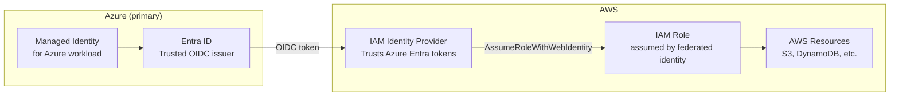

### LAB

**Step 1 — Create OIDC Identity Provider in AWS**

```
AWS Console → IAM → Identity providers → Add provider
→ Provider type: OpenID Connect
→ Provider URL: https://login.microsoftonline.com/YOUR-TENANT-ID/v2.0
→ Get thumbprint
→ Audience: api://AzureADTokenExchange
→ Add provider
```

**Step 2 — Create IAM role trusted by the OIDC provider**

```json
{
  "Version": "2012-10-17",
  "Statement": [{
    "Effect": "Allow",
    "Principal": {
      "Federated": "arn:aws:iam::ACCOUNT-ID:oidc-provider/login.microsoftonline.com/TENANT-ID/v2.0"
    },
    "Action": "sts:AssumeRoleWithWebIdentity",
    "Condition": {
      "StringEquals": {
        "login.microsoftonline.com/TENANT-ID/v2.0:aud": "api://AzureADTokenExchange",
        "login.microsoftonline.com/TENANT-ID/v2.0:sub": "YOUR-MANAGED-IDENTITY-OBJECT-ID"
      }
    }
  }]
}
```

**Step 3 — Azure workload assumes AWS role using managed identity token**

```python
import boto3
import requests

# Get Azure managed identity token scoped for AWS
metadata_url = "http://169.254.169.254/metadata/identity/oauth2/token"
params = {
    "api-version": "2018-02-01",
    "resource": "api://AzureADTokenExchange"
}
headers = {"Metadata": "true"}

response = requests.get(metadata_url, params=params, headers=headers)
azure_token = response.json()["access_token"]

# Exchange Azure token for AWS temporary credentials
sts = boto3.client("sts", region_name="us-east-1")
assumed_role = sts.assume_role_with_web_identity(
    RoleArn="arn:aws:iam::ACCOUNT-ID:role/IPL-Azure-FederatedRole",
    RoleSessionName="IPL-Analytics-Session",
    WebIdentityToken=azure_token,
    DurationSeconds=3600
)

credentials = assumed_role["Credentials"]
print(f"AWS temporary credentials obtained — no stored secret used")
print(f"Expires: {credentials['Expiration']}")

# Now use AWS resources with temporary credentials
s3 = boto3.client(
    "s3",
    aws_access_key_id=credentials["AccessKeyId"],
    aws_secret_access_key=credentials["SecretAccessKey"],
    aws_session_token=credentials["SessionToken"]
)

# List objects in IPL data bucket
objects = s3.list_objects_v2(Bucket="ipl-match-data", Prefix="2026/")
print(f"Found {objects['KeyCount']} match data files")
```

### DOCS
- https://docs.aws.amazon.com/IAM/latest/UserGuide/id_roles_providers_oidc.html
- https://learn.microsoft.com/en-us/entra/workload-id/workload-identity-federation

---

# PHASE 6 — PRIVILEGED ACCESS MANAGEMENT

---

## Lab 31 — CyberArk Concepts and Integration with Entra

### WHY

CyberArk is the market-leading PAM tool. It appears in almost every large enterprise IAM environment. CyberArk manages privileged credentials — root passwords, service account passwords, SSH keys — and provides session recording for all privileged activity. For the AI identity role, CyberArk is relevant when AI agents need to access privileged credentials (database passwords, API keys) securely without those credentials being embedded in code.

### THEORY

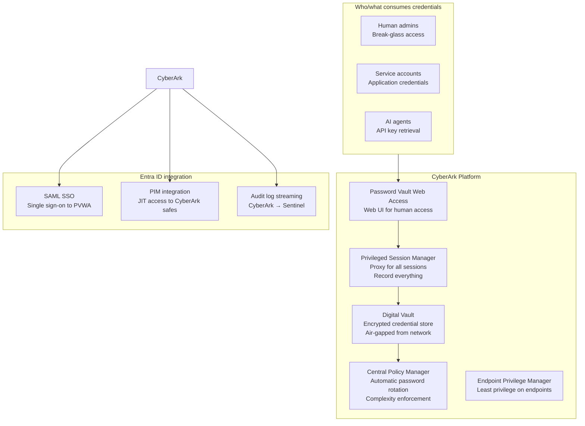

**The CyberArk object model:**

| Object | What it is | IAM equivalent |
|---|---|---|
| Safe | Container for credentials | Access Package / Catalog |
| Account | A managed credential (password, key) | Entitlement |
| Policy | Rules for rotation, access, recording | CA Policy |
| Safe member | Who/what can access a safe | Group membership |
| Session | Recorded privileged session | PIM activation window |

### LAB (Conceptual — requires CyberArk licence)

**CyberArk REST API — retrieve a credential for an AI agent**

This is how an AI agent should retrieve database credentials instead of having them hardcoded:

```python
import requests
import os

# AI agent retrieves credential from CyberArk at runtime
# Credential is never stored in the agent's config or code

class CyberArkCredentialProvider:
    def __init__(self, pvwa_url: str, app_id: str):
        self.pvwa_url = pvwa_url
        self.app_id   = app_id

    def get_credential(self, safe: str, object_name: str) -> dict:
        """
        Retrieve credential from CyberArk Central Credential Provider.
        Uses CCP (non-interactive) — no human login required.
        AI agent authenticates via certificate.
        """
        url = f"{self.pvwa_url}/AIMWebService/api/Accounts"
        params = {
            "AppID":      self.app_id,
            "Safe":       safe,
            "Object":     object_name,
            "reason":     "IPL Analytics pipeline credential retrieval",
        }

        # Certificate-based auth — no secret in code
        response = requests.get(
            url,
            params=params,
            cert=("./agent-cert.pem", "./agent-key.pem"),
            verify=True
        )
        response.raise_for_status()
        data = response.json()

        return {
            "username": data["UserName"],
            "password": data["Content"],
            "address":  data["Address"]
        }

    def rotate_credential(self, safe: str, object_name: str):
        """Trigger immediate rotation after use."""
        # Tell CyberArk to rotate the password immediately
        # This means even if the credential was intercepted,
        # it is invalid before the attacker can use it
        pass

# Usage in AI agent
provider = CyberArkCredentialProvider(
    pvwa_url="https://cyberark.ansari.solutions",
    app_id="IPL-Analytics-Agent"
)

creds = provider.get_credential(
    safe="IPL-Database-Credentials",
    object_name="IPL-Prod-DB-Admin"
)

# Connect to database using retrieved credential
# Credential is never written to disk or logs
print(f"Connected as {creds['username']} — credential retrieved from vault at runtime")
```

**Entra PIM + CyberArk integration concept:**

```
Human admin needs database access:
→ Activates PIM role (User Administrator scoped to DB team)
→ PIM activation triggers CyberArk workflow
→ CyberArk grants time-limited safe access (same duration as PIM)
→ Admin uses PVWA to connect — session recorded
→ PIM expires → CyberArk access expires simultaneously
→ Full audit: PIM log + CyberArk session recording
```

### DOCS
- https://docs.cyberark.com/Product-Doc/OnlineHelp/PAS/Latest/en/Content/HomeTilesLan/HP-Tiles.htm
- https://docs.cyberark.com/Product-Doc/OnlineHelp/PAS/Latest/en/Content/PASIMP/Integrating-with-Microsoft-Entra-ID.htm

---

## Lab 32 — Delinea Secret Server

### WHY

Delinea (formerly Thycotic) is the main alternative to CyberArk in the mid-market. Many enterprises use Secret Server for secrets management — API keys, service account passwords, SSH keys. For AI workloads, Secret Server provides an API that agents can call to retrieve credentials at runtime without storing them.

### THEORY

Delinea Secret Server architecture is similar to CyberArk but simpler:

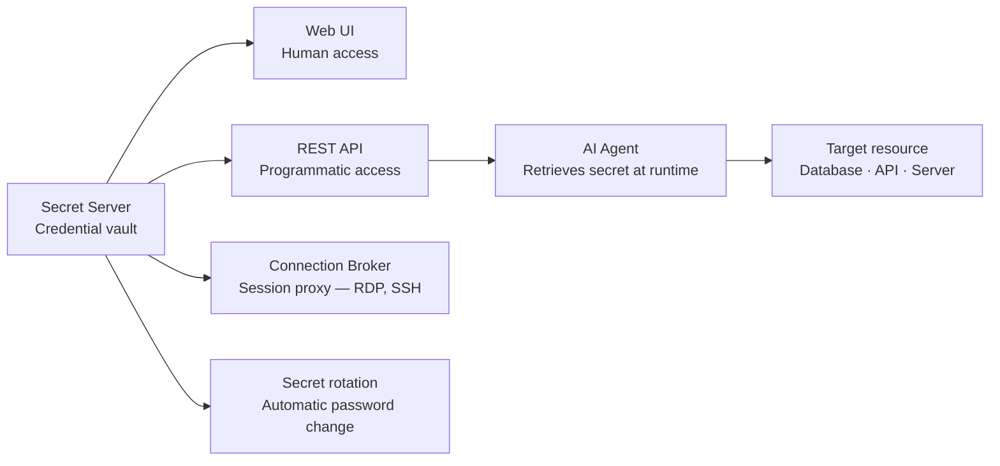

### LAB

**Retrieve a secret via Delinea REST API:**

```powershell
# Delinea Secret Server — PowerShell credential retrieval
function Get-DelineaSecret {
    param(
        [string]$SecretServerUrl,
        [string]$SecretId,
        [string]$Username,
        [string]$Password
    )

    # Step 1 — Authenticate to Secret Server
    $tokenBody = @{
        username   = $Username
        password   = $Password
        grant_type = "password"
    }

    $tokenResponse = Invoke-RestMethod `
        -Uri "$SecretServerUrl/oauth2/token" `
        -Method POST `
        -Body $tokenBody

    $token = $tokenResponse.access_token

    # Step 2 — Retrieve the secret
    $headers = @{Authorization = "Bearer $token"}

    $secret = Invoke-RestMethod `
        -Uri "$SecretServerUrl/api/v1/secrets/$SecretId" `
        -Headers $headers

    # Step 3 — Extract credential fields
    $username = ($secret.items | Where-Object {$_.fieldName -eq "Username"}).itemValue
    $password = ($secret.items | Where-Object {$_.fieldName -eq "Password"}).itemValue

    Write-Host "Secret retrieved: $($secret.name)"
    Write-Host "Username: $username"
    # Never log the password

    return @{
        Username = $username
        Password = $password
    }
}

# Usage by AI agent — no hardcoded credentials
$creds = Get-DelineaSecret `
    -SecretServerUrl "https://secrets.ansari.solutions" `
    -SecretId 42 `
    -Username $env:SS_SERVICE_ACCOUNT `
    -Password $env:SS_SERVICE_PASSWORD
```

### DOCS
- https://docs.delinea.com/online-help/secret-server/restapi/

---

# PHASE 7 — DETECTION & AUDIT

---

## Lab 35 — Sentinel Identity Workbook

### WHY

Identity telemetry in a SIEM is what makes your IAM programme auditable and detectable. Entra generates hundreds of identity-related signals — sign-in logs, audit logs, PIM activations, CA policy matches, risky users. Without a SIEM, these signals exist but nobody sees them until after a breach. With Sentinel, you create detection rules that alert on suspicious identity patterns before damage occurs.

For the AI identity role specifically: AI agent anomalous behaviour shows up as unusual API call patterns in audit logs. Sentinel KQL queries correlate those patterns.

### THEORY

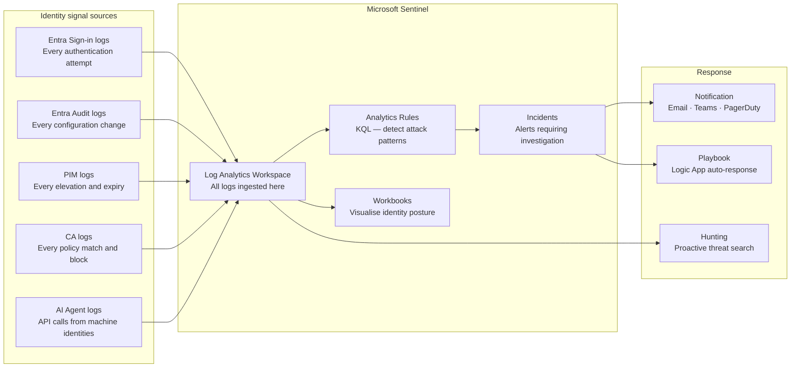

### LAB

**KQL queries for identity threat detection:**

```kql
// Detection 1 — PIM activation outside business hours
// Risk: legitimate users activate during work hours
// Suspicious: activations at 3am suggest account compromise

PrivilegedIdentityManagementEvents
| where TimeGenerated > ago(7d)
| where OperationName == "SelfActivate"
| extend ActivationHour = hourofday(TimeGenerated)
| where ActivationHour !between (8 .. 18)  // outside 8am-6pm
| project TimeGenerated, RequestorId, RoleName = Properties.roleDefinitionName,
          Justification = Properties.justification, ActivationHour
| order by TimeGenerated desc
```

```kql
// Detection 2 — AI agent calling APIs outside its expected pattern
// Replace with your actual managed identity object ID

let agentObjectId = "YOUR-AI-AGENT-MI-OBJECT-ID";
let normalOperations = dynamic(["Get user", "List groups", "Get blob"]);

AuditLogs
| where TimeGenerated > ago(24h)
| where InitiatedBy.app.servicePrincipalId == agentObjectId
| where OperationName !in (normalOperations)
| project TimeGenerated, OperationName, 
          TargetResource = TargetResources[0].displayName,
          Result
| where Result == "success"
| order by TimeGenerated desc
// Any results here = potential prompt injection or misconfiguration
```

```kql
// Detection 3 — Impossible travel
// User signs in from two geographically impossible locations

let travelThresholdKm = 500;

SigninLogs
| where TimeGenerated > ago(1d)
| where ResultType == 0  // successful sign-in
| project TimeGenerated, UserPrincipalName, IPAddress,
          Location = todynamic(LocationDetails)
| extend City    = Location.city,
         Country = Location.countryOrRegion,
         Lat     = todouble(Location.geoCoordinates.latitude),
         Lon     = todouble(Location.geoCoordinates.longitude)
| sort by UserPrincipalName asc, TimeGenerated asc
| extend PrevTime = prev(TimeGenerated),
         PrevLat  = prev(Lat),
         PrevLon  = prev(Lon),
         PrevUser = prev(UserPrincipalName)
| where UserPrincipalName == PrevUser
| extend TimeDiffHours = datetime_diff('minute', TimeGenerated, PrevTime) / 60.0
| extend DistanceKm = geo_distance_2points(Lon, Lat, PrevLon, PrevLat) / 1000
| where DistanceKm > travelThresholdKm and TimeDiffHours < 2
| project TimeGenerated, UserPrincipalName, DistanceKm, TimeDiffHours,
          IPAddress, City, Country
| order by TimeGenerated desc
```

```kql
// Detection 4 — Orphaned AI agent identity
// Managed identity active but has not called any API in 30+ days
// Indicates potentially forgotten AI agent that should be decommissioned

AuditLogs
| where TimeGenerated > ago(30d)
| where InitiatedBy.app.servicePrincipalId != ""
| summarize LastSeen = max(TimeGenerated) by 
    AgentId = InitiatedBy.app.servicePrincipalId,
    AgentName = InitiatedBy.app.displayName
| where LastSeen < ago(30d)
| project AgentName, AgentId, LastSeen,
          DaysSinceLastActivity = datetime_diff('day', now(), LastSeen)
| order by DaysSinceLastActivity desc
// These are candidates for decommissioning
```

### DOCS
- https://learn.microsoft.com/en-us/azure/sentinel/overview
- https://learn.microsoft.com/en-us/azure/sentinel/detect-threats-built-in

---

# PHASE 8 — OKTA

---

## Lab 39 — Okta Workforce Identity Foundations

### WHY

Okta is the dominant cloud-native identity provider in enterprises that are not primarily Microsoft-stack. Many clients run Okta for SSO + MFA while also having Entra for Microsoft 365. Understanding Okta means you can work in both environments and explain the differences and integration points.

### THEORY

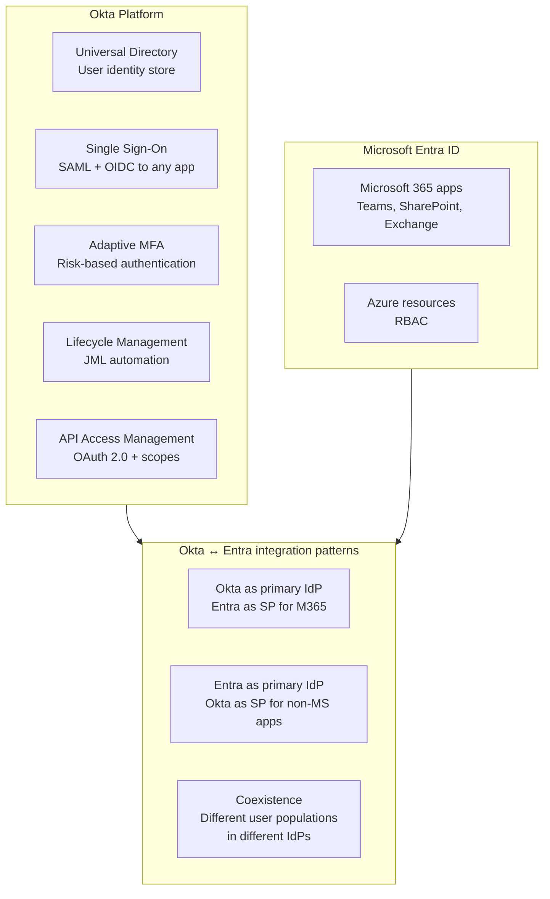

**Okta vs Entra — concept mapping:**

| Concept | Okta term | Entra term |
|---|---|---|
| Identity store | Universal Directory | Entra ID directory |
| Policy engine | Sign-on Policy | Conditional Access |
| MFA | Okta Verify | Microsoft Authenticator |
| App integration | Application | Enterprise Application |
| Provisioning | Lifecycle Management | Lifecycle Workflows + SCIM |
| Privileged access | Okta Privileged Access | PIM |
| Developer identity | CIAM | External ID |
| API gateway | API Access Management | Entra ID + APIM |

### LAB

**Sign up for free Okta Developer tenant:**
```
developer.okta.com → Create free account
Your org URL: https://dev-XXXXXXX.okta.com
Admin console: https://dev-XXXXXXX-admin.okta.com
```

**Use Case A — SAML SSO integration**

```
Okta Admin → Applications → Browse App Catalog
→ Search: "SAML Test App" or any catalog app
→ Add Integration
→ General → configure SAML settings
→ Assignments → assign to "Everyone" or a test group
→ Test SSO by opening app from Okta dashboard
```

**Use Case B — Okta Lifecycle Management (JML automation)**

```
Okta Admin → Workflow → Create Workflow
→ Trigger: User added to group "IPL-Players"
→ Action 1: Activate user account
→ Action 2: Assign app "IPL-Scheduling"
→ Action 3: Send welcome email
→ Save and test
```

**Use Case C — Okta SCIM provisioning to Entra (or vice versa)**

```
Okta Admin → Directory → Directory Integrations
→ Add Active Directory or Microsoft Entra ID
→ Install Okta AD Agent on Windows Server
→ Configure sync direction: Okta → AD or AD → Okta
→ Define attribute mappings
→ Test with a pilot group before full rollout
```

**Use Case D — Okta API Access Management (OAuth scopes for AI agents)**

```
Okta Admin → Security → API → Add Authorization Server
→ Name: IPL-AI-API
→ Audience: api://ipl-analytics
→ Add scopes:
   - analytics:read (AI agent can read data)
   - analytics:write (restricted — human approval required)
→ Add access policy:
   - Machine-to-machine clients: grant analytics:read automatically
   - analytics:write: require step-up authentication
```

### DOCS
- https://developer.okta.com/docs/
- https://help.okta.com/en-us/content/topics/apps/apps_app_integration_wizard_saml.htm
- https://developer.okta.com/docs/concepts/oauth-openid/

---

# PHASE 9 — SAILPOINT

---

## Lab 45 — SailPoint IdentityIQ Concepts

### WHY

SailPoint IIQ is the dominant IGA platform in large enterprises — banks, insurance, healthcare, government. While Entra IGA covers Microsoft-centric environments, SailPoint governs identity across every application in an enterprise estate — SAP, Oracle, mainframes, RACF, custom apps. Many IAM consulting engagements involve SailPoint.

### THEORY

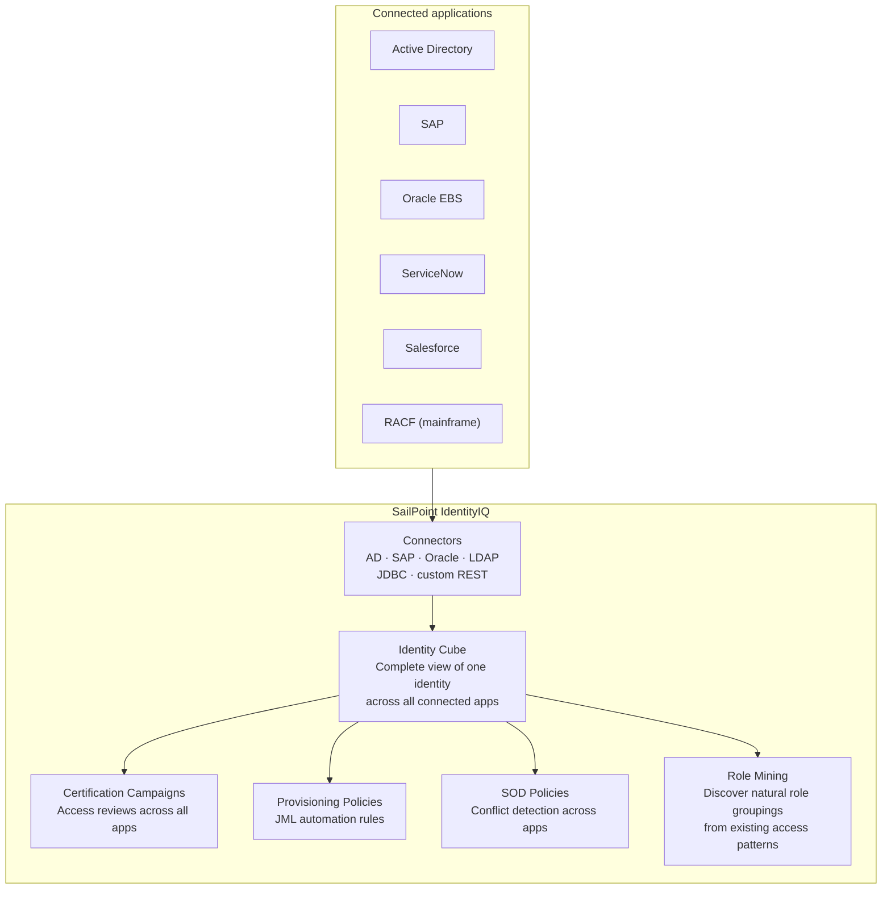

**SailPoint vs Entra IGA — feature comparison:**

| Capability | SailPoint IIQ | Entra IGA |
|---|---|---|
| Connector library | 200+ pre-built | ~100 SCIM apps + custom |
| Mainframe identity | RACF, ACF2, TopSecret | Not supported |
| Role mining | Native AI-driven | Not available |
| SOD policy complexity | Enterprise-grade, multi-app | Single-tenant, Entra apps only |
| Certification granularity | Entitlement-level | Group/app/role level |
| Workflow engine | Java-based BPM | Logic Apps + Lifecycle Workflows |
| Target market | Large enterprise ($1B+ revenue) | SMB to enterprise (Microsoft-first) |
| Licence model | Per-managed-identity | Per-user P2 + Governance |

### LAB (Conceptual — requires SailPoint IIQ licence)

**SailPoint Developer Community — free access:**
```
https://developer.sailpoint.com/
→ SailPoint IdentityNow (cloud) — free developer tenant
→ SailPoint IIQ — requires licence (check with employer)
```

**Key concepts to demonstrate understanding:**

```java
// SailPoint IIQ rule — Joiner provisioning (BeanShell/Java)
// This is what SailPoint uses instead of Lifecycle Workflows

import sailpoint.object.*;
import sailpoint.api.*;

public Object execute(SailPointContext context, Map args) throws Exception {

    Identity identity = (Identity) args.get("identity");
    String  dept      = identity.getAttribute("department");
    String  location  = identity.getAttribute("location");

    // Determine what access to provision based on attributes
    List rolesToAssign = new ArrayList();

    if("Batting".equals(dept)){
        rolesToAssign.add("CSK-Batting-Standard");
    }

    if("Canada".equals(location)){
        rolesToAssign.add("Canada-Office-Access");
    }

    // This is the Identity Cube concept — SailPoint builds a complete
    // view of every identity and their access across all connected apps
    // Then provisions based on rules like this one

    return rolesToAssign;
}
```

**SailPoint IIQ REST API — equivalent of Microsoft Graph:**

```powershell
# Authenticate to SailPoint IIQ
$iiqUrl  = "https://iiq.ansari.solutions/identityiq"
$session = Invoke-RestMethod `
    -Uri "$iiqUrl/rest/login" `
    -Method POST `
    -Body "username=admin&password=PASSWORD" `
    -SessionVariable "iiqSession"

# Get identity details (equivalent to Get-MgUser)
$identity = Invoke-RestMethod `
    -Uri "$iiqUrl/rest/identities/ruturaj.gaikwad" `
    -WebSession $iiqSession

Write-Host "Identity: $($identity.name)"
Write-Host "Entitlements: $($identity.links.Count) connected accounts"

# List all entitlements for an identity
# (equivalent to Get-MgUserMemberOf)
$identity.links | ForEach-Object {
    Write-Host "App: $($_.application.name) — Account: $($_.nativeIdentity)"
}
```

### DOCS
- https://developer.sailpoint.com/docs/
- https://community.sailpoint.com/
- https://documentation.sailpoint.com/identityiq/help/iiq_landing_page.html

---

## Weekend study plan

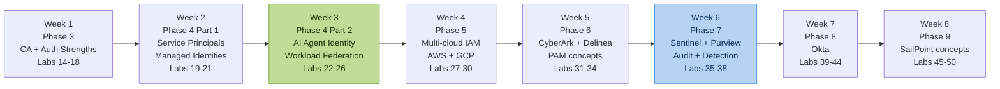

---

## Role readiness checklist

**Traditional IAM (already built in Phase 1-2):**
- [x] Entra ID user and group management
- [x] Hybrid identity — Cloud Sync and AD
- [x] Administrative Units and scoped delegation
- [x] Entitlement Management — access packages
- [x] Access Reviews — certification campaigns
- [x] PIM — just-in-time elevation
- [x] Separation of Duties enforcement
- [ ] Conditional Access and Zero Trust (Phase 3)

**Workload & AI Identity (Phase 4):**
- [ ] Service principals and app registrations
- [ ] Managed identities — system and user assigned
- [ ] Workload identity federation — no stored secrets
- [ ] AI agent identity lifecycle — onboard, govern, offboard
- [ ] Delegation chain documentation
- [ ] Prompt injection as identity risk — detection pattern

**Multi-cloud (Phase 5):**
- [ ] AWS IAM role federation from Entra
- [ ] GCP Workload Identity Pool
- [ ] Cross-cloud RBAC design
- [ ] ABAC across cloud boundaries

**PAM (Phase 6):**
- [ ] CyberArk architecture and object model
- [ ] Delinea Secret Server API
- [ ] Session recording and audit integration
- [ ] PIM + PAM combined workflow

**Detection (Phase 7):**
- [ ] Sentinel workspace and data connectors
- [ ] KQL for identity threat detection
- [ ] AI agent anomaly detection
- [ ] Purview data sensitivity integration

**Okta (Phase 8):**
- [ ] Universal Directory and Sign-on Policies
- [ ] SAML SSO integration
- [ ] Lifecycle Management workflows
- [ ] API Access Management for machine identities

**SailPoint (Phase 9):**
- [ ] Identity Cube concept
- [ ] Certification Campaigns
- [ ] Provisioning policies and BeanShell rules
- [ ] SOD policy configuration
- [ ] IIQ REST API

---

*This curriculum builds Traditional IAM → Workload Identity → AI Identity → Multi-cloud → PAM → Detection → Okta → SailPoint.*  
*Every lab is grounded in a real enterprise problem.*  
*Phase 4 Lab 22 (AI Agent Identity) is the core differentiator for the target role.*

